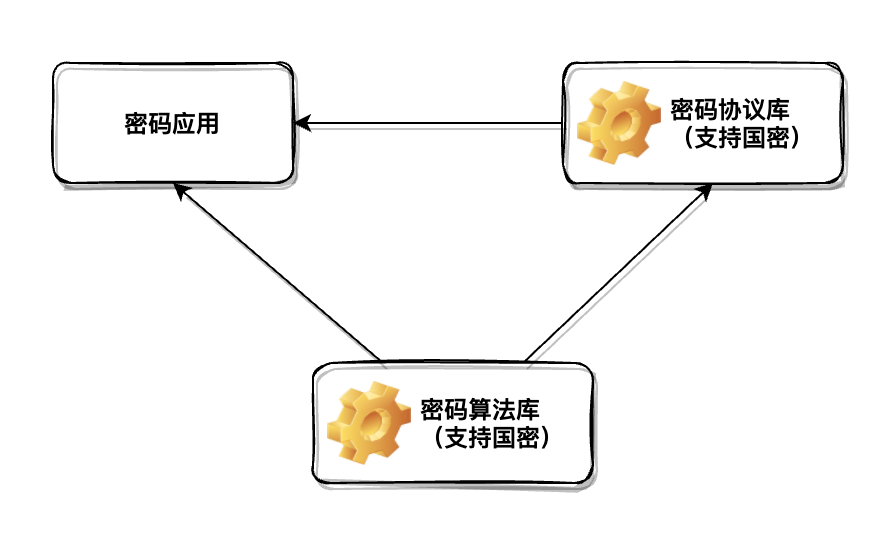
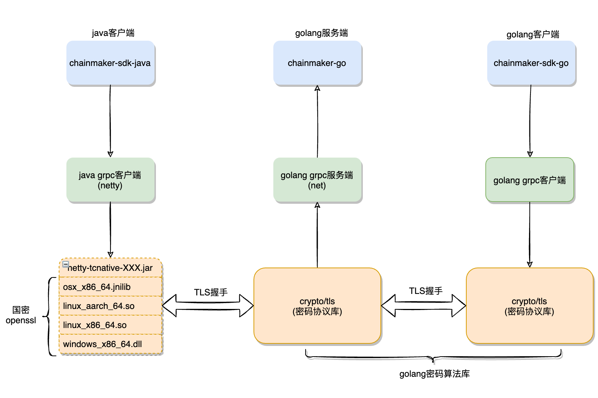

# 国密TLS设计和实现

## 背景

互联网上传输的数据，每时每刻都存在着被窃听和篡改的风险， __SSL/TLS协议__ 在保护用户 __数据机密性、完整性以及身份鉴别__ 等方面发挥了重大作用。国际通用TLS协议并不包含中国国密局推荐使用的商用密码算法 (即 __国密算法__ ) 套件，而绝大部分的编程语言原生TLS实现、第三方开源TLS实现大都不支持国密套件。随着国内安全合规、自主可控政策的指引， __国密TLS__ 的需求也越来越大，尤其在金融、政务领域已然成为刚需。与此同时，国密相关密码产品大多依托于硬件或者芯片，存在价格昂贵，部署成本高，部分中小企业用户难以承担的问题。 国密软件产品存在以下问题也急需解决：

1. 未形成国密权威密码实现库，开源生态不活跃

2. 国密TLS实现不完善，各语言版本支持现状参差不齐。

国密算法套件包括 SM2 签名、SM2 非对称加密、SM3 杂凑函数 (哈希)、SM4 对称加密，以及一个国密密钥协商协议。要在安全信道中完全使用国密算法，对TLS协议实现、与其相关的X509协议实现都需要做大量的改造适配。应用层的协议 (GRPCS、HTTPS等) 在实现上也需要做相应的适配。

长安链致力于打造国内完全自主可控区块链，启用全国密算法，支持国密TLS成为必要需求。
本文主要内容：

1. 长安链国密支撑整体设计思路

2. 长安链国密TLS支持现状

3. 长安链国密未来工作

## 整体设计思路

 __密码技术__ 作为长安链底层重要技术之一，在主项目chainmaker-go，ca服务、中间件以及SDK中都有深度应用。长安链在整体设计上，综合考虑了 __算法性能、扩展性、标准化__ 等方面，密码相关组件如下：
 
 

1. 密码算法库：提供统一密码算法接口，支持不同密码算法以及实现的扩展。

2. 密码协议库：支持标准TLS，包括国际标准和国密标准

3. 密码应用：长安链密码技术应用依赖于“密码算法库”和“密码协议库”，解耦具体实现细节。

## TLS支持现状

长安链后端服务采用 __Golang语言__ 实现，通过grpc对外提供区块链服务。生态工具SDK支持Golang、Java等不同语言。目前为止，长安链已经完成了区块链服务与客户端SDK，区块链网络节点之间的 __双向国密TLS通信__ 。 
长安链服务调用以及国密TLS支撑图如下：

 

1. golang服务端：底层基于grpc通信，其中tls握手采用长安链密码协议库（支持国密TLS以及国际TLS协议）

2. golang客户端：同上

3. java客户端：由于java调用长安链golang密码协议库支持国密TLS，工作量较大并且维护困难，实现上采用了比较成熟的netty-tcnative + 国密openssl方式。

### 密码算法库

 __长安链密码算法库__ 采用golang语言实现，目前支持主流国际密码算法AES、RSA、ECC以及SHA系列算法，并已经全面支持SM2、SM3以及SM4国密算法。底层国密实现目前采用了tjfoc密码库。

### 密码协议库

 __长安链密码协议库__ 包含 __国密x509、国密TLS__ ，并兼容国际x509、国际TLS标准。 国密TLS实现库包含 __golang 国密tls__ 和 __java国密tls__ 两个实现。

1. golang国密tls：在golang标准库（golang1.14版本）基础上，增加了SM2算法、SM3算法、国密X509以及SM2-SM3算法套件支持，并独立为单独的国密协议库。

2. java国密tls：包含国密算法部分和国密TLS协议两个部分。 __国密算法部分__ Java侧由 __Java标准库CurveDB类__ 提供，国密通过反射机制注入到Java标准库，国密算法实现自主研发，符合国密算法标准。 __国密TLS协议__ 部分主要由长安链 __国密openssl__ 提供，Java侧通过反射机制将SM3WithSM2标识注入到netty ssl  `io.netty.handler.ssl.ExtendedOpenSslSession` 支持的签名算法 `LOCAL_SUPPORTED_SIGNATURE_ALGORITHMS` 列表中，Java netty通过netty-tcnative调用openssl底层密码功能。目前 __netty-tcnative__ 已支持macOS、linux、windows以及linux_aarch等平台，并在长安链chainmaker-java-sdk中实现了 __平台兼容性__ ，用户只要下载长安链官方java sdk就可以实现客户端与链的国密TLS通信，无需关心netty-tcnative国密的跨平台问题。

### __国密openssl__   
长安链的国密openssl实现是在OpenSSL-1.1.1l的基础上改造的。OpenSSL 在 __1.1.1__ 版本中引入了国密算法的实现，但是仅仅提供了算法接口，没有把国密算法引入到任何通信协议中去支持。
长安链国密openssl把国密算法的支持加入到 __X509协议__ 中。主要包括：

1. 按PKCS8标准实现SM2私钥的编码序列化；

2. 按PKIX定义的公钥编码方式实现SM2算法公钥的序列化；

3. 实现ECC编码的SM2签名的序列化；

4. 将SM2算法、SM3算法、SM2-SM3算法套件、SM2曲线的OID引入到X509的逻辑中。

完成了X509协议的国密支持后，进一步改造了 __TLS协议__ ，主要包括：

1. 把国密算法套件加入到支持的密码算法包列表中，以供server、client两端进行算法套件的协商

2. 在ECDSA对应的协议套件中去支持了国密算法的逻辑

3. 身份认证阶段，使用改造过的x509协议进行国密证书验证。

## 备注
1. 目前长安链已经在v2.1.0及以上版本支持国密TLS, SDK地址：<a href="https://git.chainmaker.org.cn/chainmaker/sdk-java"  target="_blank"> chainmaker-sdk-java </a>

2. netty-tcnative国密jar包基于长安链国密openssl以及netty-tcnative的2.0.39.Final版本，构建流程参考  
netty-tcnative官方地址： <a href="https://netty.io/wiki/forked-tomcat-native.html" target="_blank">netty-tcnative wiki</a>
