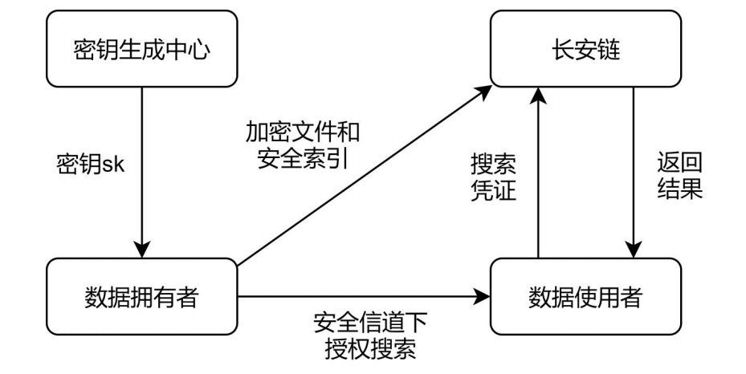

# 密文检索技术方案

​     随着区块链的迅速发展以及用户对个人数据隐私性的愈加重视，如何对存储在区块链中的密文进行搜索就显得格外重要．可搜索加密方法（searchable encryption，SE）是解决密文搜索的有效方法。长安链引入可搜索加密技术(Searchable Encryption, SE)对上链数据加密，保护链上数据隐私的同时支持用户对链上密态数据进行搜索，提高了长安链的可用性以及适配更丰富的应用场景的可能性。

了解使用方法，请参考[密文检索使用文档](../dev/密文检索使用文档.md)

## **需求概述**

​     随着区块链技术不断地蓬勃发展，为了保护用户的数据隐私，在上链之前需要对数据进行加密。但是加密之后的数据失去了明文特征，使得用户无法高效地进行检索。可搜索加密实现数据安全的同时支持对加密数据的搜索，保证了数据的安全性和可用性，作为解决上述问题的有效方法得到了迅速的发展。针对长安链目前隐私保护存在的问题与挑战，设计基于可搜索加密的长安链隐私保护机制，在不降低账本数据隐私保护强度的前提下，面向多用户和多关键词搜索场景支持对链上密态数据可检索操作，提高了长安链的可用性和适配性;

## 具体针对场景

支持多用户: 针对长安链丰富的应用场景,提供了密文检索SDK,支持灵活的适配各种应用场景;

支持多关键字：围绕长安链可搜索加密方案隐私保护机制设计并研发支持多关键字的灵活密态数据搜索方案，为丰富长安链可搜索加密方案的表达能力。

## **密文检索**

可搜索加密技术[1]是搜索技术和加密技术的结合。可搜索加密能够实现将用户的数据进行特殊的加密后上传到云服务器或者区块链上, 并且可以实现根据关键字进行检索的功能, 有些可搜索加密方案更能实现范围查询或布尔查询等高级检索功能。在方便用户使用的过程中, 也保护了文件的隐私安全。

### **密文检索分类**

​    现今众多的可搜索加密机制技术一般分为对称可搜索加密(SearchableSymmetric Encryption, SSE)和非对称可搜索加密(Asymmetric SearchableEncryption, ASE),非对称可搜索加密[2]目前一般又称为公钥可搜索加密(Public Key Encryption With Searching, PEKS)。两者有不同的应用场景和构造方式。对称可搜索加密一般考虑单用户使用的情况, 相当于建立个人加密云盘, 依赖对称加密算法进行方案构造。公钥可搜索加密一般考虑多用户使用的场景例如邮件系统或者多人文件共享系统, 主要依赖公钥加密算法进行构造。

### **密文检索研究现状**

​    自从 SE 机制提出后,针对其所能部署的应用场景得到了研究者的关注.从 SE机制提出初期的数据所有者独享数据[3],到后来数据所有者将搜索的能力共享给其他用户[4],云存储环境下的一些特殊场景中用户私密数据的管理[5],以及基于区块链下的可搜索加密研究[6，7，8]等.针对不同的应用场景,需要相应的 SE机制来支持,因此设计适合目的应用场景的 SE 机制,是应用密码学领域的研究方向之一。

## **长安链采用的密文检索方案**

### **基本概念**

长安链采用的可搜索加密是基于多关键字模糊搜索加密方案，利用局部敏感哈希和布隆过滤器来构造索引，使用距离可恢复加密算法对该索引进行加密，实现了对多关键字的密文模糊搜索，最后 top-k 算法对检索结果进行优化，可以更好的满足用户的查询需求。与已有研究工作相比不需要预定义字典库，降低了存储开销，同时还保证了方案的安全性与隐私性。

### **算法构造**

1. sk←KenGen（λ）：初始化算法，由密钥生成中心负责，主要用于生成密钥。

输入安全参数λ，输出密钥 sk。

2. I←BuildIndex（sk，F，W）：生成安全索引算法，由数据拥有者负责，主要用于生成文件对应的安全索引。输入密钥 sk、文件标识符集合Ｆ以及关键字集合 W，输出安全索引Ｉ。

3. t←Trapdoor(sk,Q)：生成陷门算法，由数据使用者负责，用于加密查询关键字集合生成安全陷门。输入密钥 sk 以及查询关键词集合Ｑ，输出安全陷门ｔ。

4. FR←Search(I, t)：搜索算法，由长安链负责。输入安全索引 I 和安全陷门 t，输出文件序列集合 FR。主要进行安全索引与安全陷门的匹配，如果匹配成功就返回该索引对应的文件标识符；如果匹配不成功，则无返回结果。

## 数学原理

### 示例合约整体架构

1. 密钥生成中心（CA）：负责生成系统参数和相应密钥。

2. 数据所有者（DO）：DO 首先使用对称加密算法对原始文件进行加密，然后生成其对应的加密关键字索引。最后，它将加密文件和相应的关键字索引存储到长安链上。

3. 数据用户（DU）：DU 经过严格的授权验证后，在安全信道中获得 DO 的私钥（秘钥协商）。DU 通过多个搜索关键字生成陷门 Token，然后将陷门 Token 发送给长安链进行搜索。

4. 长安链（CM）：为 DO 提供文件存储服务，为 DU 提供搜索服务。并且支持数据更新服务。

## **参考**

[1] Kamara, Seny, Charalampos Papamanthou, and Tom Roeder. "Dynamic searchable symmetricencryption." *Proceedings of the 2012 ACM conference on Computer and communications security*. 

2012.[2] Boneh D, Crescenzo G, Ostrovsky R, et al. Public key encryption with keyword search[C]. Proceedings of Eurocrypt 2004, Interlaken, Switzerland, 2004. 506-522.

[3] Song D, Wagner D, Perrig A. Practical techniques for searches on encrypted data. In: Proc. ofthe 2000 IEEE Symp. on Security and Privacy. Berkeley: IEEE Computer Society, 2000. 44-55 .

[4] Li J, Wang Q, Wang C, Cao M, Ren K, Lou WJ. Fuzzy keyword search over encrypted data incloud computing. In: Proc. of the IEEE INFOCOM Mini-Conf. San Diego: IEEE Computer Society, 2010.1-5.

[5] Wang C, Cao N, Li J, Ren K, Lou WJ. Secure ranked keyword search over encrypted cloud data.In: Proc. of the IEEE 30th Int’l Conf. on Distributed Computing Systems (ICDCS). Genoa: IEEEComputer Society, 2010. 253-262 .

[6] Hu S , Cai C , Qian W , et al. Searching an Encrypted Cloud Meets Blockchain: A Decentralized, Reliable and Fair Realization[C]// IEEE INFOCOM 2018 - IEEE Conference on ComputerCommunications. IEEE, 2018.

[7] Li X , Li J , Yu F , et al. BEIR:A Blockchain-based Encrypted Image Retrieval Scheme[C]// 2021IEEE 24th International Conference on Computer Supported Cooperative Work in Design(CSCWD). IEEE, 2021.

[8] B. Wang, S. Yu, W. Lou and Y. T. Hou, "Privacy-preserving multi-keyword fuzzy search overencrypted data in the cloud," IEEE INFOCOM 2014 - IEEE Conference on ComputerCommunications, 2014, pp. 2112-2120, doi: 10.1109/INFOCOM.2014.6848153.