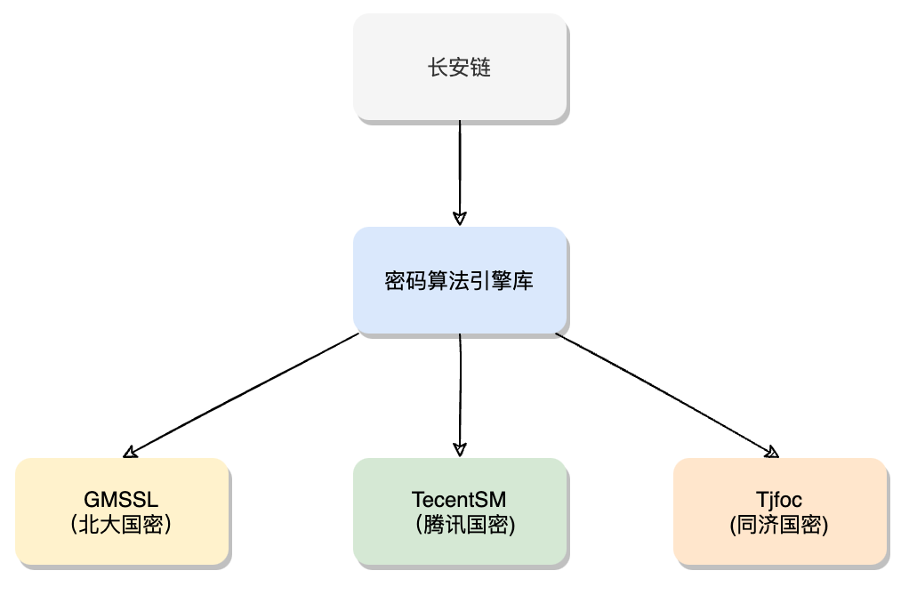

# 密码算法引擎介绍和使用手册

## 密码算法引擎介绍
长安链支持多种密码算法引擎，并支持 __动态可配置__,长安链引入多种密码算法引擎主要考虑以下几点：
* 不同密码库密码算法实现性能差异较大
* 不同密码库开源开放程度不同
* 开源密码库活跃程度，已知漏洞是否能够及时修复
* 密码库实现语言以及跨平台兼容问题 
  
长安链当前已支持引擎如下：



- 同济国密库 Tjfoc， 代码库地址 https://github.com/tjfoc/gmsm
- 北大国密库 GMSSL， 代码库地址 https://github.com/guanzhi/GmSSL
- 腾讯国密库 TencentSM，暂未开源

## 密码算法引擎配置
在长安链chainmaker.yml配置文件中，通过配置项crypto_engine来配置具体的密码算法引擎，如下:

```yaml
log:
  config_file: ../config/wx-org2/log.yml # config file of logger configuration.

#crypto engine config setting
crypto_engine: tjfoc #support gmssl, tencentsm and tjfoc

blockchain:
  - chainId: chain1
    genesis: ../config/wx-org2/chainconfig/bc1.yml
```

其中，crypto_engine目前支持tjfoc、gmssl以及tencentsm配置选项，缺省配置为tjfoc.  
注：密码算法引擎目前仅支持SM2和SM4，用来进行算法性能优化.如果长安链网络使用非国密启动（或者非linux平台），则该配置项不会生效。

## 不同引擎密码算法性能对比 
__软硬件环境__ 
- 处理器：6-Core Intel Core i7， 2.6 GHz 
- 内存：16 GB 
- go版本：go1.16.6 darwin/amd64
  
__测试方法__  
- c实现密码库，统一使用cgo进行了封装，性能上有一定影响
- 采用golang原生benchmark进行测试（串行性能）
- 测试使用数据msg=“hello world”， 加解密直接针对msg，签名/验证操作先对msg取sm3哈希
  
__测试结果__  
1. SM2性能对比（TPS)

| 密码库 | 签名 | 验证 | 加密 | 解密 | 
| ------ | ------ | ------ | ------ |-----| 
| 同济库 | 3194 | 691 | 680 | 984 | 
| 北大gmssl | 32793 | 17258 | 7633 | 8902 | 
| 腾讯国密 | 43951 | 26937 | 29283 | 17054 | 

2.  SM3性能对比 (TPS)

| 密码库 | 哈希 | 
| ------ | ------ | 
| 同济库 | 1767591 | 
| 北大gmssl | 2159385 | 
| 腾讯国密 | 3048235 |

3. SM4性能对比 (TPS)

| 密码库 | 加密 | 解密 | 
| ------ | ------ | ------ | 
| 同济库 | 722229 | 1844478 | 
| 北大gmssl | 399276 | 484226 | 
| 腾讯国密 | 768583 | 2777679 | 