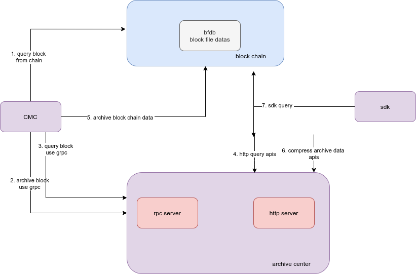
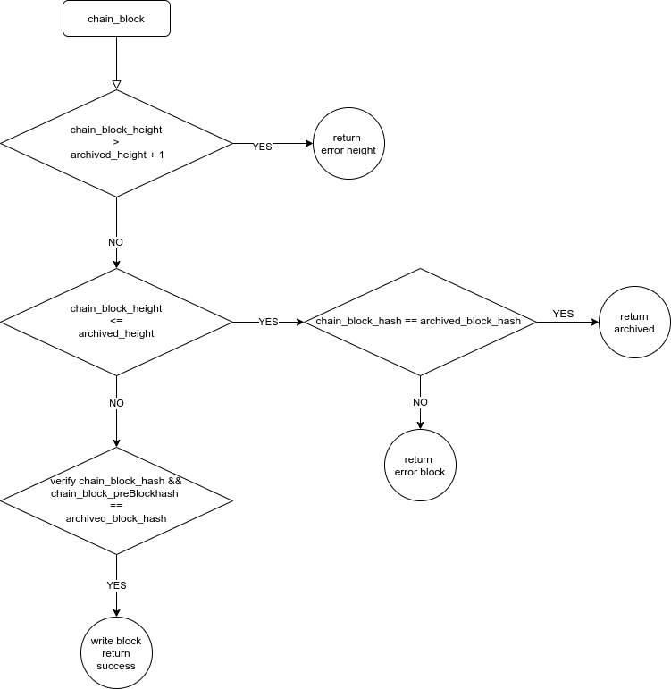
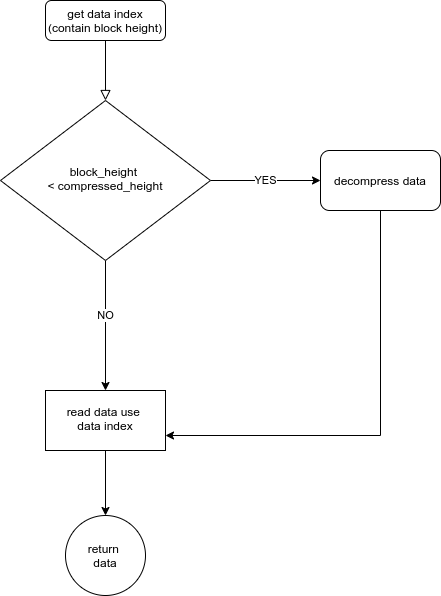

# 归档中心设计和实现

## 概述
随着区块链的运行，存储区块数据的文件会逐渐增长，占用大量的磁盘空间。为减少`冷数据(低频使用的旧的区块数据)`的磁盘占用，`长安链·归档中心`v1.0.0版本提供了数据归档备份，归档数据数据查询，已归档数据扫描清理一整套解决方案

## 设计

### 整体流程
- 用户使用`CMC`工具，发送归档命令。该指令从链上查询出区块，将该区块数据通过GRPC传送到`归档中心`(对应下图步骤1，2)
- 用户可以通过`CMC`工具在`归档中心`查询已经归档数据(如步骤3)，也可以通过http接口查询(如步骤4)
- 用户使用`CMC`工具的清理数据命令，该命令会根据传入的区块高度参数来(如图步骤5)计算出一个合适的区块高度，然后清理该高度以下的区块文件
- 用户使用`SDK`进行区块/交易查询时，`SDK`会自动先去归档中心查询(如果打开了归档中心的配置，且sdk_config.yml中的archive_center_query_first配置设置为true)，查不到数据会到链上查询(如图步骤7)
- 为进一步压缩已经归档到归档中心的文件数据，归档中心提供了压缩数据的功能(如图步骤6)    


<div align=center>

<center>归档中心整体流程</center>
</div>  

### 归档区块的逻辑
- 比较`待归档区块`的块高度和`归档中心已经归档的高度`，如果该区块与已归档的区块连不上，则报错。否则，检查该区块是否已经归档过。如该区块已经归档，则校验该区块hash是否和已归档的hash一致，如果一致则跳过，若不一致，则报错。若该区块尚未归档，则校验该区块hash是否正确，校验该区块指向的前一个区块hash是否正确。若正确则写入该区块数据，否则，报错。     
 <div>

<center>归档区块逻辑</center>
</div>  

### 归档中心查询数据的逻辑
- 根据查询条件，首先获取数据存储的索引信息。根据索引信息中的高度和`归档中心`已压缩数据的高度做比较。若低于压缩高度，说明已压缩，检查是否解压过，若未解压，则解压，然后取出数据即可；若大于压缩高度，则直接从文件中读取数据即可   

<div>

<center>归档中心查询数据逻辑</center>
</div>  

## 代码整体目录结构  

```bash

├── configs # 归档中心服务配置文件夹
│   ├── config.yml # 归档中心服务配置
│   ├── server_cert # 如果开启GRPC的TLS，为归档中心的证书和私钥
│   │   ├── archiveserver1.tls.key # 归档中心的私钥
│   │   └── archiveserver1.tls.crt # 归档中心的证书
│   └── trust_list # 如果开启了GRPC的TLS，为连接归档中心的CMC所使用的根证书
│       └── ca.crt # 签发CMC的根证书
├── src # 归档中心服务源码
│   ├── archive_utils # 公共utils代码 
│   ├── httpserver # http接口服务及处理
│   ├── interfaces # 归档中心存储的接口约定
│   ├── logger # 归档中心日志模块
│   ├── main.go # 归档中心入口
│   ├── process # 归档中心的业务处理模块
│   ├── rpcserver # rpc服务接口及处理
│   ├── serverconf # 解析配置文件
│   └── store
│       ├── filestore # 封装的存储，读取区块的底层文件系统实现
│       └── levelkv # 封装的底层levelkv数据库操作
└── ut_cover.sh # ut脚本

```   
## [详细使用见文档](../dev/%E5%BD%92%E6%A1%A3%E4%B8%AD%E5%BF%83%E4%BD%BF%E7%94%A8%E6%96%87%E6%A1%A3.md)