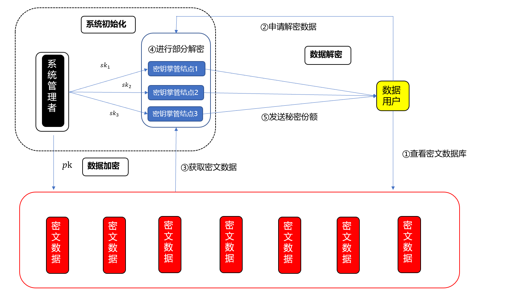

# 抗量子多方安全计算方案

## 需求背景
本模块为长安链提供一种抗量子的多方门限解密能力，加密方使用公钥对数据进行加密，多个私钥持有方联合对数据进行解密。

在区块链应用场景中，常常需要有大量隐私数据存储，为了保护数据的隐私，数据往往以加密的形式进行存储。但解密用的私钥如果在单个节点上进行管理，会造成节点权限过大和私钥泄露风险。

抗量子多方门限解密可以使得私钥由多个节点进行管理，需要对加密数据进行解密的时候，对多个私钥管理节点发起解密请求，私钥管理节点使用自己的私钥份额对数据执行解密，得到解密分片，将解密分片发送给解密请求方，解密请求方收集到一定数量的解密分片后，恢复出隐私数据。

传统多方门限解密的构造都依赖于大整数分解、离散对数求解等困难问题，然而在量子计算机的攻击下，这些困难问题将不再安全。基于格构造的密码算法通常依赖于格上的困难问题，如格上最短向量问题、最近向量问题，这些困难问题在量子计算机攻击下仍然是安全的。在众多基于格构造的密码算法中，基于NTRU格构造的算法具有输出向量短，运算高效的特性，本模块研究基于NTRU格的多方门限解密算法，利用线性秘密分享方案对私钥进行安全切割。

了解使用方法，请参考[抗量子多方安全计算使用文档](../dev/抗量子多方安全计算使用文档.md)
## 场景介绍

-	在业务场景中，某份敏感数据加密给董事会，用于汇报，由于数据敏感性，需要多个董事会成员在场，数据才能被解密。
-	医疗数据库中，病人的敏感数据通常加密存储，使用单私钥解密会使得私钥掌管方权限过大，切一旦私钥泄露，则会造成隐私数据泄露。通过多方门限解密，可以将私钥的解密能力分散给各个数据库监督管理节点，只有多个节点联合解密，请求数据方才能获得敏感数据。


## 实施方案
1. 长安链系统初始化后，将NTRU算法的私钥按（t-n）门限切割后分发给数据管理节点进行掌管。将公钥在系统内进行公开
2.	业务数据方使用公钥对隐私数据进行加密存储
3.	数据用户进行解密申请
- 数据用户通过智能合约向密钥掌管节点申请解密密文数据
- 密钥掌管节点执行部分解密得到解密分片
- 密钥掌管节点将解密分片发送给数据用户
- 数据用户收集到一定数量的解密分片后，执行最终解密。

整体架构如图所示


## 长安链的抗量子多方安全门限算法介绍

### 线性秘密分享方案

长安链的抗量子多方安全门限算法使用的线性秘密分享方案基于Dan Boneh等人于2018年提出的{0,1}-LSSS 方案，具体的细节为

(1) 首先对于一般的t/u门限方案，其对应的布尔表达式为析取范式 $\bigvee{(\bigwedge{P_i)}}$，其中$P_i$为第$i$个密钥掌管结点，这种特殊形式的布尔表达式中只包含“与”和“或”，因此是单调的布尔表达式，我们可以根据该布尔表达式构造一个二叉树结构，其叶子结点为表达式中的全部$P_i$，非叶子结点为两个子树对应表达式之间的“与”或者“或”，最后从树的根结点出发即可还原整个布尔表达式。

(2) 对上面得到的二叉树使用Folklore算法，详细过程如下:  
		a. 为根结点赋值$m_1=(1)$，令count=1；  
		b. 对表达式形成的树上的每个结点n执行如下操作：  
			若结点n对应“或”，则将结点n的值m赋给左右孩子；  
	        若结点n对应“与”，则在m的末尾补0，使得m的长度等于count，然后在m的后面补一个1并将其赋值给左孩子，最后将长为count+1的向量$(0,0,\ldots,0,-1)$赋给右孩子，并令count=count+1；  
        c. 取出所有叶子结点的值，并在这些值后面补0使得他们的长度相同。

(3) 对将得到的所有叶子结点的值按照顺序排成一列，构成一个$t\cdot C_u^t\ \times\ \left(t-1\right)\cdot C_u^t+1$的矩阵，该矩阵即为秘密分享矩阵M。  
(4) 为了得到私钥k对应的每个密钥掌管结点的秘密份额，首先在$Z_p$上按照离散高斯分布采样得到随机数$r_2,r_3,\ldots,r_n$，然后定义向量$w=M\cdot\left(k,r_2,r_3,\ldots,r_n\right)^T$，此时长为$t\cdot C_u^t$的列向量w中的每个数字即为对应密钥掌管结点$P_i$在进行秘密分享时的一个秘密份额。

## 抗量子多方门限加密方案
长安链的抗量子多方门限加密方案基于NTRU加密算法[2]构造，方案包含以下三个公共参数：正整数$N$，对应多项式的次数；大模数$q$和小模数$p$，满足$\left(q,p\right)=1$，且$q\gg p$，在方案中我们取$p=3$。此外，我们还需要定义多项式环$\mathcal{R}=Z\left[x\right]/(X^N-1)$。

抗量子多方门限加密方案的**密钥生成**过程如下：
  1. 首先任取多项式$F,G$，满足$F,G$的系数均属于${-1,0,1}$；
  2. 令$f\ =\ 1+pF$, 如果$f$在多项式环$\mathcal{R}_q$上不可逆，则重新选择多项式
  3. 令$g=pG$，定义$h=f^{-1}g\ mod\ q$
  4. 对于（t-n）门限，按线性秘密分享方案构造秘密分享矩阵shareMatrix，初始一条长度为shareMatrix列数的向量k，设置$k\left[0\right]=f$，其余分量按步骤（1）、（2），生成$f_1,f_2,\ldots$，并设置$k\left[1\right]=f_1,k\left[2\right]=f_2,...$
  5. 令$keys\ =\ shareMatrix\ \cdot k$，将$keys$各分量分给各参与方
  6. 输出公钥为$h$，私钥份额$keys$

抗量子多方门限加密方案的**加密**过程如下：
  1. 任取随机多项式$r$；
  2. 对于明文消息$m$，计算密文$y=r\ast h+m\ (mod\ q)$。

**部分解密**过程如下：
  1. 门限值t个参与方进行解密
  2. 各个参与方计算$a_i=f_i\ast y\left(mod\ q\right)$

**最终解密**过程如下：
  1. 计算$a\ =\ \sum a_i\left(mod\ q\right)$
  2. 明文$m=\ a(mod\ p)$


## 函数说明

### 相关结构体

#### PublicKey 

```
type PublicKey struct {
	H *poly.Polynomial
}
```

PublicKey结构体存储公钥信息，H为公钥多项式

#### PrivateKey

```
type PrivateKey struct {
	PublicKey   
       F         *poly.Polynomial
}
```

PrivateKey 结构体存储私钥信息，包括匹配的公钥、私钥对应多项式。

### 相关函数

#### Public

```
func (priv *PrivateKey) Public() *PublicKey
```

私钥获取对应公钥。

#### Encrypt

```
func (pub *PublicKey) Encrypt(rand io.Reader, plain *poly.Polynomial) (cipher *poly.Polynomial, err error)
```

公钥加密原多项式，生成加密多项式，rand 为随机源，plain 为原多项式，cipher 为加密后的多项式。


#### Decrypt

```
func (priv *PrivateKey) Decrypt(cipher*poly.Polynomial) (plain *poly.Polynomial)
```

使用私钥对加密多项式进行解密。cipher 为加密多项式，plain 为解密后的多项式。

#### GenerateKey

```
func GenerateKey(rand io.Reader) (privateKey *PrivateKey, err error)
```

根据随机源生成公私钥对，rand 为随机源，privateKey 为生成的私钥，内包含公钥

#### GenerateThresholdKey

```
GenerateThresholdKey(rand io.Reader, threshold, total int64) (privateKeys []*PrivateKey, err error)
```

生成门限算法秘密分享的多个公私钥对，rand 为随机源，threshold 为门限值，total 为生成的总密钥数量，privateKeys 为生成的多个密钥


## 正确性验证

在 ntru_test.go 文件中对密钥生成、加密、解密进行了正确性验证。


## 参考文献

[1] Boneh D, Gennaro R, Goldfeder S, et al. Threshold cryptosystems from threshold fully homomorphic encryption[C]//Annual International Cryptology Conference. Springer, Cham, 2018: 565-596.  
[2] Hoffstein J, Pipher J, Silverman J H. NTRU: A ring-based public key cryptosystem[C]//International algorithmic number theory symposium. Springer, Berlin, Heidelberg, 1998: 267-288.  