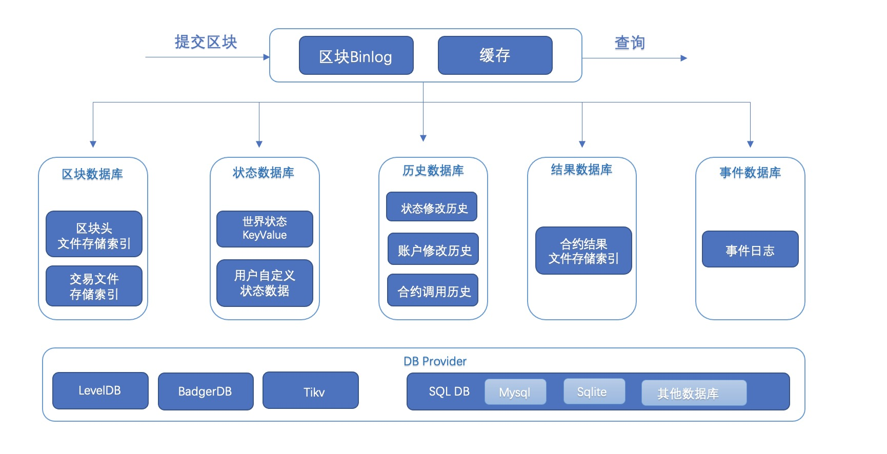
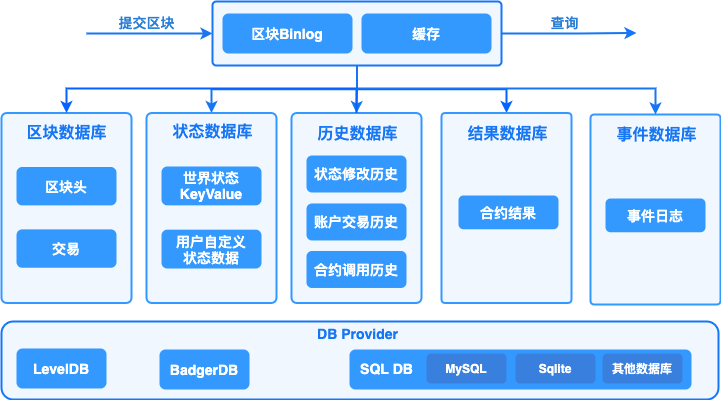
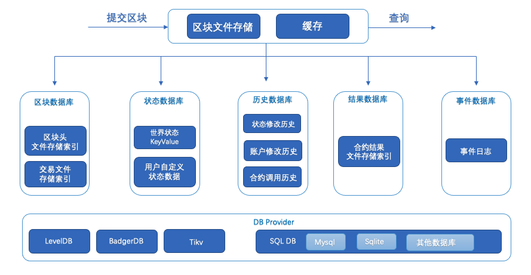
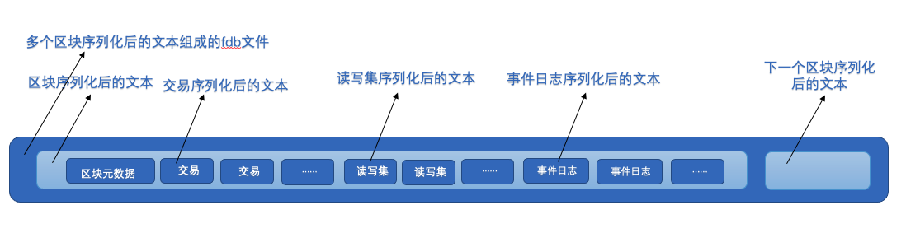
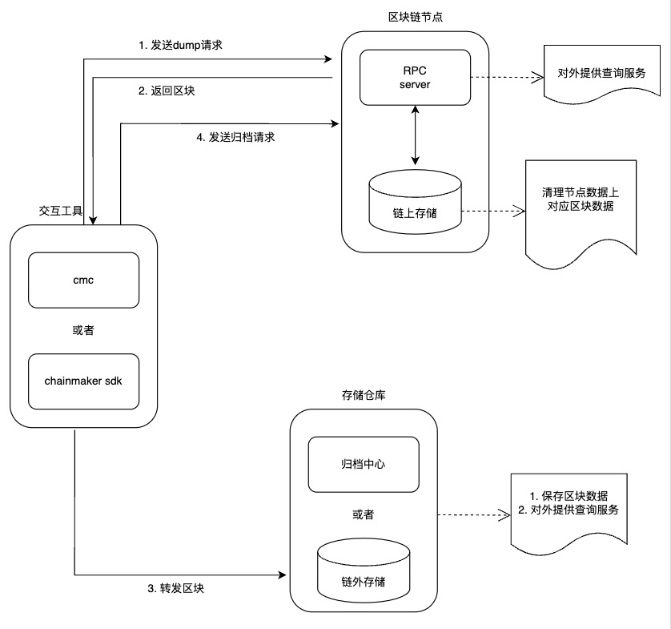
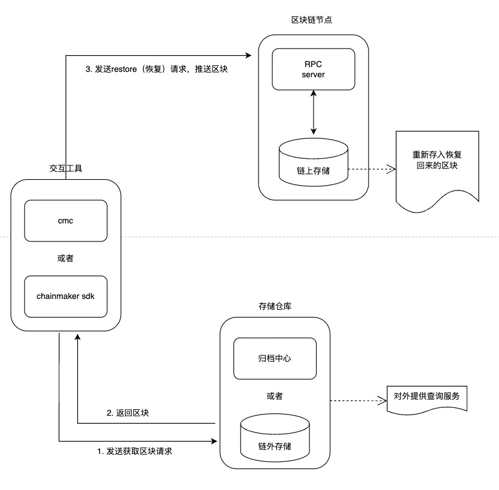
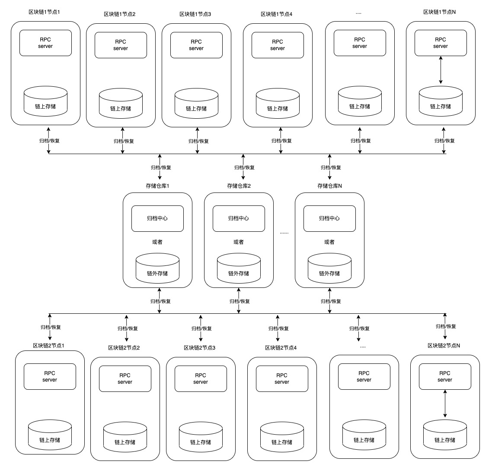
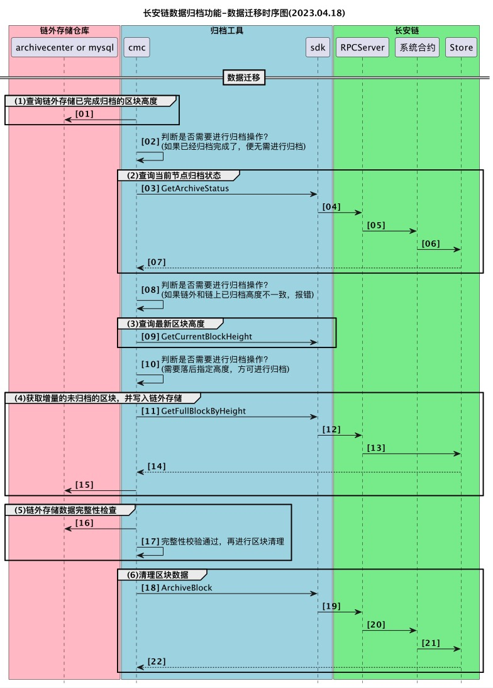
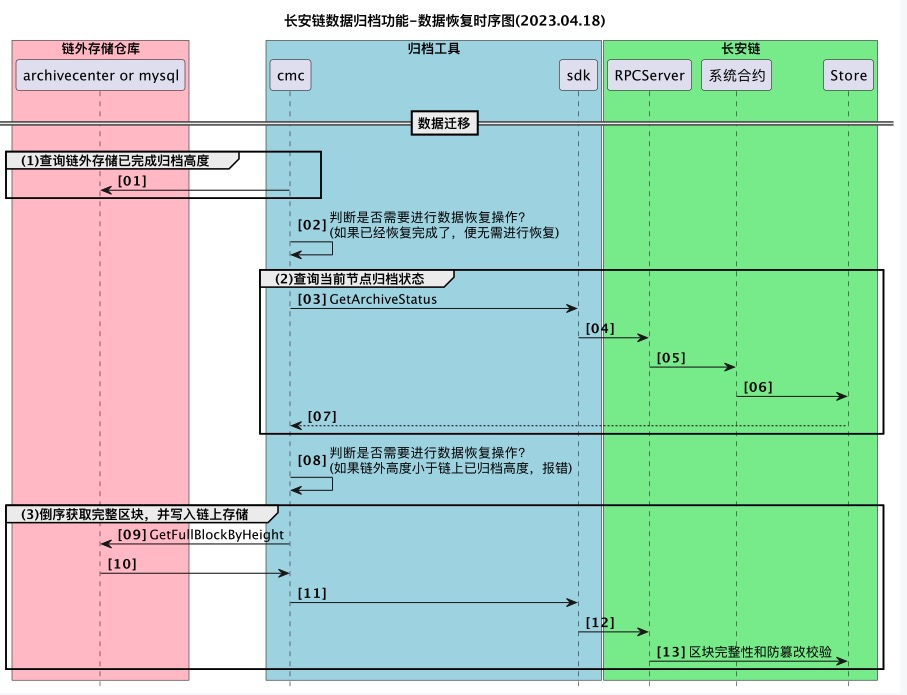
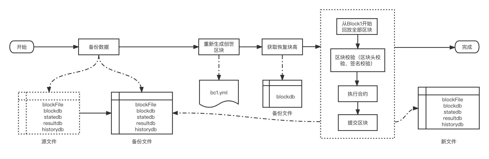

# 数据存储

##  概述

存储模块负责持久化存储链上的区块、交易、状态、历史读写集等账本数据，并对外提供上述数据的查询功能。区块链以区块为单位进行批量的数据提交，一次区块提交会涉及到多项账本数据的提交，比如：交易提交，状态数据修改等，所以存储模块需要维护账本数据的原子性。长安链支持常用的数据库来存储账本数据，如KV数据库（LevelDB、BadgerDB等）、分布式数据库（TikvDB等）和关系型数据库（MySQL、TDSQL和达梦等），业务可选择其中任意一种数据库来部署区块链。

账本数据主要分为5类：

1. 区块数据，记录区块元信息和交易数据：
    - 区块元数据包括：区块头、区块DAG、区块中交易的txid列表，additionalData等；
    - 交易数据，即序列化后的交易体，为了提供对单笔交易数据的查询，所以对交易数据进行了单独存储。
2. 状态数据，记录智能合约中读写的链上状态数据，即世界状态。
3. 历史数据，长安链对每笔交易在执行过程中的状态变化历史、合约调用历史、账户发起交易历史都可以进行记录，可用于后续追溯交易、状态数据的变迁过程。
4. 合约执行结果读写集数据，长安链对每笔交易在执行过程中的所读写的状态数据集进行了单独保存，方便其他节点进行快速的数据同步。
5. 事件数据，合约执行过程中产生的事件日志

## 存储模块运行逻辑

针对上述5类账本数据，长安链分别实现了5个DB类，分别是：Block DB、State DB、History DB、Result DB和Contract Event DB。采用多个数据库之后，就需要维护数据库之间的数据一致性，避免仅有部分数据库提交后，发生程序中断而导致不同数据库间的数据不一致，因此，长安链引入了Block binary log组件来持久化存储区块的原始内容，用于重启过程中的数据恢复，类似于数据库中的预写式日志(wal)的功能。 需要注意的是，历史数据、结果数据并不是每个节点必须保存的，节点可以根据自己的业务需要在配置文件中启用或者关闭历史数据库和结果数据库。



## 区块提交流程

1.  首先将序列化后的区块、读写集数据、以及最新的区块高度写入Block binary log，用于异常中断后的数据恢复。为了提高性能，加入一层cache，新区块提交请求在更新完Block binary log之后，再将区块数据写入cache，在更新完log和cache后，提交即可返回，由后台线程异步更新Block DB、State DB、ContractEvent DB、History DB和Result DB。
2.  在Block DB中记录区块元信息与交易信息，其中交易信息以TxID作为主键存储，区块信息以BlockHeight作为主键存储，区块元信息中只记录交易ID列表，同时索引BlockHash到BlockHeight的映射关系。Block DB中额外记录了当前最新的区块高度（LastBlockHeight）作为checkpoint，用以重启后的数据恢复。
3.  在State DB中保存state数据，key为合约名与对象主键的组合：<contractName, ObjectKey>，同时记录最新的区块高度（LastBlockHeight）作为checkpoint。
4.  在History DB中记录交易产生的三种类型的索引：
    1.  状态变更历史，以<contractName, ObjectKey，TxId>为索引
    2.  合约调用历史，以<contractName, TxId>为索引
    3.  账户交易历史，以<accountId,TxId>为索引
5.  在Result DB中记录交易的读写集，读写集以TxID作为key，同时记录最新的区块高度（LastBlockHeight）作为checkpoint。
6.  在ContractEventDB中记录下交易结果的EventLog，并记录最新区块高度作为checkpoint。

## 账本恢复流程

如果区块正在提交过程中，节点因异常退出，节点在下次启动时存储模块会进入恢复流程：

1. 分别从Block binary log、Block DB、State DB、ContractEvent DB、History DB、Result DB中获取最新的区块高度，以Block binary log中的区块高度作为基准高度，判断其他DB是否落后基准高度。
2. 如果有某个DB落后基准高度，则从Block binary log中获取缺失的区块及读写集，依次提交到落后DB中。
3. 所有DB同步到基准高度后，存储模块启动完成，节点进入正常流程。

## 存储接口说明

```go
// BlockchainStore provides handle to store instances
type BlockchainStore interface {
    StateSqlOperation
    SysContractQuery
    MemberQuery
    //InitGenesis 初始化创世单元到数据库
    InitGenesis(genesisBlock *store.BlockWithRWSet) error
    // PutBlock commits the block and the corresponding rwsets in an atomic operation
    PutBlock(block *common.Block, txRWSets []*common.TxRWSet) error

    // GetBlockByHash returns a block given its hash, or returns nil if none exists.
    GetBlockByHash(blockHash []byte) (*common.Block, error)

    // BlockExists returns true if the black hash exist, or returns false if none exists.
    BlockExists(blockHash []byte) (bool, error)

    // GetHeightByHash returns a block height given its hash, or returns nil if none exists.
    GetHeightByHash(blockHash []byte) (uint64, error)

    // GetBlockHeaderByHeight returns a block header by given its height, or returns nil if none exists.
    GetBlockHeaderByHeight(height uint64) (*common.BlockHeader, error)

    // GetBlock returns a block given its block height, or returns nil if none exists.
    GetBlock(height uint64) (*common.Block, error)

    // GetLastConfigBlock returns the last config block.
    GetLastConfigBlock() (*common.Block, error)
    //GetLastChainConfig return the last chain config
    GetLastChainConfig() (*configPb.ChainConfig, error)
    // GetBlockByTx returns a block which contains a tx.
    GetBlockByTx(txId string) (*common.Block, error)

    // GetBlockWithRWSets returns a block and the corresponding rwsets given
    // its block height, or returns nil if none exists.
    GetBlockWithRWSets(height uint64) (*store.BlockWithRWSet, error)

    // GetTx retrieves a transaction by txid, or returns nil if none exists.
    GetTx(txId string) (*common.Transaction, error)
    //GetTxWithRWSet return tx and its rw set
    GetTxWithRWSet(txId string) (*common.TransactionWithRWSet, error)
    //GetTxInfoWithRWSet return tx and tx info and rw set
    GetTxInfoWithRWSet(txId string) (*common.TransactionInfoWithRWSet, error)
    //GetTxWithInfo get tx and tx block information
    GetTxWithInfo(txId string) (*common.TransactionInfo, error)
    // TxExists returns true if the tx exist, or returns false if none exists.
    TxExists(txId string) (bool, error)
    // TxExistsInFullDB returns true and the latest committed block height in db if the tx exist,
    // or returns false and math.MaxUint64 if none exists.
    TxExistsInFullDB(txId string) (bool, uint64, error)
    // TxExistsInIncrementDB returns true if the tx exist from starHeight to the latest committed block,
    // or returns false if none exists.
    TxExistsInIncrementDB(txId string, startHeight uint64) (bool, error)
    // TxExistsInIncrementDBState returns
    // first return value is true if the tx exist from starHeight to the
    // latest committed block,or returns false if none exists.
    // second return value is true if inside the window or false if outside the window.
    TxExistsInIncrementDBState(txId string, startHeight uint64) (bool, bool, error)
    //GetTxInfoOnly get tx block height,timestamp, txindex
    GetTxInfoOnly(txId string) (*commonPb.TransactionInfo, error)
    //Deprecated, please use GetTxInfoOnly, retrieves a transaction height by txid, or returns nil if none exists.
    GetTxHeight(txId string) (uint64, error)

    //Deprecated, please use GetTxInfoOnly, returns the confirmed time for given tx
    GetTxConfirmedTime(txId string) (int64, error)

    // GetLastBlock returns the last block.
    GetLastBlock() (*common.Block, error)

    // ReadObject returns the state value for given contract name and key, or returns nil if none exists.
    ReadObject(contractName string, key []byte) ([]byte, error)

    // ReadObjects returns the state values for given contract name and keys
    ReadObjects(contractName string, keys [][]byte) ([][]byte, error)

    // SelectObject returns an iterator that contains all the key-values between given key ranges.
    // startKey is included in the results and limit is excluded.
    SelectObject(contractName string, startKey []byte, limit []byte) (StateIterator, error)

    // GetTxRWSet returns an txRWSet for given txId, or returns nil if none exists.
    GetTxRWSet(txId string) (*common.TxRWSet, error)

    // GetTxRWSetsByHeight returns all the rwsets corresponding to the block,
    // or returns nil if zhe block does not exist
    GetTxRWSetsByHeight(height uint64) ([]*common.TxRWSet, error)

    // GetDBHandle returns the database handle for given dbName
    GetDBHandle(dbName string) DBHandle

    //GetArchivedPivot returns the archived pivot (include this pivot height)
    //Deprecated
    GetArchivedPivot() uint64

    // GetArchiveStatus returns archive status
    GetArchiveStatus() (*store.ArchiveStatus, error)

    // ArchiveBlock the block after backup
    ArchiveBlock(archiveHeight uint64) error

    //RestoreBlocks restore blocks from outside block data
    RestoreBlocks(serializedBlocks [][]byte) error

    // Close closes all the store db instances and releases any resources held by BlockchainStore
    Close() error
    //GetHistoryForKey 查询某合约中某个Key的变更历史
    GetHistoryForKey(contractName string, key []byte) (KeyHistoryIterator, error)
    //GetAccountTxHistory 查询一个账户的交易历史记录
    GetAccountTxHistory(accountId []byte) (TxHistoryIterator, error)
    //GetContractTxHistory 查询一个合约的调用交易历史记录
    GetContractTxHistory(contractName string) (TxHistoryIterator, error)
}

//StateSqlOperation 状态数据库的SQL操作
type StateSqlOperation interface {
    //QuerySingle 不在事务中，直接查询状态数据库，返回一行结果
    QuerySingle(contractName, sql string, values ...interface{}) (SqlRow, error)
    //QueryMulti 不在事务中，直接查询状态数据库，返回多行结果
    QueryMulti(contractName, sql string, values ...interface{}) (SqlRows, error)
    //ExecDdlSql 执行建表、修改表等DDL语句，不得在事务中运行
    ExecDdlSql(contractName, sql, version string) error
    //BeginDbTransaction 启用一个事务
    BeginDbTransaction(txName string) (SqlDBTransaction, error)
    //GetDbTransaction 根据事务名，获得一个已经启用的事务
    GetDbTransaction(txName string) (SqlDBTransaction, error)
    //CommitDbTransaction 提交一个事务
    CommitDbTransaction(txName string) error
    //RollbackDbTransaction 回滚一个事务
    RollbackDbTransaction(txName string) error
    //CreateDatabase 为新合约创建数据库
    CreateDatabase(contractName string) error
    //DropDatabase 删除一个合约对应的数据库
    DropDatabase(contractName string) error
    //GetContractDbName 获得一个合约对应的状态数据库名
    GetContractDbName(contractName string) string
}

//SysContractQuery query system contract data
type SysContractQuery interface {
    GetContractByName(name string) (*commonPb.Contract, error)
    GetContractBytecode(name string) ([]byte, error)
}

//MemberQuery query member information
type MemberQuery interface {
    //GetMemberExtraData get member extra data by member
    GetMemberExtraData(member *accesscontrol.Member) (*accesscontrol.MemberExtraData, error)
}
```

## 数据库

### 概述

存储模块中的Block DB、State DB、History DB等都是封装后的DB对象，其具体实现要基于特定的数据库引擎，比如KV数据库（LevelDB、BadgerDB等）、分布式数据库（TikvDB等）和关系型数据库（MySQL、TDSQL和达梦）等引擎。为了实现可插拔的数据库引擎，长安链在数据库引擎之上封装了一层接口，并将LevelDB、BadgerDB、TikvDB、MySQL、TDSQL和达梦等数据库封装成DB provider。用户可以根据业务需求选择合适的数据库引擎作为长安链的底层存储组件。

<span id="storeMode"></span>
#### 数据库存储模式
长安链的存储分为RawDB(非文件存储)和BFDB(文件存储)两种方式
- RawDB：RawDB是指将数据完全存储在关系或非关系型数据库中RawDB的优点是数据存储在数据库中，存储运行逻辑如下图，此时所有数据都直接存放在业务数据库(区块数据库、状态数据库、历史数据库、结果据库、事件数据库)中
  


- BFDB：BFDB是指将区块数据存放在"区块文件存储"中，然后将"区块文件存储"的数据索引信息存放在区块数据库、结果据库，其他业务数据库(状态数据库、历史数据库、事件数据库)与RawDB的数据一样，存储运行逻辑如下图
  

  - RawDB和BFDB支持版本

| 节点数据存储类型 |  别称   |            配置方式             | chainmaker-go支持版本 | blockdb/resultdb/statedb/historydb等的provider | 是否推荐 |
|:--------:|:-----:|:---------------------------:|:-----------------:|:--------------------------------------------:|:----:|
|  RawDB   | 非文件存储 | disable_block_file_db:true  |    \>= v1.2.4     |         leveldb/badgerdb/tikvdb/sql          |  否   |
|   BFDB   | 文件存储  | disable_block_file_db:false |    \>= v2.2.0     |        leveldb/badgerdb/tikvdb/sqlkv         |  是   |

  - 注:
    - "长安链节点" BFDB归档方案不支持采用sql方式（provider: sql）存储的节点数据，用户可以使用sqlkv（provider: sqlkv）方式替代
    - 采用sql方式（provider: sql）存储的节点额外支持在链上部署支持sql的合约，但该sql合约性能偏低，不推荐使用
    - 表格中的provider为：chainmaker.yml -> storage -> blockdb_config/statedb_config/... -> provider

#### 支持的数据库类型

长安链目前支持6种数据库引擎可供选择，分别是LevelDB、BadgerDB、TikvDB、MySQL、TDSQL和达梦。

- LevelDB: 默认采用的数据库引擎，LevelDB作为一款嵌入式KV数据库，默认集成在长安链节点中，无需部署，性能也相对关系型数据要更好，适合在数据量不大的情况下使用。
- BadgerDB: 作为另一种形式的KV单机数据库的实现，也是嵌入式KV数据库，性能在写入value比较大时比LevelDB更高,但是读性能可能差于LevelDB，适合在数据量不大的情况下使用。
- TikvDB: 作为KVDB的横向扩容版本，需要单独启动tikv服务，底层使用rocksdb,性能更高。适合在大规模数据情况下使用，但是需要运营者自行负责tikv数据库集群的维护工作。[tikv部署流程](./Tikv安装部署.md)
- MySQL: (provider为：chainmaker.yml -> storage -> blockdb_config/statedb_config/resultdb/... -> provider)
    - 采用关系型数据库的方式(provider: sql)，支持schema和富查询，性能较KV数据库低，目前关系型数据库与区块链的状态数据并不能很好的结合，导致很少有区块链采用关系型数据库作为状态数据库。原因主要有两点：1.区块链需要对智能合约所读写的状态数据做严格的控制和校验，而SQL语句相对区块链来说过于灵活，难以控制；2.需要提前创建库表和索引，需要针对不同的智能合约创建不同的数据库表结构，不够灵活。目前长安链支持MySQL存储引擎，在系统数据如Block DB上支持区块元信息、交易信息的关系型语义，状态数据库支持kv的方式和智能合约编写SQL语句方式读写状态数据(world state)。
    - 采用模拟非关系型数据库的方式(provider: sqlkv)，类似KV数据库的方式组织数据存储到mysql中，适合搭配BFDB存储模式使用(用户数据量偏大时可将mysql数据库替换成TDSQL等分布式存储数据库)(推荐使用)。

<span id="store_config"></span>
###  配置说明

节点本地配置文件chainmaker.yml中存储部分的配置说明

> 注：
>
> 若需使用Mysql存储，特殊配置：max_allowed_packet 属性需比bc.yml中的block_size要大
>
> 临时修改：set global max_allowed_packet = 2 * 1024 * 1024 * 10
>
> 永久修改：
>
> vim /etc/my.cnf
> [mysqld]
> max_allowed_packet = 20M

```yml
storage:
  store_path: ../data/ledgerData  #账本的存储路径， 包括LevelDB、BadgerDB的数据目录，Block binary log的数据目录
  # block_store_tmp_path: "../data/ledgerData_tmp" # tmp file文件夹, 默认为""，即不配置，代表不开启该功能
  write_buffer_size: 4  #LevelDB的write_buffer_size， 单位为MB，默认为4M
  disable_historydb: false  #是否禁用历史读写集的存储功能， 默认为false，也就是保存历史读写集。
  disable_block_file_db: false  #是否禁用区块文件存储功能， 默认为true，也就是未启用,新节点建议此处设置为false。
  logdb_segment_async: false  #区块文件异步落盘与否， 默认为false，也就是默认同步落盘，异步落盘时存在断电后数据损坏风险。
  logdb_segment_size: 128  #区块文件大小，单位MB，默认64MB，最小值: 64MB。
  read_bfdb_timeout: 10000 # 读取 bfdb 下区块文件的超时时间，单位ms, 默认: 10000，即10s。
  unarchive_block_height: 300000 # 不允许归档的高度， 默认: 300000，归档最高高度为 当前高度 - unarchive_block_height。
  archive_check_interval: 10 # 归档操作检查间隔，单位s, 默认: 10，即10s。
  restore_interval: 60 # 恢复区块文件的间隔，单位s, 默认: 60，即60s，节点将在数据恢复操作60s后开始合并数据到链上。
  # encryptor: sm4    # Symmetric encryption algorithm for writing data to disk. can be sm4 or aes
  # encrypt_key: "1234567890123456" # Symmetric encryption key:16 bytes key。 如果 pkcs11 设置有值，代表打开encryption
  write_block_type: 0            # 0 common write，1 quick write

  # bigfilter config
  enable_bigfilter: false    #default false  是否使用bigfilter,如果使用需要安装redis
  bigfilter_config:
    redis_hosts_port: "127.0.0.1:6300,127.0.0.1:6301"   #redis host:port
    redis_password: abcpass  #redis password
    tx_capacity: 1000000000   #support max transaction capacity
    fp_rate: 0.000000001      #false postive rate

  # RWC config               
  enable_rwc: true          #default false, 是否开启滑动窗口缓存
  rolling_window_cache_capacity: 55000 # greater than max_txpool_size*1.1

  disable_state_cache: false   #default false, 是否关闭statedb缓存，模式是打开的.
  state_cache_config:            # statedb cache
    life_window: 3000000000000   # key/value ttl time, ns
    clean_window: 1000000000     # 间隔一定时间后清理 expired keys and values(clean up), ns
    max_entry_size: 500          # 每个entry的最大大小，单位byte。
    hard_max_cache_size: 1024    # 最大缓存大小，单位MB。
  blockdb_config: #BlockDB 数据库配置
    provider: leveldb #数据库类型，支持LevelDB，BadgerDB，TikvDB，Mysql，这里示例为LevelDB
    leveldb_config: #LevelDB的详细配置
      store_path: ../data/org1/blocks
      write_buffer_size: 4	#LevelDB的write_buffer_size， 单位为MB，默认为4M
      block_write_buffer_size:
  statedb_config: #StateDB 数据库配置
    provider: sqlkv  #数据库类型，支持LevelDB，BadgerDB，TikvDB，Mysql，这里示例为Mysql, 优先推荐使用'sqlkv'代替 'sql'
    # 或者 provider: sql
    sqldb_config: #SQL数据库的详细配置
      sqldb_type:  mysql #具体的RDBMS为mysql，也可以是sqlite、mssql等
      dsn:  root:password@tcp(127.0.0.1:3306)/ #MySQL的数据库连接字符串
      max_idle_conns: 10  #连接池中维持的最大的空闲连接数，默认为10
      max_open_conns: 10  #最大的可用连接数，默认为10
      conn_max_lifetime: 60  #连接维持的最长时间，单位秒，默认为60
  
  historydb_config: #HistoryDB数据库配置
    provider: badgerdb #数据库类型，支持LevelDB，BadgerDB，TikvDB，Mysql，这里示例为BadgerDB
    badgerdb_config:
      store_path: ../data/org1/history
      compression: 0 # value为0 不压缩，1 Snappy压缩，2 ZSTD压缩，默认为0
      value_threshold: 10240 # 单位为bytes，默认为10240 bytes
  resultdb_config: #ResultDB数据库配置
    provider: tikvdb # 支持LevelDB，BadgerDB，TikvDB，Mysql
    tikvdb_config:
       endpoints: "127.0.0.1:2379" # tikv pd server url，支持多个url， 如: "192.168.1.2:2379,192.168.1.3:2379"
       max_batch_count: 128 # 每次kv batch最大大小 默认128
       grpc_connection_count: 4 # chainmaker连接tikv的连接数， 默认4
       grpc_keep_alive_time: 10 # 保持连接的连接数， 默认10
       grpc_keep_alive_timeout: 3 # 保持连接的超时时间 默认3
       write_batch_size: 128 # 每次提交tikv批次最大大小，默认128
  disable_contract_eventdb: true  #是否禁止合约事件存储功能，默认为true，如果设置为false,需要配置mysql
  contract_eventdb_config:
    provider: sql                 #如果开启contract event db 功能，需要指定provider为sql
    sqldb_config:
      sqldb_type: mysql           #contract event db 只支持mysql
      dsn: root:password@tcp(127.0.0.1:3306)/  #mysql的连接信息，包括用户名、密码、ip、port等，示例：root:admin@tcp(127.0.0.1:3306)/
```

###  存储特性功能介绍

#### 区块文件存储(BFDB)
1. 区块文件存储从v2.2.0(>= v2.2.0)以后开始支持，默认未开启(在未配置时)。可以修改配置为开启(设置 disable_block_file_db:false), 使用chainmaker-go的配置生成工具生成配置时，此处的值为false，即生成的配置默认是开启的
2. 区块文件存储是适合区块数据库大于400GB以后的场景，采用与之前方案不同的区块存储方式，以解决日益增长的区块数据导致节点速度变慢的问题(推荐优先使用)，故暂时与旧版本的节点数据不兼容
3. 区块文件存储从v2.3.2开始支持归档
4. 区块文件存储未开启时，兼容旧版本的数据
5. 建议配置disable_block_file_db:false & logdb_segment_async: false
6. 文件存储实现原理:
   1. 区块在到达存储模块后会进行序列化操作，为下一步区块数据落盘做准备，此时我们将区块对象中的子对象单独序列化，同时记录序列化产生字节流的长度，然后再拼接起来，就是一个序列化之后的完整区块的字节流
   2. 在序列化和拼接的时候记录子对象在区块字节流的偏移量和长度，即: 某子对象在整个区块字节流的起始位置和长度，在反序列化字节流成对象的时候直接截取区块指定位置特定长度的片段，再反序列化，即可得到原始对象
   3. 区块字节流主要由区块元数据、交易、读写集、事件日志，由于区块文件存储不再删除存入的区块，同时也能具有原来WAL的效果，因此KV数据库中不再需要存储原始的区块信息，只需要存储区块原始数据在文件存储中的(区块元数据、交易、读写集、事件日志)索引即可
   4. 长安链在文件存储中定义了区块存储的文件.fdb文件，用于存放每次产生的区块文件,如下图：
   
   5. 在读取区块时，从KV数据库中获取区块所在在fdb文件名和在该文件中的起始和长度，然后再反序列化即可
   6. 在读取区块中的数据如交易时，同样获取该交易所在fdb文件名和在该文件中的起始和长度，然后再反序列化即可
   7. 文件存储可以将区块存储对于磁盘的KV数据库随机写，变成对于磁盘的顺序写，可以降低磁盘的读写压力，同时降低KV数据库的压力

#### 区块文件存储临时存储

区块临时存储: StoreTmpPath (配置名: block_store_tmp_path)
1. 该功能本质是在将区块文件先写到block_store_tmp_path，之后再移动到原来放置区块文件的文件夹(原bfdb文件夹), 用户可将block_store_tmp_path指定为SSD,fbdb指定为HDD以提高存储效率的同时，降低磁盘存储成本,流程如下图:
   
   
2. 运行流程：
    1. 节点启动后如果检查block_store_tmp_path值的长度大于0时，表示用户配置了StoreTmpPath
    2. 检查block_store_tmp_path文件路径是否存在，如果不存在，则尝试创建改文件夹
    3. 创建文件夹完成后会尝试向该文件夹写入tmp.txt文件，之后再删除，以测试对于该文件夹有写权限
    4. 上述流程一旦出错，则会打印出错误，且关闭StoreTmpPath功能，存储按照没有该功能的方式运行
    5. 若节点之前没有启动该功能，是在后期启用。可以在配置好block_store_tmp_path之后启动节点，然后立即关闭节点，再将原bfdb文件夹下面的.END文件覆盖到block_store_tmp_path下面的bfdb文件夹，之后再启动节点即可
    6. 节点在启用该功能后，区块文件按照原来的逻辑写入block_store_tmp_path下: 先生成.END文件，然后向其中写入区块，待其变成.fdb文件之后，节点会将.fdb文件移动到原bfdb文件夹下，同时block_store_tmp_path下会生成新的.END文件，如此循环运行
    7. 考虑到block_store_tmp_path和原bfdb文件夹可能处在不同的磁盘且可能存在网络盘，为了数据安全，这里的移动采用先拷贝再删除源文件的方式，且在拷贝失败时，还有2次重试。如果重试之后还是失败，会有协程10s扫描一次block_store_tmp_path，若发现有.fdb文件，将再次触发移动流程
    8. .fdb移动的过程是异步的，以降低移动对性能的影响。节点新启动时，若发现block_store_tmp_path下有.fdb文件，则会将.fdb文件移动到原bfdb文件夹，待移动完成后才能后续启动运行，该过程为同步移动
    9. 用户可将block_store_tmp_path指向性能更好的磁盘，以提高区块写入速度，将原来的bfdb路径指向性能不怎么好的磁盘，以节省成本。建议磁盘IO性能不相差太大，避免出现大量.fdb文件同时拷贝而不结束的情况，该情况会影响GetBlock的相关请求，影响会持续到对应.fdb文件移动完毕
3. 节点从未开启StoreTmpPath到开启该功能:
   1. 假设StoreTmpPath为"./youdata/ledgerData_TMP"，该节点为单链且chainID为chain1，将StoreTmpPath在chainmaker.yml中配置好。如: block_store_tmp_path: "./youdata/ledgerData_TMP"
   2. 先创建"./youdata/ledgerData_TMP/chain1/bfdb"文件夹(简称tmpfile)，且保证文件夹有读写权限
   3. 停止节点，跳转到原来放置.fdb的文件夹下,如: "yourprojectpath/build/release/chainmaker-v2.3.1-wx-org1.chainmaker.org/data/wx-org1.chainmaker.org/ledgerData1/chain1/bfdb",(简称originfile)
   4. 将originfile下的.END文件移动到tmpfile下，然后启动再节点,等待节点启动完毕即可。这里的移动为了安全起见，建议先拷贝originfile下的.END文件到tmpfile下，确认拷贝无误后，然后再删除originfile下的.END文件
   5. 若节点为多链结构，则chainID有多个，如: chain1,chain2,chain3..., 此时:
      
        originfile1: yourprojectpath/build/release/chainmaker-v2.3.1-wx-org1.chainmaker.org/data/wx-org1.chainmaker.org/ledgerData1/chain1/bfdb ----移动.END文件到---> tmpfile1: ./youdata/ledgerData_TMP/chain1/bfdb
        
        originfile2: yourprojectpath/build/release/chainmaker-v2.3.1-wx-org1.chainmaker.org/data/wx-org1.chainmaker.org/ledgerData1/chain2/bfdb ----移动.END文件到---> tmpfile1: ./youdata/ledgerData_TMP/chain2/bfdb
        
        originfile3: yourprojectpath/build/release/chainmaker-v2.3.1-wx-org1.chainmaker.org/data/wx-org1.chainmaker.org/ledgerData1/chain3/bfdb ----移动.END文件到---> tmpfile1: ./youdata/ledgerData_TMP/chain3/bfdb
        
        ...
4. 节点从开启StoreTmpPath到关闭该功能:
    1. 假设StoreTmpPath为"./youdata/ledgerData_TMP"，该节点为单链且chainID为chain1，将block_store_tmp_path在chainmaker.yml中配置删除
    2. 进入"./youdata/ledgerData_TMP/chain1/bfdb"文件夹(简称tmpfile)
    3. 停止节点，设原来放置.fdb的文件夹为: "yourprojectpath/build/release/chainmaker-v2.3.1-wx-org1.chainmaker.org/data/wx-org1.chainmaker.org/ledgerData1/chain1/bfdb",(简称originfile)
    4. 将tmpfile下的.END文件移动到originfile下，然后启动再节点,等待节点启动完毕即可。这里的移动为了安全起见，建议先拷贝tmpfile下的.END文件到originfile下，确认拷贝无误后，然后再删除tmpfile下的.END文件
    5. 若节点为多链结构，则chainID有多个，如: chain1,chain2,chain3..., 此时:
       
       tmpfile1: ./youdata/ledgerData_TMP/chain1/bfdb ----移动.END文件到---> originfile1: yourprojectpath/build/release/chainmaker-v2.3.1-wx-org1.chainmaker.org/data/wx-org1.chainmaker.org/ledgerData1/chain1/bfdb
           
       tmpfile2: ./youdata/ledgerData_TMP/chain2/bfdb ----移动.END文件到---> originfile2: yourprojectpath/build/release/chainmaker-v2.3.1-wx-org1.chainmaker.org/data/wx-org1.chainmaker.org/ledgerData1/chain2/bfdb
           
       tmpfile3: ./youdata/ledgerData_TMP/chain3/bfdb ----移动.END文件到---> originfile3: yourprojectpath/build/release/chainmaker-v2.3.1-wx-org1.chainmaker.org/data/wx-org1.chainmaker.org/ledgerData1/chain3/bfdb
           
       ...


#### MySQL数据库表

长安链支持选用MySQL作为账本存储引擎，节点启动会自动创建数据库，使用chainId作为数据库名，同时也会自动创建相应的表：

1. 区块元信息表

   ```sql
   CREATE TABLE `block_infos` (
    `chain_id` varchar(128) COLLATE utf8mb4_general_ci DEFAULT NULL COMMENT '链标识',
    `block_height` bigint(20) NOT NULL COMMENT '区块高度',
    `pre_block_hash` varbinary(128) DEFAULT NULL COMMENT '上个区块的散列值',
    `block_hash` varbinary(128) DEFAULT NULL COMMENT '本区块的散列值',
    `pre_conf_height` bigint(20) DEFAULT '0' COMMENT '上一次修改链配置的区块高度',
    `block_version` varbinary(128) DEFAULT NULL COMMENT '区块版本',
    `dag_hash` varbinary(128) DEFAULT NULL COMMENT '当前区块Dag的散列值',
    `rw_set_root` varbinary(128) DEFAULT NULL COMMENT '区块读写集的Merkle Root',
    `tx_root` varbinary(128) DEFAULT NULL COMMENT '区块交易的Merkle Root',
    `block_timestamp` bigint(20) DEFAULT '0' COMMENT '区块时间戳',
    `proposer` blob COMMENT '区块的生产者标识',
    `consensus_args` blob COMMENT '共识参数',
    `tx_count` bigint(20) DEFAULT '0' COMMENT '交易数量',
    `signature` blob COMMENT '区块生成者的签名',
    `dag` blob COMMENT '区块内交易的执行依赖顺序',
    `tx_ids` longtext COLLATE utf8mb4_general_ci COMMENT '区块中交易ID列表',
    `additional_data` longblob COMMENT '区块产生以后附加的数据',
    PRIMARY KEY (`block_height`),
    KEY `idx_hash` (`block_hash`)
   ) ENGINE=InnoDB DEFAULT CHARSET=utf8mb4 COLLATE=utf8mb4_general_ci;
   ```

2. 交易表

   ```sql
   CREATE TABLE `tx_infos` (
    `chain_id` varchar(128) COLLATE utf8mb4_general_ci DEFAULT NULL COMMENT '链标识',
    `sender` blob COMMENT '交易发送者信息',
    `tx_id` varchar(128) COLLATE utf8mb4_general_ci NOT NULL COMMENT '交易ID',
    `tx_type` int(11) DEFAULT NULL COMMENT '交易类型',
    `block_height` bigint(20) DEFAULT NULL COMMENT '交易所在区块高度',
    `offset` int(11) DEFAULT NULL COMMENT '交易在区块链中的位置',
    `timestamp` bigint(20) DEFAULT '0' COMMENT '链标识生成交易的unix时间戳',
    `expiration_time` bigint(20) DEFAULT '0' COMMENT '交易过期的unix时间戳',
    `request_payload` longblob COMMENT '交易的载荷数据',
    `request_signature` blob COMMENT '交易发送者的签名',
    `code` int(11) DEFAULT NULL COMMENT '交易执行结果的状态',
    `contract_result` longblob COMMENT '合约执行返回结果',
    `rw_set_hash` varbinary(128) DEFAULT NULL COMMENT '交易执行结果的读写集哈希',
    PRIMARY KEY (`tx_id`),
    KEY `idx_height_offset` (`block_height`,`offset`)
   ) ENGINE=InnoDB DEFAULT CHARSET=utf8mb4 COLLATE=utf8mb4_general_ci;
   ```

3. 世界状态表

   ```sql
   CREATE TABLE `state_infos` (
    `contract_name` varchar(128) COLLATE utf8mb4_general_ci NOT NULL COMMENT '合约名',
    `object_key` varbinary(128) NOT NULL DEFAULT '' COMMENT '状态数据的key',
    `object_value` longblob COMMENT '状态数据的value',
    `block_height` bigint(20) DEFAULT NULL COMMENT '该状态数据被修改时的区块高度',
    `updated_at` datetime(3) DEFAULT NULL COMMENT '该状态数据被修改时的节点本地时间',
    PRIMARY KEY (`contract_name`,`object_key`),
    KEY `idx_height` (`block_height`)
   ) ENGINE=InnoDB DEFAULT CHARSET=utf8mb4 COLLATE=utf8mb4_general_ci;
   ```

4. 历史读写集表

   ```sql
   CREATE TABLE `history_infos` (
    `tx_id` varchar(128) COLLATE utf8mb4_general_ci NOT NULL COMMENT '交易ID',
    `rw_sets` longblob COMMENT '读写集序列化后的数据', 
    `block_height` bigint(20) DEFAULT NULL COMMENT '该交易所在的区块高度',
    PRIMARY KEY (`tx_id`),
    KEY `idx_height` (`block_height`)
   ) ENGINE=InnoDB DEFAULT CHARSET=utf8mb4 COLLATE=utf8mb4_general_ci;
   ```

<span id="store_archive_restore"></span>
## 链上数据归档

### 归档需求

1. 节点在长时间运行后，会积累大量数据，这些数据不常访问，但不能丢弃，因此需要长安链需要提供数据归档功能
2. 归档之后节点需要能正常运行，不影响节点参与共识出块和对外提供服务
3. 归档出去的数据要支持在需要的时候恢复到节点上
4. 恢复的区块应该与原先归档的区块内容一致，能拒绝节点篡改后的区块恢复到节点上
5. 长安链在早期推出过一种数据归档和恢复方案，当前归档和恢复方案需要尽可能保持使用方式的一致

### 总体方案

#### 对区块链中的账本数据分类

1. 状态数据，仅存储最新的数据快照，无历史版本，数据量相对较少，而且数据是否冷热由业务决定，因此不考虑对状态数据做归档。
2. 非状态数据，如：区块、交易、历史读写集，数据量大，随交易不断膨胀，而且只读不修改，适合对某个区块高度之前的数据做归档。
3. 归档后节点对其他节点提供同步服务时，其他节点需选择已归档高度低于同步节点高度的节点

归档只对单个节点，由节点运营方发起对自己节点的归档

### 整体流程

1. 数据归档服务主要模块
   - 节点: 区块链中运行的节点服务，可以是共识节点，也可以是同步节点，产生并保存区块数据
   - 交互工具: cmc或者chainmaker-sdk等，与节点和链外存储工具的链接服务
   - 存储仓库:
     - 归档中心： 长安链主推的归档数据存储仓库，采用与节点类似的存储区块方式，提供数据压缩功能，降低磁盘存储成本，实现完整的数据查询功能，提供数据查询服务
     - 链外存储： 自长安链v1.2.x开始支持的链外mysql数据库，用户通过sql语句访问存储的数据，需自行组织sql语句访问
2. 数据归档流程

   
   - 交互工具发送dump请求，请求区块信息
   - 节点返回区块信息交互工具，交互工具转发区块到数据仓库
   - 数据仓库保存获取到的原始区块信息
3. 数据恢复流程

   
   - 交互工具发送请求，请求区块信息
   - 数据仓库返回区块信息到交互工具
   - 交互工具转发区块到节点，由节点存储恢复回来的区块
4. 数据归档/恢复服务拓扑

   
   - 单个数据仓库可以存储多条链的数据
   - 单个链或者节点可以存储数据到任意一个数据仓库
   - 节点和数据仓库通过校验节点的创始区块hash识别仓库存储的数据归属于哪条链
   - 同一个链的多个节点在同一个归档中心的数据是共用的

### 对外接口

#### 获取节点归档状态

**参数说明**
- 输出：输出节点当前采用归档类型：RawDB(全数据库/非文件存储)，BFDB(文件存储)
- 输出：已归档的区块高度
- 输出：节点允许的归档的最高高度
- 输出：当前节点的归档状态：Normal(正常), Archiving(正在归档), Restoring(正在恢复)
- 输出：当前节点上可恢复区块的暂存文件信息，是一个FileRange数组

```go
GetArchiveStatus() (*store.ArchiveStatus, error)

// archive status data
type ArchiveStatus struct {
  // store type: RawDB、BFDB
  Type StoreType `protobuf:"varint,1,opt,name=type,proto3,enum=store.StoreType" json:"type,omitempty"`
  // file range data
  FileRanges []*FileRange `protobuf:"bytes,2,rep,name=file_ranges,json=fileRanges,proto3" json:"file_ranges,omitempty"`
  // current archive pivot height
  ArchivePivot uint64 `protobuf:"varint,3,opt,name=archive_pivot,json=archivePivot,proto3" json:"archive_pivot,omitempty"`
  // max allow archive height
  MaxAllowArchiveHeight uint64 `protobuf:"varint,4,opt,name=max_allow_archive_height,json=maxAllowArchiveHeight,proto3" json:"max_allow_archive_height,omitempty"`
  // node archive process status: Normal、Archiving、Restoring
  Process ArchiveProcess `protobuf:"varint,5,opt,name=process,proto3,enum=store.ArchiveProcess" json:"process,omitempty"`
}

type FileRange struct {
  // file name: 00000000000000000019, fdb文件名
  FileName string `protobuf:"bytes,1,opt,name=file_name,json=fileName,proto3" json:"file_name,omitempty"`
  // file contains block start height
  Start uint64 `protobuf:"varint,2,opt,name=Start,proto3" json:"Start,omitempty"`
  // file contains block end height
  End uint64 `protobuf:"varint,3,opt,name=End,proto3" json:"End,omitempty"`
}

```

#### 归档区块

**参数说明**
- archiveHeight: 归档目标区块高度
- 备注：必须在ArchiveStatus.Process归档状态为Normal时才可调用成功
    - archiveHeight 范围：ArchivePivot < archiveHeight < MaxAllowArchiveHeight
    - ArchivePivot、MaxAllowArchiveHeight、Process可由GetArchiveStatus()接口获取
    - 返回"archive range less than"错误信息时，请调大archiveHeight值，直到成功
    - 实际的归档区块高度可能会比archiveHeight小，节点会根据当前存储状态自动选择合适的归档区块高度

```go
ArchiveBlock(archiveHeight uint64) error
```

#### 恢复区块

**参数说明**
- serializedBlocks: 要恢复的区块序列化之后的数据流数组，数组中的区块高度顺序必须是从低到高
- 备注：必须在ArchiveStatus.Process归档状态为Normal时才可调用成功，节点在最后收到区块(默认)1分钟之后再开始恢复数据写入链上操作
    - serializedBlocks数据演示:
        - 设恢复的区块范围为800～500， 每批次推送100个区块，则需推送4次
        - 推送区块给节点时区块的组织方式为(数值为区块高度):
            - 第一次推送区块高度: 701～800
            - 第二次推送区块高度: 601～700
            - 第三次推送区块高度: 501～600
            - 第四次推送区块高度: 500
        - 推送的区块中不能包含“节点暂存空间”存在的区块，否则会推送失败，可通过GetArchiveStatus()返回的FileRanges信息查看“节点暂存空间”已有哪些区块

```go
RestoreBlocks(serializedBlocks [][]byte) error
```


### “区块链节点”归档功能版本支持
长安链的存储分为RawDB(非文件存储)和BFDB(文件存储)两种方式

- 本处讨论的长安链支持的归档方式为“区块链节点“上数据的处理方式，用户在选择使用“数据仓库”时，可以自由选择使用归档中心、链外存储或者自己实现的数据仓库
- 节点支持的归档方案是在节点启动前在chainmaker.yml的storage配置中决定的，节点启动后就已经确定支持的归档方式。长安链节点提供两种归数据方式：RawDB(非文件存储)和BFDB(文件存储)，不同的存储方式对应了不同的数据归档内部运行方式，但对外提供的服务是相同的
- RawDB: 存储方式为将所有数据都直接存储在leveldb/mysql等数据库中，(disable_block_file_db:true)
    - RawDB的节点blockdb和resultdb存储数据scheme

|  业务数据库   |          key          |          value           | 归档操作目标 |   备注    | 归档 | 数据恢复 |
|:--------:|:---------------------:|:------------------------:|:------:|:-------:|:--:|:----:|
| blockdb  |  lastBlockNumKeyStr   |    lastBlockNumBytes     |   否    |    -    | -  |  -   |
| blockdb  |       heightKey       |    serializedMetaData    |   是    |    -    | 删除 |  恢复  |
| blockdb  |     blockHashKey      | block.Header.BlockHeight |   否    |    -    | -  |  -   |
| blockdb  |     blockTxIdKey      |        txBlockInf        |   否    |    -    | -  |  -   |
| blockdb  |        txIdKey        |         txBytes          |   是    |    -    | 删除 |  恢复  |
| blockdb  | lastConfigBlockNumKey |    lastBlockNumBytes     |   否    | 配置区块才会有 | -  |  -   |
| resultdb | resultDBSavepointKey  |    lastBlockNumBytes     |   否    |    -    | -  |  -   |
| resultdb |      txRWSetKey       |       txRWSetBytes       |   是    |    -    | 删除 |  恢复  |

- BFDB: 主要特点为降区块信息存储在长安链自研的文件存储系统中，只将相关索引和状态数据存放在leveldb/mysql等数据库中,(disable_block_file_db:false)
    - BFDB的节点blockdb和resultdb存储数据scheme


|  业务数据库   |          key          |          value           | 归档操作目标 |   备注    |          归档           |         数据恢复          |
|:--------:|:---------------------:|:------------------------:|:------:|:-------:|:---------------------:|:---------------------:|
| blockdb  |  lastBlockNumKeyStr   |    lastBlockNumBytes     |   否    |    -    |           -           |           -           |
| blockdb  |     blockIndexKey     |      blockIndexInfo      |   是    |    -    |          删除           |          恢复           |
| blockdb  |     metaIndexKey      |      metaIndexInfo       |   是    |    -    |          删除           |          恢复           |
| blockdb  |     blockHashKey      | block.Header.BlockHeight |   否    |    -    |           -           |           -           |
| blockdb  |     blockTxIdKey      |        txBlockInf        |   是    |    -    | 删除txBlockInf中的txIndex | 恢复txBlockInf中的txIndex |
| blockdb  | lastConfigBlockNumKey |    lastBlockNumBytes     |   否    | 配置区块才会有 |           -           |           -           |
| resultdb | resultDBSavepointKey  |    lastBlockNumBytes     |   否    |    -    |           -           |           -           |
| resultdb |     rwSetIndexKey     |       rwIndexInfo        |   是    |    -    |          删除           |          恢复           |

- “区块链节点”上归档功能支持详情表，存储角度：RawDB(非文件存储)和BFDB(文件存储)

| 节点数据存储类型 |               配置方式                |     支持版本     |       blockdb/resultdb        | statedb/historydb等 | 优先推荐的数据仓库 | 归档效率 |
|:--------:|:---------------------------------:|:------------:|:-----------------------------:|:------------------:|:---------:|:----:|
|  RawDB   | 非文件存储(disable_block_file_db:true) |  \>= v1.2.4  |  leveldb/badgerdb/tikvdb/sql  |      对该数据库无操作      |  链外mysql  |  低   |
|   BFDB   | 文件存储(disable_block_file_db:false) | \>= v2.3.1.1 | leveldb/badgerdb/tikvdb/sqlkv |      对该数据库无操作      |   归档中心    |  高   |

- “区块链节点”上归档功能支持详情表，节点角度：不同版本

|        长安链版本        | 节点数据存储类型 |               配置方式                | 是否支持 |       blockdb/resultdb        | statedb/historydb等 | 优先推荐的数据仓库 | 归档效率 |
|:-------------------:|:--------:|:---------------------------------:|:----:|:-----------------------------:|:------------------:|:---------:|:----:|
| >= v1.2.4 <v2.3.1.1 |  RawDB   | 非文件存储(disable_block_file_db:true) |  是   |  leveldb/badgerdb/tikvdb/sql  |      对该数据库无操作      |  链外mysql  |  低   |
| >= v1.2.4 <v2.3.1.1 |   BFDB   | 文件存储(disable_block_file_db:false) |  否   |           对该数据库无操作            |      对该数据库无操作      |     无     |  -   |
|     >= v2.3.1.1     |  RawDB   | 非文件存储(disable_block_file_db:true) |  是   |  leveldb/badgerdb/tikvdb/sql  |      对该数据库无操作      |  链外mysql  |  低   |
|     >= v2.3.1.1     |   BFDB   | 文件存储(disable_block_file_db:false) |  是   | leveldb/badgerdb/tikvdb/sqlkv |      对该数据库无操作      |   归档中心    |  高   |


注：
- "长安链节点" BFDB归档方案不支持采用sql方式（provider: sql）存储的节点数据，用户可以使用sqlkv（provider: sqlkv）方式替代
- 采用sql方式（provider: sql）存储的节点额外支持在链上部署支持sql的合约，但该sql合约性能偏低，不推荐使用

### [归档中心设计和实现](./归档中心设计和实现.md)

### 时序图
- 数据转存后归档：


- 数据恢复：



### [cmc工具操作](../dev/命令行工具.html#archive)

<span id="rebuild_dbs"></span>
## 数据恢复(rebuild_dbs)



1. 操作步骤 
   1. 停止区块链服务
   2. 执行数据恢复（执行过程如上图），示例如下
        
        ./chainmaker rebuild-dbs -c ../config/wx-org1-solo/chainmaker.yml ci-solo
        
   3. 查看日志，确认恢复成功

2. 使用限制
   
   1. 当前仅支持leveldb存储方式的恢复
   
3. 其他
   1. 执行数据恢复，会自动备份原数据
   2. 可以配置恢复区块高度，不配置则恢复全部
      
      storage:
      rebuild_block_height: 10
      
   3. 可以在命令行末尾添加chainid来指定恢复的chainid
      
      ./chainmaker rebuild-dbs -c ../config/wx-org1-solo/chainmaker.yml ci-solo --chain-id=chain1
      
   4. 可以在命令行末尾添加need-verify，对于可靠的数据恢复原始数据跳过区块验证过程，提高恢复速度，默认true
      
      ./chainmaker rebuild-dbs -c ../config/wx-org1-solo/chainmaker.yml ci-solo --chain-id=chain1 --need-verify=false
      
4. 用法
    1. 启用了文件存储功能(推荐启动)：
        1. 数据库恢复: 在数据库数据损坏时，使用block和ledgerData1文件夹的数据，可以重新生成其他文件夹的数据
        2. 数据同步: 在同步过程中，可以拷贝目标节点的block和ledgerData1数据，然后使用该工具在本地重新生成其他文件夹的数据，之后即可以快速启动链，达到快速同步的效果
        3. 回滚链到指定高度: 在最新数据写入紊乱，数据库不可用时，也可以使用该工具恢复到数据未紊乱时的高度，达到数据回滚的效果
    2. 未启用文件存储功能：
        1. 数据库恢复: 在数据库数据损坏时，需要完整的多个数据库文件夹，使用该工具重新生成数据到指定的数据未损坏时的高度
        2. 回滚链到指定高度: 在最新数据写入紊乱，数据库不可用时，也可以使用该工具恢复到数据未紊乱时的高度，达到数据回滚的效果


## 透明数据加密（TDE）

[透明数据加密（Transparent Data Encryption (简称TDE)）](透明数据加密.md)是指可以在文件层对数据和文件进行实时加密和解密，落盘的文件是加密后的内容，而对于上层应用系统和开发人员而言，加解密过程是无感知的，写入和读取的内容是明文内容，所以叫做透明数据加密。长安链密码模块同时提供了软件实现和硬件集成，使用以下步骤即可完成TDE的配置。

### 基于软件实现的TDE配置

#### 创建对称密钥

长安链的透明数据加密默认支持AES和国密SM4两种对称加密算法。AES算法支持128位、192位、256位这3种密钥长度，SM4算法支持128位密钥长度。密钥长度必须与对应的算法匹配，如果长度不匹配则无法正常启动长安链。我们以国密SM4算法为例，密钥推荐使用随机密码生成器生成的密码，比如“0H#y@EGXPOAScAnB”这样的形式，将有效提高数据的安全性，防止被字典破解。除了字符串形式的密钥，长安链还支持任意二进制形式的密钥，只要长度满足要求（国密SM4：128位）即可。新生成的密钥请做好安全备份，防止密钥丢失后数据无法解读。

#### 配置透明数据加密

在长安链节点的配置文件，即chainmaker.yml文件中，storage配置项下提供了对该节点TDE的配置选项，形如：

```
storage:
  encryptor: sm4    # sm4/aes
  encrypt_key: "1234567890123456" #16 bytes key
```

* encryptor是采用的对称加密算法，目前支持sm4和aes两个选项。
* encrypt_key是对称加密的密钥，支持字符串、十六进制和文件路径三种形式。
  - 字符串，支持字母大小写、数字、符号、空格等，长度必须满足加密算法要求
  - 十六进制，必须以0x开头，后面跟对应密钥的十六进制内容
  - 文件路径，将密钥保存到一个文件中，然后将文件绝对路径配置到这里，并确保长安链进程用户具有读写该文件的权限。
    以下配置示例：

```
storage:
  encryptor: aes    # sm4/aes
  encrypt_key: "0x48656c6c6f20436861696e4d616b6572" #16 bytes key
```

```
storage:
  encryptor: sm4    # sm4/aes
  encrypt_key: "/usr/key/my.key" #this file content is a 16 bytes key
```

#### 启用节点

完成TED的配置后，请确保当前节点没有任何数据，如果之前已经有数据，需要完全删除。节点启动后将会从创世区块开始基于TDE的密钥对每个区块每个交易每个世界状态Value进行统一的加密存储。
在encrypt_key上使用文件路径配置密钥的情况下，长安链在启动时将读取文件内容作为密钥，同时将文件内容清空，防止硬盘数据被盗时密钥也同时被盗。所以如果下次要重新启动长安链进程，必须重新在对应的密钥文件中写入密钥才能正常启动。

### 基于硬件密码机的TDE配置

基于软件的对称加密存在占用主机计算资源，密钥容易暴露的风险，基于硬件密码机的方案可以有效提升加解密的性能和密钥的安全性。长安链支持PKCS11标准的硬件密码机接入，以下为在TDE中启用硬件密码机集成的步骤。

#### 在加密中生成对称密钥

基于硬件密码机的情况下，密钥都托管在密码机内部，外部程序无法获得密钥内容，只能通过标准接口进行密钥生成、加解密、签名、哈希等密码学操作。进入密码机自带的管理后台可以为TDE生成对应的密钥，对称加密算法可选择AES或者国密SM4。密钥生成后会有一个对应的KeyID作为该密钥在密码机中的唯一标识，在接下来配置中会用到。

#### 配置PKCS11

长安链基于PKCS11标准与密码机进行通讯，其对应的配置在chainmaker.yml配置文件的node配置节点下，配置示例如下：

```
node:
  pkcs11:
    enabled: true
    library: /usr/local/lib64/pkcs11/libupkcs11.so      # path to the so file of pkcs11 interface
    label: HSM                                          # label for the slot to be used
    password: 11111111                                  # password to logon the HSM
    session_cache_size: 10                              # size of HSM session cache, default to 10
    hash: "SHA256"                                      # hash algorithm used to compute SKI
```

具体配置因为对应的密码机不同而不同，具体参见[硬件加密](硬件加密.md)章节。

#### 配置透明数据加密

在完成了node配置节点下的pkcs11配置后，接下来需要进行storage配置节点下关于TDE加密算法和密钥的配置，对于密码机，我们并不知道对应的密钥内容，只有密钥的ID，所以我们只需要配置成对应的KeyID即可，比如：

```
storage:
  encryptor: sm4    # sm4/aes
  encrypt_key: "MasterKey1" #密码机上对应KeyID
```

#### 启用节点

在完成配置后，同样是需要保证本节点的数据库是空的，如果之前已经同步过区块或者已经写入了创世区块，都需要删除。启动节点后，长安链将会把所有写入数据库的键值对数据中的Value部分发送给密码机进行加密，将加密后的内容进行存储。
