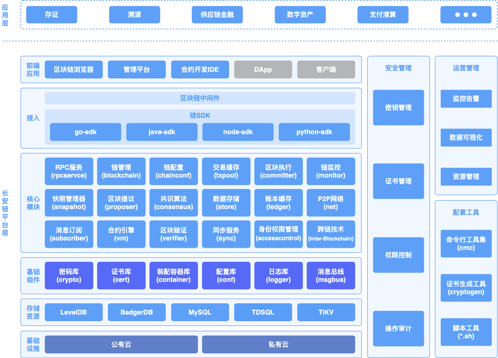

# 整体架构说明

## 逻辑架构

长安链逻辑架构如下图所示。主要包含以下元素：

- 共识节点（`consensus node`）：参与区块链网络中共识投票、交易执行、区块验证和记账的节点。
- 同步节点 (`sync node`)：或称见证节点，参与区块和交易同步、区块验证，交易执行，并记录完整账本数据，但不参与共识投票。
- 轻节点 (`light node`)：参与同步和校验区块头信息、验证交易存在性的节点。
- SDK：帮助用户通过RPC和区块链网络进行连接，完成合约创建、调用、链管理等功能。
- 区块链浏览器 (`ChainMaker broswer`)：通过可视化界面为用户展示区块信息、交易信息、节点信息等区块链信息。
- 管理平台 (`management platform`)：通过可视化界面方便用户对链进行管理、信息浏览和资源监控等。
- 合约IDE (`contract IDE`)：智能合约在线开发环境，长安链所有合约支持语言均可在该IDE上开发和编译。
- 命令行工具集 (`ChainMaker CLI, cmc`)：使用户可以用命令行的方式对链进行部署和管理操作，例如证书生成、链配置、交易发送等。


## 层级架构

自下而上，长安链由以下层级构成：

- 基础设施层：公有云、私有云，包括虚拟机、物理机等，为长安链提供基础运行环境。
- 存储资源层：为长安链节点提供数据存储服务，具体情况可参见[数据存储](./数据存储.md)章节。
- 基础组件层：为长安链节点提供密码学、配置、日志、常用数据结构等通用技术组件，具体可见[chainmaker-common](https://git.chainmaker.org.cn/chainmaker/chainmaker-common)项目。
- 核心模块层：长安链共识算法、核心引擎、虚拟机等核心模块，核心模块均采用可插拔设计，为可装配区块链奠定基础。
- 接入层：多语言链SDK，方便应用开发者与链交互。
- 前端应用层：包括区块链管理平台、区块链浏览器、合约开发IDE等，方便用户直接访问区块链底层平台。




<br><br>


## 核心流程

长安链区块产生的核心流程如下图所示，主要包括：

1. 提议候选区块。区块提议节点从交易池选取一批交易，并行调度执行得到结果，生成DAG，并将区块和DAG广播。
2. 共识候选区块。基于链上的共识机制，对候选区块进行共识投票。
3. 验证候选区块。在共识过程中，网络中其他节点针对提议的候选区块进行正确性验证。
4. 执行候选区块。将完成共识投票的区块提交记录至账本，并从交易缓存中移除。


<br><br>

## 数据结构

长安链（ChainMaker）核心数据结构皆采用protobuf3语法进行定义，以方便在不同的语言之间进行通信。长安链数据结构模型定义在[pb](https://git.chainmaker.org.cn/chainmaker/pb/-/tree/v2.3.2)项目下，并按功能和使用范围，分为：

* `accesscontrol` 与访问控制相关的用户账户、组织角色等对象
* `api` 与客户端SDK相关的对象
* `archivecenter` 与归档中心交互接口及对象定义* 
* `common` 核心区块头、交易、结果对象
* `config` 区块节点配置和网络配置等相关对象
* `consensus` 与共识相关的对象，不同的共识算法会有不同的共识对象
* `discovery` 用于P2P网络发现的对象
* `net` 用于P2P网络广播的消息对象
* `store` 进行账本和状态数据存储使用的对象
* `sync` 同步数据使用的相关对象
* `syscontract` 系统合约名称/方法/参数/常量对象
* `tee` 隐私计算对象
* `txfilter` 交易过滤器状态对象
* `txpool` 交易池相关对象
* `vm` 虚拟机引擎所需对象

ChainMaker官方提供ChainMaker协议的Golang实现，根据protobuf3数据模型定义，生成Golang代码在同级的pb-go目录下。
## 核心数据模型

### 区块
#### 结构示意图


#### 整体结构

```go
// Block definition
message Block {
    // header of the block
    BlockHeader header = 1;

    // execution sequence of intra block transactions, generated by proposer
    DAG dag = 2;

    // transaction list in this block
    repeated Transaction txs = 3;

    // stores the voting information of the current block
    // not included in block hash value calculation
    AdditionalData additional_data = 4;
}

// block additional data
message AdditionalData {
    // extra data, with map type, excluded in hash calculation
    map<string, bytes> extra_data = 1;
}

// transaction execution sequence
// Using adjacency table storage
message DAG {
    // Neighbor node: related party transactions with reading and writing conflicts
    message Neighbor {
        repeated uint32 neighbors = 1;
    }

    // sequence number of transaction topological sort
    //the sequence number of the transaction topological sort associated with the transaction
    repeated Neighbor vertexes = 2;
}
```

* Header：区块头
* Dag：块内交易的执行依赖顺序，由Proposer生成，如果为空则表示本区块的所有交易都可以并行执行，不存在前后依赖关系
* Txs：块内交易列表
* AdditionalData：区块产生以后附加的数据，不参与区块的散列值计算。可用于存储当前区块的投票信息，交易过滤等，具体内容根据链上配置的内容而决定

#### 区块头

```go
// header of the block
message BlockHeader {
    // block version
    uint32 block_version = 1;

    // config block or normal block or other else
    BlockType block_type = 2;

    // blockchain identifier
    string chain_id = 3;

    // block height
    uint64 block_height = 4;

    // block hash (block identifier)
    bytes block_hash = 5;

    // previous block hash
    bytes pre_block_hash = 6;

    // previous config block height, used to trace and check if chain config is valid
    uint64 pre_conf_height = 7;

    // count of transactions
    uint32 tx_count = 8;

    // merkle root of transactions
    // used to verify the existence of this transactions
    bytes tx_root = 9;

    // Save the DAG feature summary, and hash the DAG after Pb serialization
    // hash of serialized DAG
    bytes dag_hash = 10;

    // The root hash of Merkle tree generated by read_write_set_digest in the result of each transaction in the block
    // used to verify the read-write set of the block
    bytes rw_set_root = 11;

    // the time stamp of the block
    int64 block_timestamp = 12;

    // consensus parameters
    // used to store information, include in block hash calculation
    bytes consensus_args = 13;

    // proposal node identifier
    accesscontrol.Member proposer = 14;

    // signature of proposer
    bytes signature = 15;
}

// BlockType specify block pack txs type
enum BlockType {
    // Normal block, pack multi txs into one block
    NORMAL_BLOCK = 0;

    // Config block, only include 1 chain config update tx in this block
    CONFIG_BLOCK = 1;

    // Sql Contract init or upgrade block, only include 1 sql contract init or upgrade tx in this block
    CONTRACT_MGR_BLOCK = 2;

    // block.Txs[0] is a coinbase tx
    HAS_COINBASE = 4;
}
```
- BlockVersion：区块版本
- BlockType: 区块的类型，按打包的交易类型，分为普通区块、链配置区块、合约管理区块和拥有Coinbase交易的区块等。
- ChainId：链标识，用于区分不同的链，在多子链的情况下可区分不同的子链
- BlockHeight：区块高度，创世区块高度为0
- BlockHash：本区块的散列值
- PreBlockHash：上个区块的散列值
- PreConfHeight：上一次修改链配置的区块高度，在这个高度的区块中，只存在一笔交易，为配置交易，其中保存了区块链的配置信息，包括本区块应该采用的共识算法，加密算法等
- TxCount：交易数量
- TxRoot：区块交易的Merkle Root
- DagHash：当前区块Dag的散列值
- RwSetRoot：区块读写集的Merkle Root
- BlockTimestamp：区块的时间戳
- ConsensusArgs：共识参数
- Proposer：区块的生成者标识
- Signature：区块生成者的签名
### 交易结构
#### 交易结构示意图


####  交易结构定义
```go
// a transaction includes request and its result
message Transaction {
    // payload
    Payload payload = 1;

    // sender account and signature
    EndorsementEntry sender = 2;

    // endorser accounts and signatures
    repeated EndorsementEntry endorsers = 3;

    // result of the transaction
    Result result = 4;

    // payer account and signature
    EndorsementEntry payer = 5;
}
```

* Payload：交易的载荷数据，交易的核心信息
* Sender：交易的发起者信息和签名信息
* Endorsers：多签情况下，多个背书人的身份信息和其签名信息
* Result：交易结果，由Proposer生成区块时进行计算、赋值
* Payer：代付gas费的用户

#### 交易载荷

```go
//transaction payload
message Payload {
    // blockchain identifier
    string chain_id = 1;

    // transaction type
    TxType tx_type = 2;

    // transaction id set by sender, should be unique
    string tx_id = 3;

    // transaction timestamp, in unix timestamp format, seconds
    int64 timestamp = 4;

    // expiration timestamp in unix timestamp format
    // after that the transaction is invalid if it is not included in block yet
    int64 expiration_time = 5;

    // smart contract name
    string contract_name = 6;

    // invoke method
    string method = 7;

    // invoke parameters in k-v format
    repeated KeyValuePair parameters = 8;

    // sequence number, default is 0
    uint64 sequence = 9;

    // gas price+gas limit; fee; timeout seconds;
    bytes limit = 10;
}
// transaction type definition
enum TxType {
    // call a pre created contract, tx included in block
    INVOKE_CONTRACT = 0;

    // query a pre-created  contract, tx not included in block
    QUERY_CONTRACT = 1;

    // subscribe block info,tx info and contract info. tx not included in block
    SUBSCRIBE = 2;

    // archive/restore block, tx not included in block
    ARCHIVE = 3;
}
// a k-v pair
message KeyValuePair {
    string key = 1;
    bytes value = 2;
}
```

* ChainId：链标识，表明本交易是针对哪条链的，防止一个交易在多个链中被打包
* TxType：交易类型，目前有4种，合约调用、合约查询、订阅、归档。其中只有合约调用会被打包上链，另外几种只用于SDK与节点之间的通信协议
* TxId：交易ID，用做该交易的全局唯一性标识
* Timestamp：生成交易的unix时间戳，当proposer从交易池获取交易时，用来检测该交易是否超时未上链；如果超时，该交易将从交易池删除
* ExpirationTime：交易的到期的unix时间，单位秒，不为0时，交易必须在该时间戳之前被打包上链
* ContractName：被调用的合约名
* Method：被调用的合约方法名
* Parameters：调用合约方法时传入的参数列表，为Key/Value列表类型
* Sequence：交易的顺序号，0表示该交易没有顺序要求；大于0则按交易发起人顺序递增
* Limit：交易执行的限制，对于有Gas限制的场景，可以是GasLimit+GasPrice，对于有超时限制的场景，可以是Timeout毫秒数
#### 交易发送者与签名
```
// endorsement info, including a signer and his signature
message EndorsementEntry {
    // signer
    accesscontrol.Member signer = 1;

    // signature
    bytes signature = 2;
}
// member of blockchain
message Member {
    // organization identifier of the member
    string org_id = 1;

    // member type
    MemberType member_type = 2;

    // member identity related info bytes
    bytes member_info = 3;
}
enum MemberType {
    //X509 cert
    CERT = 0;
    //cert hash
    CERT_HASH = 1;
    //public key
    PUBLIC_KEY = 2;
    //did
    DID = 3;
    //alias
    ALIAS = 4;
    //address
    ADDR = 5;
}
```
* Sender：交易发送者信息，由Signer和Signature组成
* Signer为Member类型，主要包含以下信息：
  * OrgId：成员所属机构编号
  * MemberType：成员的类型，主要有：X509证书、证书哈希、公钥、DID、别名、地址等几种类型。
  * MemberInfo：成员的身份信息，可以是证书信息也可以是证书哈希，或者是公钥、DID、别名、地址等，依赖于MemberType字段
* Signature：交易发送者对Payload的签名，具体签名算法取决与链配置和X509证书中的签名算法

#### 交易结果

```go
// tx result, part of a transaction in block
message Result {
    // response code
    TxStatusCode code = 1;
    // returned data, set in smart contract
    ContractResult contract_result = 2;
    // hash of the transaction's read-write set
    bytes rw_set_hash = 3;

    string message = 4;
}

// invoke user contract method return UserContractReturnPayload
// Unmarshal from TransactResult.TxResponse.payload
message ContractResult {
    // user contract defined return code, 0-ok, >0 user define error code. for example, insufficient balance in token transfer
    uint32 code = 1;
    // user contract defined result
    bytes result = 2;
    // user contract defined result message
    string message = 3;
    // gas used by current contract(include contract call)
    uint64 gas_used = 4;
    // contract events
    repeated ContractEvent contract_event = 5;
}

// contract event saved in block chain
message ContractEvent {
    string topic = 1;
    string tx_id = 2;
    string contract_name = 3;
    string contract_version = 4;
    repeated string event_data = 5;
}
```

* TxStatusCode：交易执行结果的状态
* ContractResult：合约执行结果
  * Code：用户自定义的合约执行结果的状态，0表示成功，非0表示异常
  * Result：合约执行返回的结果
  * Message：合约执行返回的错误信息
  * GasUsed：合约执行消耗的Gas数量
  * ContractEvent：合约执行产生的事件日志
* RwSetHash：交易执行结果的读写集哈希
* Message：合约外返回的错误信息
### 交易请求结构

```go
// transaction request proposed by user
message TxRequest {
    // payload
    Payload payload = 1;

    // sender account and sender's signature
    EndorsementEntry sender = 2;

    // endorsers account and signatures
    repeated EndorsementEntry endorsers = 3;
}
```
用户发起一个交易请求的完整结构，包括：
* Payload：交易的载荷数据，交易的核心信息
* Sender：交易的发起者信息和发起者对Payload的签名信息
* Endorsers：多签情况下，多个背书人的身份信息和其对Payload的签名信息

### 交易响应结构

```go
// tx request - tx response, only for RPC response
message TxResponse {
  // response code
  TxStatusCode code = 1;
  // response message
  string message = 2;
  // returned data, set in smart contract
  ContractResult contract_result = 3;
  // tx id of request
  string tx_id = 4;
  // async tx mode: tx timestamp is zero
  // sync tx mode: tx timestamp is TxRequest.Payload.Timestamp
  int64 tx_timestamp = 5;
  // async tx mode: tx block height is zero
  // sync tx mode: tx block height is the height of block which this tx was packaged
  uint64 tx_block_height = 6;
}
```

* Code：交易执行结果的状态
* Message：交易错误信息
* ContractResult：合约执行结果
* TxId：对应的交易ID
* TxTimestamp： 创建交易的时间戳
* tx_block_height： 区块高度
### 交易执行结果的读写集
#### 读写集
```go
// TxRWSet describes all the operations of a transaction on ledger
message TxRWSet {
    // transaction identifier
    string tx_id = 1;
    // read set
    repeated TxRead tx_reads = 2;
    // write set
    repeated TxWrite tx_writes = 3;
}
```
读写集为交易合约正常执行后对其世界状态的改变情况的反应，主要包括：
* TxId 本读写集是由哪个交易产生的
* TxRead 读集列表
* TxWrite 写集列表
#### 读对象
读集主要用于在并发执行合约交易后判断并发的交易之间是否存在数据（版本）冲突，如果冲突则需要在DAG结构中反映交易之间的依赖情况，并调整冲突交易的执行顺序，重新执行合约。
```go
// TxRead describes a read operation on a key
message TxRead {
    // read key
    bytes key = 1;
    // the value of the key
    bytes value = 2;
    // contract name, used in cross-contract calls
    // set to null if only the contract in transaction request is called
    string contract_name = 3;
    // read key version
    KeyVersion version = 4;
}
```
一条交易读主要包括：
* ContractName 本读记录是读的哪个合约的状态数据
* Key 本记录读取的状态键值信息
* Version 读取到的版本
* Value 读取到的值，后期考虑将Value移除，只需要依靠Version即可进行冲突判断。
#### 写对象
交易正常执行完毕后，如果世界状态发生了更改，那么写集就会记录详细的更改记录。
```go
// TxRead describes a write/delete operation on a key
message TxWrite {
    // write key
    bytes key = 1;
    // write value
    bytes value = 2;
    // contract name, used in cross-contract calls
    // set to null if only the contract in transaction request is called
    string contract_name = 3;
}
```
交易写包括以下内容：
* ContractName 对哪个合约的状态数据进行了更改
* Key 被修改的状态键值
* Value 修改后的状态值


<br><br>
