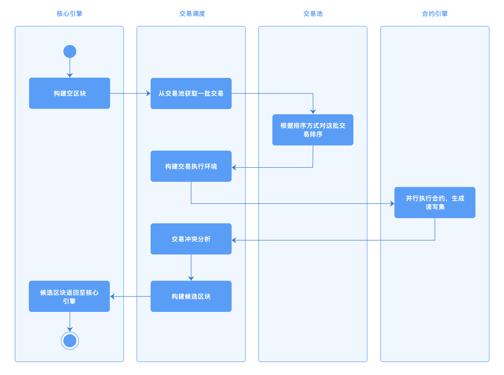
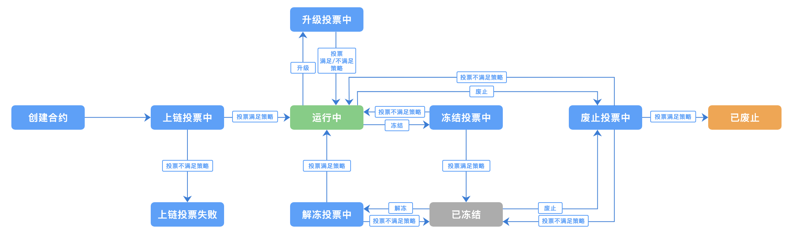
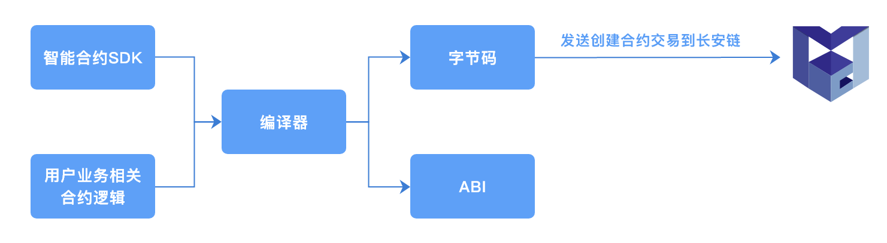
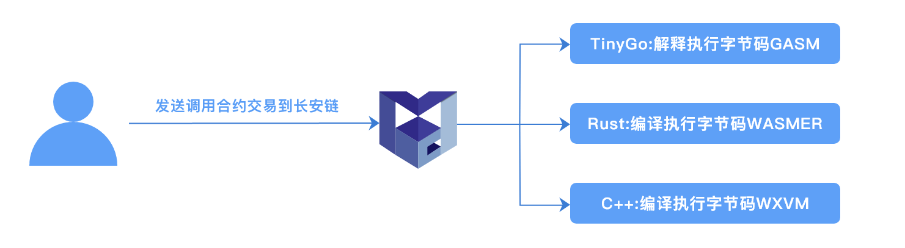

# 智能合约与虚拟机

智能合约是一种计算机程序或交易协议，记录了交易条款信息、事件、行为，旨在减少对可信中间人的需求、仲裁和执行成本。在长安链上，用户可以通过高级语言（Golang、Rust、Solidity、TinyGo和C++）来编写智能合约，经过编译后，以二进制文件、WASM、EVM字节码的形式存储在区块链中，用户可以通过发送交易来触发执行智能合约中的代码。


虚拟机为智能合约提供计算资源和运行容器。每个虚拟机都运行在隔离的环境中，确保资源访问安全性，只能修改属于该合约自身的状态记录。智能合约需要有执行终止条件，以限制对资源的消耗；终止条件可以是按照时间、指令数量、指令执行代价（类似ETH gas）等方式。


长安链支持多种智能合约编程语言和虚拟机，为虚拟机提供统一的数据访问和密码算法访问接口。当一批交易通过调度器被发送至虚拟机时，虚拟机将解析交易中的智能合约调用参数，并且在运行时，通过数据访问接口获取运行时必要的数据，最后执行生成交易的读写集、交易执行结果和交易执行的日志信息。



## 字节码

长安链目前在软件上支持的虚拟机字节码包括两类：WASM（WebAssembly）和EVM字节码。
- WebAssembly 有一套完整的语义，实际上 wasm 是体积小且加载快的二进制格式， 其目标就是充分发挥硬件能力以达到原生执行效率。WebAssembly 设计了一个非常规整的文本格式用来开发、调试、测试、优化。
- EVM字节码是最初运用在以太坊上的一种虚拟机字节码，目前已经被广泛的运用在许多区块链平台上，有相对比较成熟的开发工具支持。

## 智能合约SDK

用户通过高级语言编写的智能合约一般情况而言，都需要存取区块链上的数据、API支持，ChainMaker为不同的高级语言提供了不同的SDK。当然，这些SDK提供的基本能力是相同的，包括读取数据、写入数据、查询区块链的一些状态等。


不同语言的SDK受限于语言本身特性和编译器的支撑能力，比如go语言支持函数同时返回多个数据，而tinygo编译器对垃圾回收支持存在缺陷，加上区块链系统本身为智能合约提供的运行内存大小受限、调用栈深度受限，用户编写合约时，需要注意这些特性。

目前ChainMaker已经支持的智能合约开发SDK包括Golang、Rust、Solidity、TinyGo和C++。

## 智能合约生命周期管理

长安链的整体生命周期管理流程如下图所示：



### 合约创建

用户编写完成智能合约后，经过编译器编译为字节码，需要通过发送交易的形式部署到区块链上。发送的交易将被共识节点和同步节点接收和处理，在校验完成各项参数后，字节码将被存储在区块链数据库中。


在校验参数的过程中，如果下列校验出错，将把执行的错误信息记录在交易的执行结果中：

- 同一条链上不允许存在重名的合约
- 字节码不能为空
- 指定的智能合约执行引擎必须有效
- 版本信息不能为空



随后将调用执行合约的初始化方法：

- 对于WASM而言，将调用合约的 **init_contract()** 方法，用户必须提供导出的 **init_contract()** 方法
- 对于EVM而言，将调用合约的构造方法



### 合约升级

ChainMaker支持对基于WASM和EVM的字节码进行升级

- 对于WASM而言，将调用 **upgrade_contract()** 方法，用户必须提供导出的 **upgrade_contract()** 方法
- 对于EVM而言，并不会调用任何方法，只是单纯更新字节码
- 对于DOCKER_GO而言，将调用 **InitContract()** 方法，该方法用于合约的部署与升级

合约升级也需要校验参数，如果下列校验出错，将把执行的错误信息记录在交易的执行结果中：

- 合约必须已经被部署成功
- 字节码不能为空
- 版本信息不能为空

### 合约冻结

用户可以对已经部署在ChainMaker的智能合约进行冻结操作，需要发送冻结类型的交易，并指定合约名称，就可以冻结合约。被冻结的合约不允许被用户调用执行。合约冻结后可升级合约，升级后的合约依旧是冻结状态。

### 合约解冻

用户可以对已经部署在长安链上已冻结的智能合约进行解冻操作，需要发送解冻类型的交易，并指定合约名称，就可以解冻合约。

### 合约注销

用户可以注销已经被安装的合约，合约一旦被注销，将无法再次对合约发起任何操作。

## 智能合约事件

智能合约事件(contract event)是合约虚拟机中提供的一种智能合约向客户端发送通知消息的功能。当一笔交易触发了合约事件时，事件数据会进行广播并记录在区块当中。

+ 事件的发送：用户可以在合约函数中指定合约事件topic和对应的合约事件数据，当一笔交易调用了包含合约事件的函数即可触发合约事件，ChainMaker会向指定的topic发送事件数据，从而进行合约事件发送。

  参见[智能合约](../instructions/智能合约开发.md)章节，智能合约示例代码说明部分。

+ 事件的订阅：用户可以使用ChainMaker SDK进行合约事件的订阅，如果用户对指定topic进行了订阅，当合约事件触发后，用户会收到对应topic的合约事件数据。

  参见[GoSDK使用说明](../sdk/GoSDK使用说明.md)消息订阅章节。

+ 事件的存储：合约事件功能支持用户可配置存储，目前支持**mysql**的可配置存储。

  ```yaml
  #chainmaker.yml配置文件
  
  storage:
    disable_contract_eventdb: true  #是否禁止合约事件存储功能，默认为true，如果设置为false,需要配置mysql
    contract_eventdb_config:
      provider: sql                 #如果开启contract event db 功能，需要指定provider为sql
      sqldb_config:
        sqldb_type: mysql           #contract event db 只支持mysql
        dsn: root:password@tcp(127.0.0.1:3306)/  #mysql的连接信息，包括用户名、密码、ip、port等，示例：root:admin@tcp(127.0.0.1:3306)/
  ```

目前ChainMaker支持**GO、C++、Rust、Solidity**的合约事件功能。


<br><br>
