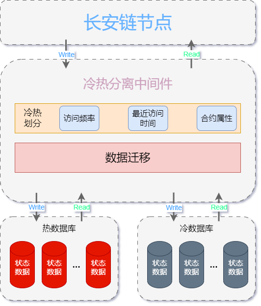
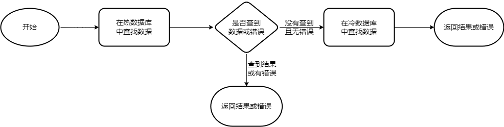
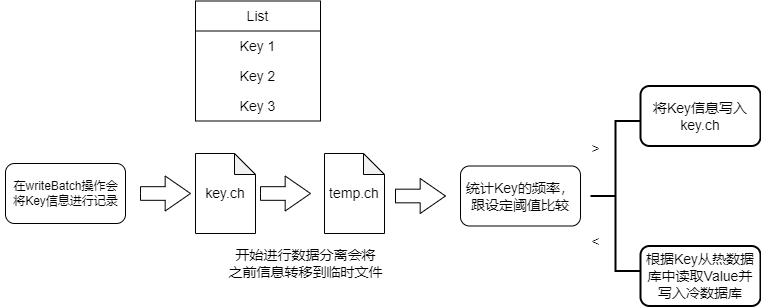
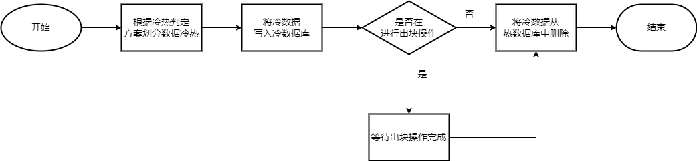
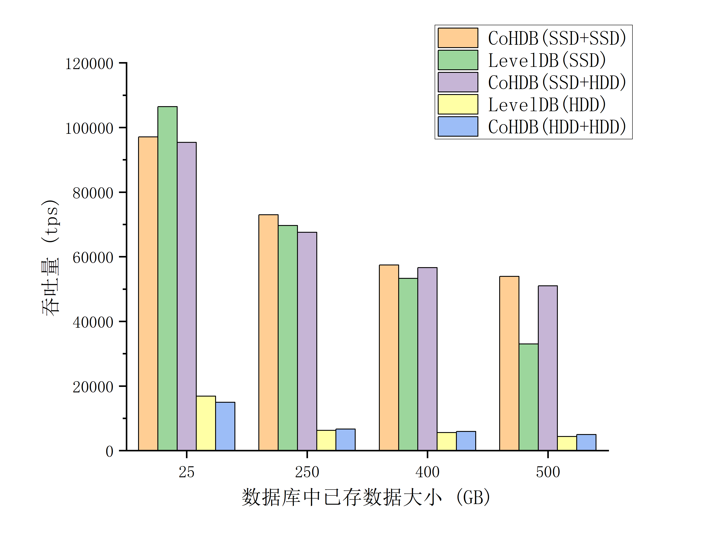
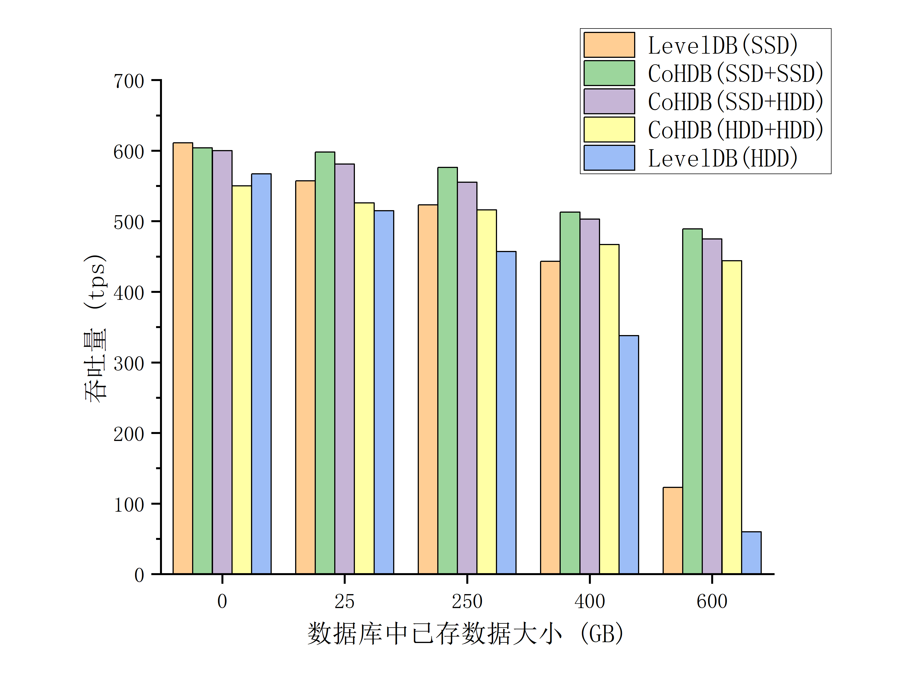

# 状态数据库冷热分离模块设计文档

## 模块介绍

区块链要求数据可追溯，需要保存全量的历史数据，因此随着链上交易的增加，存储的数据持续增加。而随之面临存储容量需求增大以及存储性能下降的问题。

本模块采用冷热分级存储的方式来实现针对状态数据库的大规模存储性能提升。将近期频繁操作的数据定义为热数据，而更早或者很少操作的数据认定为冷数据。将热数据存储在高性能存储介质上，将冷数据存放在性能相对较差但价格更低的存储介质上，可以实行更高的存储性能以及更低的存储成本。
<div align=center>

<center>模块架构</center>
</div>


## 模块运行逻辑

本模块通过在长安链存储模块状态数据库的基础上实现了一个冷热分离中间件。通过该中间件，将状态数据库进一步划分为热状态数据库和冷状态数据库，实现了状态数据库初始化、区块提交、数据的读取以及数据迁移等功能。

### 读写操作
当进行数据写入时，会直接写入热数据库，以实现更高的存储效率。当进行数据读取时，运行逻辑如下， 首先（若设置使用缓存，则优先在缓存内寻找数据）尝试从热数据库中寻找是否存在所需数据，若没有找到则继续从冷数据库中读取并返回最终结果。

<div align=center>

<center>读取数据逻辑</center>
</div>

关于读取多个数据的方法实现了ReadObjects 和 SelectObject 两个函数。
其中ReadObjects函数会根据给出的keys分别读取value，具体底层代码实现如下
``` go
func (s *ColdOrHotDB) getKeys(keys [][]byte) ([][]byte, error) {
  if len(keys) == 0 {
    return nil, nil
  }
  
  values := make([][]byte, len(keys))
  nfIndexs := make([]int, 0, len(keys))
  for index, key := range keys {
    if len(key) == 0 {
      values[index] = nil
      continue
    }
    
    //get from cache
    value, exist := s.cache.Get(string(key))
    if exist {
      values[index] = value
    } else {
      nfIndexs = append(nfIndexs, index)
    }
  }
  
  //get from database
  nfKeys := make([][]byte, len(nfIndexs))
  for i := 0; i < len(nfIndexs); i++ {
    nfKeys[i] = keys[nfIndexs[i]]
  }
  
  nfHotValues, err := s.hotDbHandle.GetKeys(nfKeys)
  if err != nil {
    return nil, err
  }
  nfColdValues, err := s.coldDbHandle.GetKeys(nfKeys)
  if err != nil {
    return nil, err
  }
  
  for i := 0; i < len(nfIndexs); i++ {
    if nfHotValues[i] != nil {
      values[nfIndexs[i]] = nfHotValues[i]
    } else {
      values[nfIndexs[i]] = nfColdValues[i]
    }
  }
  return values, nil
}
```
SelectObject函数通过返回一个迭代器的方式来遍历给定范围内的数据，由于遍历涉及到冷、热两个数据库，相关迭代器设计如下：
``` go
// 迭代器的主要思路是对两个数据库分别创建迭代器，对比两者的key值来确定下一个数据从哪个库中读取
type kvi struct {
  hotKeyCache  []byte
  coldKeyCache []byte
  hotIter      protocol.Iterator
  coldIter     protocol.Iterator
  finalIter    protocol.Iterator
  contractName string
}

func (i *kvi) Next() bool {
  if i.hotKeyCache == nil {
    //hot iterator check if hot value cahche is null
    if i.hotIter.Next() {
      //if iterator next not empty, get it's value
      key := i.hotIter.Key()
      i.hotKeyCache = key
    }
  }

  if i.coldKeyCache == nil {
    //cold iterator check if cold value cahche is null
    if i.coldIter.Next() {
      //if db iterator next not null, get it's value
      key := i.coldIter.Key()
      i.coldKeyCache = key
    }
  }

  //hotvalue cache and coldvalue cache all null, return false
  if i.hotKeyCache == nil && i.coldKeyCache == nil {
    return false
  }

  var resultCache protocol.Iterator
  //none of them null, then compare their key
  if i.hotKeyCache != nil && i.coldKeyCache != nil {
    if string(i.hotKeyCache) == string(i.coldKeyCache) {
      i.hotKeyCache = nil
      resultCache = i.coldIter
      i.coldKeyCache = nil
    } else if string(i.hotKeyCache) < string(i.coldKeyCache) {
      resultCache = i.hotIter
      i.hotKeyCache = nil
    } else {
      resultCache = i.coldIter
      i.coldKeyCache = nil
    }
  } else if i.hotKeyCache != nil {
    resultCache = i.hotIter
    i.hotKeyCache = nil
  } else if i.coldKeyCache != nil {
    resultCache = i.coldIter
    i.coldKeyCache = nil
  }
  i.finalIter = resultCache
  return true
}
```
### 数据迁移功能
将冷数据写入冷数据库是通过数据迁移功能完成的，该过程与链上存取操作并发进行。


#### 冷热划分规则
鉴于工程实践对于性能的要求，目前实现的冷热划分方案是依据数据的频率进行的，在统计新操作的数据的频率后，将操作频率较高`前20%`视为热数据，剩下的数据视为转变为冷数据，在之后进行迁移操作。具体流程如下：
<div align=center>

<center>冷热划分方案</center>
</div>

1. 在向状态数据库中写入数据时将Key信息记录在特定文件key.ch中。
2. 触发数据迁移功能后，首先将该文件更改为临时文件，避免影响新数据的写入。
3. 之后会根据文件内容统计不同Key的频率并进行排序，操作频繁的数据视为热数据，其Key值信息再次写入特定文件key.ch内，其余数据视为冷数据。

``` go
// writeKeyLog 鉴于需要记录的数据量以及安全性，选择写入文件的方式记录而不是保存在内存中
func writeKeyLog(logPath string, data []string) error {
  dataFile, err := os.OpenFile(logPath, os.O_RDWR|os.O_CREATE|os.O_APPEND, 0666)
  if err != nil {
    return err
  }
  defer dataFile.Close()

  write := bufio.NewWriter(dataFile)
  for i := range data {
    _, err = write.WriteString(data[i] + "\n")
    if err != nil {
      return err
    }
  }
  err = write.Flush()
  if err != nil {
    return err
  }
  return nil
}
```

``` go
// getKey通过将数据根据频率进行排序来确定冷、热数据 
func getKey(data []string) ([]string, error) {
  var valueMap = make(map[string]int)
  for _, r := range data {
    valueMap[r]++
  }
  
  type keyHot struct {
    key string
    hot int
  }

  freList := make([]keyHot, 0)
  for k, v := range valueMap {
    freList = append(freList, keyHot{key: k, hot: v})
  }

  sort.Slice(freList, func(i, j int) bool {
    return freList[i].hot > freList[j].hot
  })

  // 统计目前热数据库中的所有Key值数为n，设置阈值为20%，即频率最高的前20%数据为热数据，剩下80%为需要转移的冷数据
  n := len(valueMap)
  l := int(float32(n) * 0.2)

  var keys []string
  for i := 0; i < l; i++ {
    k := freList[i].key
    keys = append(keys, k)
  }

  err := writeKeyLog(dataLogPath, keys)
  if err != nil {
    return nil, err
  }

  var coldKey []string
  for i := l; i < n; i++ {
    k := freList[i].key
      coldKey = append(coldKey, k)
    }
  return coldKey, nil
}
```

#### 数据迁移条件
1. 在本模块代码实现中，通过设定一个定时器来触发数据迁移，该定时器的间隔可以自行配置，并根据热数据库的规模调整。默认`设置5分钟`进行一次检测，如果上一轮迁移已经完成且有数据等待迁移则进行。同时，对于LevelDB和BadgerDB两种数据库可以通过遍历文件夹的方法来获取已存数据大小，可以设定在`热数据库容量达到50GB`时将触发间隔缩减到`1分钟`。
``` go
func (s *ColdOrHotDB) DataMigration() error {
  finished := true
  t := s.setPeriod()        // 设置定时器间隔
  ticker := time.NewTicker(t)
  go func(ticker *time.Ticker) {
    defer ticker.Stop()
    t = s.setPeriod()
    for {
    select {
      case <-ticker.C:
        // 具体迁移操作
        ......
      }
    }
  }(ticker)
  return nil
}

// setPeriod 设置数据迁移触发时间间隔
func (s *ColdOrHotDB) setPeriod() time.Duration {
  stateConfig := s.storeConf.StateDbConfig.ColdOrHotDbConfig
  // 在配置文件中可以设置默认间隔
  t := 300 * time.Second
  t := time.Duration(stateConfig.Period) * time.Second
  hotDbConfig := stateConfig.HotDbConfig
  // LevelDB 和 BadgerDB 两种数据库可以通过遍历文件夹的方法来获取已存数据大小
  if hotDbConfig.Provider == "leveldb" || hotDbConfig.Provider == "badgerdb" {
    config := hotDbConfig.GetDbConfig()
    dirPath := config["store_path"].(string)
    fileSize := getSize(dirPath)
    if fileSize > 50 {    // 可以根据数据库规模设置触发间隔
      t = 60 * time.Second
    }
  }
  return t
}

// getSize 通过迭代遍历来获取文件夹大小
func getSize(dirPath string) float64 {
  var wait sync.WaitGroup
  var syncM sync.Map

  var scanDir func(string, *sync.Map)
  scanDir = func(path string, syncM *sync.Map) {
    defer wait.Done()
    dirAry, err := ioutil.ReadDir(path)
    if err != nil {
      panic(fmt.Sprintf("Error get hotDB size: %s", err))
    }
    for _, e := range dirAry {
      if e.IsDir() {
        wait.Add(1)
        go scanDir(filepath.Join(path, e.Name()), syncM)
      } else {
        syncM.Store(filepath.Join(path, e.Name()), float64(e.Size())/1024/1024/1024)
      }
    }
  }

  wait.Add(1)
  go scanDir(dirPath, &syncM)
  wait.Wait()

  var dirSize float64
  syncM.Range(func(key, value interface{}) bool {
    v := value.(float64)
    dirSize += v
    return true
  })
  return dirSize
}
```

#### 数据迁移具体操作
具体流程如下：
<div align=center>

<center>数据迁移逻辑</center>
</div>

1. 在数据迁移操作中，首先会通过设定规则对数据进行冷热划分。
2. 根据划分结果，从热数据库中读取“变冷”的数据，同时写入冷数据库。
3. 写入完成后再将热数据库中相关数据进行删除。由于删除操作和正常出块操作存在冲突，在此过程中通过信道通信的方式来获取是否进行出块操作，适当阻塞删除操作优先进行出块。
``` go
  ......
  coldKeys, err := getKey(data)

  coldBatch := types.NewUpdateBatch()
  hotBatch := types.NewUpdateBatch()
  for _, k := range coldKeys {
    key := []byte(k)
    value, _ := s.hotDbHandle.Get(key)
    if len(value) != 0 {
      coldBatch.Put(key, value)
      hotBatch.Delete(key)
    }
  }

  // 使用Batch的方式进行数据的写入和删除
  coldBatches := coldBatch.SplitBatch(s.storeConf.WriteBatchSize)
  hotBatches := hotBatch.SplitBatch(s.storeConf.WriteBatchSize)
  wg := &sync.WaitGroup{}
  wg.Add(len(coldBatches))
  for i := 0; i < len(coldBatches); i++ {
    go func(index int) {
      defer wg.Done()
      if err = s.coldDbHandle.WriteBatch(coldBatches[index], false); err != nil {
        panic(fmt.Sprintf("Error writing state data to colddb in data migration: %s ", err))
      }
    }(i)
  }
  wg.Wait()

  finished, s.migrationDone = false, true
  for i := 0; i < len(hotBatches); i++ {
  select {
    // 当进行出块操作时堵塞数据迁移功能
    // chan的另一端是CommitBlock函数
    case <-s.migrationControl:
      <-s.migrationControl
    // Delete data that has completed migration
    default:
      err = s.hotDbHandle.WriteBatch(hotBatches[i], false)
      if err != nil {
        panic(fmt.Sprintf("Error delete old date in data migration: %s", err))
      }
    }
  }
  finished, s.migrationDone = true, false
  ......
```
在CommitBlock函数内对于信道的相关操作
``` go
  ......
  if s.migrationDone {
    // 如果在数据迁移触发时间内，通过channle来传递将要出块的信息
    s.migrationControl <- true
    err := s.writeBatch(block.Header.BlockHeight, batch)
    if err != nil {
      return err
    }
    s.migrationControl <- true
  } else {
    err := s.writeBatch(block.Header.BlockHeight, batch)
    if err != nil {
      return err
    }
  }
```


## 实现接口说明

本功能是在StateDB的实现基础上完成的，相关接口定义如下：
``` go
type StateDB interface {

  // InitGenesis 创世块写入
  // @param genesisBlock 序列化后的创世块
  // @return error  运行过程中错误
  InitGenesis(genesisBlock *serialization.BlockWithSerializedInfo) error

  // CommitBlock 提交区块，写入状态数据
  // @param blockWithRWSet  序列化后的区块信息
  // @param isCache
  // @return error  运行过程中错误
  CommitBlock(blockWithRWSet *serialization.BlockWithSerializedInfo, isCache bool) error

  // GetChainConfig  读取链配置信息
  GetChainConfig() (*configPb.ChainConfig, error)

  // ReadObject 根据给定合约名称和Key值返回对应Value值，如果不存在，则返回 nil。
  // @param contractName  合约名
  // @param key
  // @return []byte  Value值
  // @return error  运行过程中错误
  ReadObject(contractName string, key []byte) ([]byte, error)

  // ReadObjects 根据给定合约名称和多个Key值返回对应的Value值
  // @param contractName  合约名
  // @param key
  // @return [][]byte
  // @return error  运行过程中错误
  ReadObjects(contractName string, keys [][]byte) ([][]byte, error)

  // SelectObject 返回一个迭代器，其中包含给定键范围之间（左闭右开）的所有键值。
  // @param contractName  合约名
  // @param startKey  起始Key值
  // @param limit  终止Key值
  // @return protocol.StateIterator  迭代器
  // @return error  运行过程中错误
  SelectObject(contractName string, startKey []byte, limit []byte) (protocol.StateIterator, error)

  // GetLastSavepoint 返回上个区块高度
  // @return uint64  区块高度
  // @return error  运行过程中错误
  GetLastSavepoint() (uint64, error)

  // Close Close is used to close database
  Close()

  // DataMigration 数据迁移,仅ColdOrHotDB实现
  // @return error  运行过程中错误
  DataMigration() error

  // 以下功能为Sql数据库提供，在本模块中仅创建了相关接口并未实现
  QuerySingle(contractName, sql string, values ...interface{}) (protocol.SqlRow, error)

  QueryMulti(contractName, sql string, values ...interface{}) (protocol.SqlRows, error)

  ExecDdlSql(contractName, sql, version string) error

  BeginDbTransaction(txName string) (protocol.SqlDBTransaction, error)

  GetDbTransaction(txName string) (protocol.SqlDBTransaction, error)

  CommitDbTransaction(txName string) error

  RollbackDbTransaction(txName string) error

  CreateDatabase(contractName string) error

  DropDatabase(contractName string) error

  GetContractDbName(contractName string) string

  GetMemberExtraData(member *accesscontrol.Member) (*accesscontrol.MemberExtraData, error)
}
```

## 配置说明
ColdOrHotDB配置结构如下
``` go
type DbConfig struct {
  Provider          string                  `mapstructure:"provider"`
  ColdOrHotDbConfig *ColdOrHotDbConfig      `mapstructure:"coldorhotdb_config"`
  ......
}
  
type ColdOrHotDbConfig struct {
  Period       int       `mapstructure:"data_marigation_time"`    // 默认数据迁移时间间隔
  HotDbConfig  *DbConfig `mapstructure:"hotdb_config"`            // 热数据库详细配置
  ColdDbConfig *DbConfig `mapstructure:"colddb_config"`           // 冷数据库详细配置
}
```

具体通过修改节点本地配置文件chainmaker.yml中存储部分的状态数据库配置进行使用。其中冷、热数据库兼容长安链支持的LevelDB、BadgerDB、TikvDB、MySQL等数据库引擎，具体详细配置内容可参考[数据存储](./数据存储.md)
``` yml
  statedb_config:
    provider: coldorhotdb     # 具有冷热分离功能的状态数据库
    coldorhotdb_config:       # ColdOrHot数据库配置
      data_marigation_time:   300  # 进行数据迁移的时间间隔
      hotdb_config:                # 热数据库配置
        provider: leveldb          # 热数据库类型，支持StateDB所支持数据库类型，这里示例为LevelDB
        leveldb_config:            # LevelDB详细配置
          store_path: ./data/org1/state/hot
            ......
      colddb_config:               # 冷数据库类型，配置同上
        provider: leveldb
        leveldb_config:
          store_path: ./data/org1/state/cold
            .......
```

## 基本使用

### 对于直接创建链情况
参考[通过命令行体验链](../quickstart/通过命令行体验链.md)搭建长安链，在启动节点集群前按照上述配置说明修改节点本地配置文件chainmaker.yml中相关信息。

### 对于原有链更改情况
#### 使用脚本关闭当前集群
```
$ ./cluster_quick_stop.sh
```

#### 修改节点本地配置文件chainmaker.yml
需将原状态数据库信息改为冷数据库相关配置，否则丢失数据无法正常工作。例如
``` yml
原状态数据库配置：
  statedb_config:
    provider: leveldb
    leveldb_config:
      store_path: ./data/org1/state

将其修改为：
  statedb_config:
    provider: coldorhotdb     
    coldorhotdb_config:       
      hotdb_config:             
      provider: leveldb       
        leveldb_config:         
          store_path: ./data/org1/state_hot
      colddb_config:            
        provider: leveldb
        leveldb_config:
          store_path: ./data/org1/state   // 确保原数据存在
```

#### 重新启动节点集群
```
$ ./cluster_quick_start.sh normal
```


## 相关测试
针对冷热分级存储进行了本地以及上链集成两方面的性能测试
### 测试环境

| 设备 or 软件 | 类型 or 版本|
| :---------- | :-----------|
| 操作系统 | Ubuntu 18.04.5 LTS |
| CPU     | Intel(R) Xeon(R) Gold 5118 CPU @ 2.30GHz  12核 48线程 |
| 内存    |    187GB   |
| 硬盘    |  SSD(2T) + HDD(2.4T)  |
| 长安链版本 |  2.3.1  |
| 虚拟机环境 | Docker Go 1.17.8  |

### 本地性能测试
前期使用LevelDB测试测试随着数据库规模的增大，存储性能表现，以及使用冷热分级存储后的结果。
首先生成一定量规模的数据库，之后进行两千万次存储操作进行性能测试，其中Key-Value对的大小统一设为Key:64B和Value:64B。在所有数据中`20%`的数据为热数据，但相关操作占总存储操作的`80%`。
LevelDB数据库在存储介质SSD和HDD上存储性能操作差距明显，相同情况下吞吐量差距接近十倍。同时随着数据库大小的增加，进行存储的吞吐量也存在明显下降。这些表现符合使用冷热分级存储的预期。
测试结果如下 
<div align=center>

<center>本地测试结果</center>
</div>

1. 数据库存放`400G`数据后，吞吐量下降了`65%`左右。
2. 在数据库存放数据情况下，使用相同的存储介质，ColdOrHotDB的吞吐量比LevelDB高`25%`左右。
3. 使用ColdOrHotDB将热数据存储在SSD，冷数据存放在HDD，在性能和性价比方面都要优于使用LevelDB。在数据库大小到达480GB时，前一种方法的吞吐量表现为后者的`1.5`倍。


### 上链集成性能测试
针对集成在链上进行测试，使用ColdOrHotDB后对状态数据库的存储表现进行测试，启动链后通过调用cmc命令行工具，使用创建的合约的save模式，测试进行一万次合约调用过程中状态数据库存储性能表现，调用合约的的结果是存储一对Key-Value值，其中两者大小分别为：64B 和10KB。将相关内容打印成日志形式进行统计。
由于集成在链上后，进行交易并不是单纯的存储操作，状态数据库的存储更是仅占很小部分，所以吞吐量差异相对不太明显，但是当数据库规模达到一定量后，仍然呈现出明显的性能下降，而使用ColdOrHotDB后的表现更好。
性能测试结果如下：
<div align=center>

<center>集成性能测试结果</center>
</div>

1. 当数据库大小到达250GB，将数据均存放在相同介质上时，使用ColdOrHotDB后性能提升了`10%和12%`。
2. 当数据库规模达到600GB时，使用ColdOrHotDB将数据存储在SSD和HDD时的吞吐量为使用LevelDB的`4倍和7倍`。
3. 考虑性能和价格因素，将热库存放在SSD，冷库存放在HDD的方案也是将数据存放在SSD的LevelDB方案的`3.86倍`。