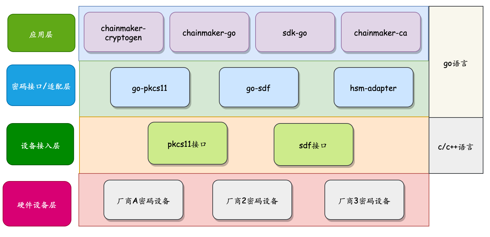

# 硬件加密方案

## 概述
目前大多数区块链项目，用户私钥和节点私钥通常以文件的形式存放在硬盘上，虽然文件可以通过口令进行加密存储，但仍然存在被窃取和破译风险，在某些金融和政务场景下  不符合安全、合规的要求。为了满足以上需求，长安链支持对接硬件加密设备，通过硬件设备对私钥进行安全存储；并通过硬件密码服务处理加密和签名操作。节点服务、CA证书服务以及sdk均可以选择硬件密码设备进行加密或签名。 

## 整体设计
为了保证不强制绑定特定厂商硬件密码设备，设计上采用pkcs11或sdf接口来对接硬件密码设备，对上层提供加密、签名以及私钥保护的能力。私钥生命周期管理依托于符合国密局要求的硬件密码设备提供.

### 分层架构


* 硬件密码设备：一般指硬件加密机，由密码硬件厂商提供。
* 设备接入层：硬件密码设备接入方式和接入配置, 一般由密码机客户端lib库和配置文件组成，需要支持PKCS11或者SDF标准接口
* 密码接口/适配层：通过cgo方式封装底层lib库提供的接口功能，方便上层调用；提供密码机适配器接口，用来屏蔽不同厂商实现上的差异，方便接入。
* 密码应用层：加密或签名应用，如交易签名，共识签名等。

### 硬件密码设备
厂商提供， 略
### 设备接入层
厂商提供，略
### 密码接口层
#### 密码接口设计

```go
// 私钥签名接口
type PrivateKey interface {
   // 私钥签名
   Sign(data []byte) ([]byte, error)
   SignWithOpts(data []byte, opts *SignOpts) ([]byte, error)

   // 返回公钥
   PublicKey() PublicKey
   // 转换为crypto包中的 PrivateKey 接口类
   ToStandardKey() crypto.PrivateKey
}

// === 对称密钥加解密接口 ===
type SymmetricKey interface {
   // 加密接口
   Encrypt(plain []byte) ([]byte, error)
   EncryptWithOpts(plain []byte, opts *EncOpts) ([]byte, error)

   // 解密接口
   Decrypt(ciphertext []byte) ([]byte, error)
   DecryptWithOpts(ciphertext []byte, opts *EncOpts) ([]byte, error)
}
```

#### 密码接口实例化
```go
//pkcs11对称密钥接口实例化
func NewSecretKey(p11 *pkcs11.P11Handle, keyId string, keyType bccrypto.KeyType) (bccrypto.SymmetricKey, error){/*...*/}
//pkcs11公钥密钥接口实例化
func NewPrivateKey(p11 *pkcs11.P11Handle, keyId string, keyType bccrypto.KeyType) (bccrypto.PrivateKey, error){/*...*/}

//sdf对称密钥接口实例化
func NewSecretKey(s *sdf.SDFHandle, keyId, keyPwd string, keyType bccrypto.KeyType) (bccrypto.SymmetricKey, error){/*...*/}
//sdf公钥密钥接口实例化
func NewPrivateKey(s *sdf.SDFHandle, keyId, keyPwd string, keyType bccrypto.KeyType) (bccrypto.PrivateKey, error){ /*...*/}
```
说明：
1. keyId：硬件密码机中，密钥索引号。
2. keyType：密钥类型，目前支持RSA，AES，SM2，SM4等
3. keyPwd: 密钥访问口令，用于在使用私钥前，获取使用权限。目前仅sdf接口支持


#### 密码机适配器插件
由于不同厂商在实现pkcs11或者sdf接口时，在参数以及接口使用上存在着差异，为了保证能够平滑对接更多厂商密码设备，接口设计如下（在对比多家厂商差异的基础上设计）：
```go
type IHSMAdapter interface {
	// for PKCS11
	PKCS11_GetSM2KeyId(keyIdex int, isPrivate bool) (string, error)
	PKCS11_GetRSAKeyId(keyIdex int, isPrivate bool) (string, error)
	PKCS11_GetECCKeyId(keyIdex int, isPrivate bool) (string, error)
	PKCS11_GetSM4KeyId(keyIdex int) (string, error)
	PKCS11_GetAESKeyId(keyIdex int) (string, error)
	PKCS11_GetSM3SM2CKM() uint

	// For SDF
	SDF_GetSM2KeyAccessRight(keyIdex int) (newKeyIdex int, need bool)
	SDF_GetSM4KeyAccessRight(keyIdex int) (newKeyIdex int, need bool)
	SDF_GetRSAKeyAccessRight(keyIdex int) (newKeyIdex int, need bool)
	SDF_GetAESKeyAccessRight(keyIdex int) (newKeyIdex int, need bool)
}
```
目前长安链提供3个插件实现，一个是默认实现，在参数以及接口使用上不作处理；另外两个分别适配了两家密码厂商的密码设备（具体厂商略）。

实现以上接口后，通过go工具`go build -buildmode=plugin -o hsm_adapter.so main.go`打包成golang插件形式，如hsm_adapter.so, 并通过环境变量指定该适配器插件，如下：
```sh
export HSM_ADAPTER_LIB=/usr/local/lib64/hsm_adapter.so #路径根据实际情况指定
```

### 密码应用层
#### 硬件加密配置
```yaml
//硬件加密配置项（以下配置项与密码设备相关）
pkcs11:
  enabled: true                                       # set true if enable pkcs11 or sdf
  type: pkcs11                                        # support pkcs11 and sdf
  library: /usr/local/lib64/libpkcs11.so              # path to the so file of pkcs11/sdf interface
  label: HSM                                          # label for the slot to be used
  password: 12345678                                  # password to logon the HSM
  session_cache_size: 10                              # size of HSM session cache, default to 10
  hash: "SHA256"                                      # hash algorithm used to compute SKI
```
注：如果type为sdf，则仅需要配置library和session_cache_size，其他配置会被忽略。

#### pkcs11签名和加密示例
```go
//pkcs11 handle初始化
p11Handle, err = pkcs11.New(library, label, password, sessionCacheSize, hash)
if err != nil{
	return nil, fmt.Errorf("failed to initialize pkcs11 handle, err = %s", err)
}
//sm2密钥初始化， “1” 表示密码机SM2密钥索引
priv, err :=  pkcs11.NewPrivateKey(p11Handle, "1", bccrypto.SM2)
if err != nil{
  log.Fatalf("failed to new sm2 private key, err = %s", err)
}
//使用sm2签名/验证
// 硬件签名
sig, _ := priv.SignWithOpts(msg, &bccrypto.SignOpts{
   Hash: hashAlgo,
   UID:  bccrypto.CRYPTO_DEFAULT_UID,
})
// 软件验签
ok, _ := priv.PublicKey().VerifyWithOpts(msg, sig, &bccrypto.SignOpts{
		Hash: hashAlgo,
		UID:  “12345678”,
})

//sm4密钥初始化， "1" 表示密码机SM4密钥索引
sk, err :=  pkcs11.NewSecretKey(p11Handle, "1", bccrypto.SM4)
if err != nil{
   log.Fatalf("failed to new secret key, err = %s", err)
}

//使用sm4加密/解密， 默认CBC模式
ciphertext, _ := sk.Encrypt(msg)
msg _ := sk.Decrypt(ciphertext)
```
注：以上为示例代码，仅供参考。

#### sdf签名和加密示例
```go
//sdf handle初始化
sdfHandle, err = sdf.New(library, sessionCacheSize)
if err != nil{
	return nil, fmt.Errorf("failed to initialize sdf handle, err = %s", err)
}
//sm2密钥初始化， “1” 表示密码机SM2密钥索引, "123456"为1号密钥访问授权口令
sk, err :=  sdf.NewPrivateKey(sdfHandle, "1", "123456",bccrypto.SM2)
if err != nil{
  log.Fatalf("failed to new sm2 private key, err = %s", err)
}
// 签名与验证与pkcs11相同

//sm4密钥初始化， "1" 表示密码机SM4密钥索引
sk, err :=  sdf.NewSecretKey(sdfHandle, "1", "123456", bccrypto.SM4)
if err != nil{
   log.Fatalf("failed to new secret key, err = %s", err)
}
//加密与解密与pkcs11相同
```