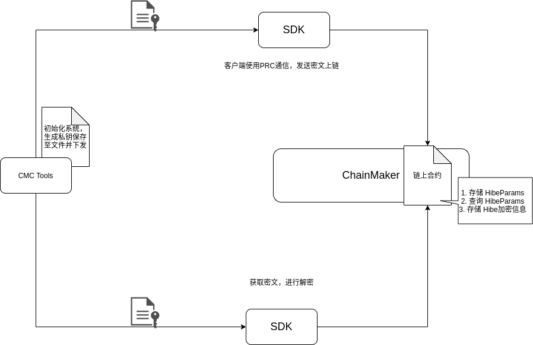
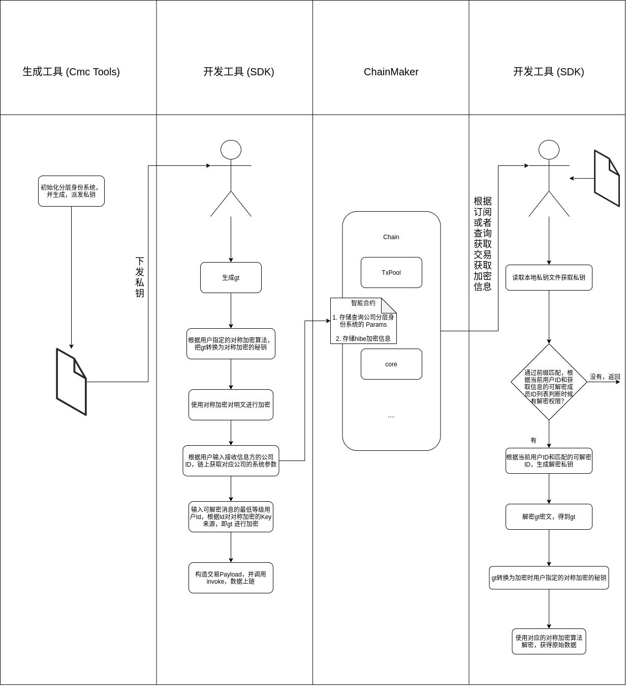

ChainMaker身份分层加密方案介绍
==============================

需求
----

需求概述
~~~~~~~~

区块链技术由于可以在无需第三方的情况下实现所有数据的公开透明、不可篡改、不可伪造等特性，在诸如数字政务、数字货币、金融资产交易结算等领域具有广阔的应用场景。很多区块链应用场景中，都会存在数据按层级划分可见性的需求，也就是说，允许上层的用户/节点查看下层用户/节点的数据，但是处于下层的用户/节点无法查看上层用户/节点的数据，并且同一层级的用户/节点间的数据不可见。

具体场景
~~~~~~~~

-  税务场景，税务总局可以查看所有省市相关数据，各省之间数据不互通，跨省的交易数据在相关方可见。
-  大型企业场景，集团对所有数据可见，二级公司之间数据互不可见，二级公司可查看下辖的三级公司数据，以此类推。

身份分层加密
------------

身份分层加密概述
~~~~~~~~~~~~~~~~

身份分层加密（ *Hierarchical Identity Based Encryption, HIBE*
）是对属性加密（ *Identity Based Encryption, IBE*
）的一种改进方案，它是一种由层级结构定义的属性加密。在传统的属性加密中，节点/用户之间没有层级结构关系，节点/用户的身份信息（属性）\ :math:`I_i`\ 作为公钥，由密钥生成中心（
*Private Key Generator , PKG*
）为每个节点/用户生成解密密钥并进行分配。\ **HIBE** 打破了传统的 **IBE**
方案，构造了一种层级结构关系，每一层节点/用户用来进行数据解密的解密密钥都由上一层级进行分配，也就是说，只有根节点/用户的密钥由
**PKG**
进行分配，这使得密钥的分配过程不再复杂，使得计算、权限分派变得简单，通信开销减少，适用于许多权限分级应用中。

-  :math:`\mathsf{Root.Setup}`\ (初始化算法): 该算法由 **PKG**
   运行，输入安全参数\ :math:`\lambda`\ ，输出系统参数列表
   :math:`params` 和主密钥 :math:`msk`\ 。
-  :math:`\mathsf{Key.Extraction}` (密钥提取算法): 该算法由 **PKG**
   运行，输入系统参数列表 :math:`params`\ ，主密钥
   :math:`msk`\ ，第一层节点/用户的身份信息 :math:`I_1`
   作为输入，输出第一层节点的解密密钥 :math:`dk_1`\ 。
-  :math:`\mathsf{Key.Delegation}` (密钥分派算法):
   该算法由第k-1层节点/用户运行，输入前\ :math:`k-1`\ 层节点/用户身份集合
   :math:`ID=[I_1, I_2, ...I_{k-1}]`\ ，系统参数列表\ :math:`params`
   和上一层用户/节点解密密钥\ :math:`dk_{k-1}`\ ，输出第k层节点/用户的解密密钥\ :math:`dk_k`\ ，并且分配给第k层节点/用户。SS
-  :math:`\mathsf{Encryption}` (加密算法):
   该算法由任意节点/用户运行，输入节点/用户身份
   :math:`ID_k = [I_1, I_2, ...I_k]`\ ，系统参数列表\ :math:`params`\ 以及明文\ :math:`m`,算法输出密文\ :math:`CT`\ 。
-  :math:`\mathsf{Decryption}` (解密算法):
   该算法由第k层节点/用户运行，输入节点/用户解密密钥 :math:`dk_k` ,
   系统参数列表 :math:`params` 以及密文 :math:`CT`\ ，输出解密后的明文
   :math:`m`\ 。

从上述算法我们可以看出，节点/用户的公钥为一组属性的集合
:math:`ID_k = [I_1, I_2, ...I_k]` ，而前 ``k``
层节点/用户（不包括第k层）节点/用户可以生成解密密钥，从而可以解密使用\ :math:`[I_1, I_2, ...I_k]`
加密的信息。所以身份分层加密天然的适应于权限分级的应用场景，即上层节点/用户可以解密下层节点/用户的数据，而下层节点/用户却无法解密上层节点/用户数据。

身份分层加密流派
~~~~~~~~~~~~~~~~

现有的 **HIBE** 方案大多是采用 *椭圆曲线*
的加密方式，也就是基于两个同素阶的椭圆曲线子群上的双线性映射
:math:`e:G_1 \times G_2 -> G_T`\ ，\ :math:`G_1`\ $ ,$
:math:`G_2`\ 上的点映射到了一个有限域 :math:`G_T`\ 上。 因此，\ **HIBE**
的安全证明大多基于双线性映射产生的一个困难问题，因为该困难问题多项式时间内不可解，\ **HIBE**
方案才能被证明是安全的。根据困难问题的类型不同，我们将现有的 **HIBE**
构造分为以下三类。

+---------+---------+---------+---------+---------+---------+---------+
|         | 困      | 密      | 密      | 参      | 匿名性  | 椭圆曲  |
|         | 难问题  | 文大小  | 钥大小  | 数大小  |         | 线选取  |
+=========+=========+=========+=========+=========+=========+=========+
| Gentry- | BDH问题 | 随层    | 常      | 常      | 非      | 困难    |
| Silverb |         | 级数线  | 数大小  | 数大小  | 匿名性  |         |
| erg方案 |         | 性增加  |         |         |         |         |
+---------+---------+---------+---------+---------+---------+---------+
| G       | BDH问题 | 随层    | 常      | 随节    | 非      | 易构造  |
| entry等 |         | 级数线  | 数大小  | 点数和  | 匿名性  |         |
| 人方案  |         | 性增加  |         | 层数线  |         |         |
|         |         |         |         | 性增加  |         |         |
+---------+---------+---------+---------+---------+---------+---------+
| Boneh等 | l-wDB   | 常      | 随层    | 随层    | 非      | 易构造  |
| 人方案  | DHI问题 | 数大小  | 级数线  | 级数线  | 匿名性  |         |
|         |         |         | 性减小  | 性增加  |         |         |
+---------+---------+---------+---------+---------+---------+---------+
| Seo等   | l-wDB   | 常      | 随层    | 层      | 非      | 易构造  |
| 人方案  | DHI问题 | 数大小  | 级数线  | 级数线  | 匿名性  |         |
|         |         |         | 性减小  | 性增加  |         |         |
+---------+---------+---------+---------+---------+---------+---------+
| Bo      | DLIN&   | 随层    | 随层级  | 随层级  | 匿名性  | 困难    |
| neh-Wat | BDH问题 | 级数线  | 数多项  | 数多项  |         |         |
| ers方案 |         | 性增加  | 式增加  | 式增加  |         |         |
+---------+---------+---------+---------+---------+---------+---------+

Bilinear Diffie-Hellman (BDH)\ `1 <#refer1>`__
^^^^^^^^^^^^^^^^^^^^^^^^^^^^^^^^^^^^^^^^^^^^^^

**BDH** 困难问题是指给定 :math:`g,g^a,g^b,g^c \in G_1`
，我们需要去计算\ :math:`g^{abc}`\ （等价于计算\ :math:`e(g,g)^{abc}`\ ），这个计算过程在多项式时间内无法计算。

*Gentry* 和 *Silverberg\ *\ `2 <#refer2>`__ 第一次通过扩展传统的
**IBE**\ ，构造了第一个 **HIBE** 方案，也就是 **Gentry-Silverberg HIBE**
。该方案基于标准的 **BDH**
假设，并且将节点/用户的身份组映射到一组线性群上，构造了一种下层节点/用户无法解密上层节点/用户的结构式
**IBE**
方案。但是该方案的密文大小以及双线性对的数量都会随着层级的加深而增多，并且其安全性降低也会随着层级的加深呈指数增长趋势。此外，在椭圆曲线上构造具有均匀分布范围空间的哈希函数也很困难。这限制了曲线的选择，因为在多项式时间内生成系统参数的约束条件下，必须均匀地哈希到一个可以保持离散对数问题的困难性的子群上。许多基于
**Gentry-Silverberg HIBE**
的方案\ `3 <#refer3>`__\ 虽然改善了原方案的安全性上的缺点，但是却限制了密钥查询次数。此外，\ **Gentry-Silverberg
HIBE** 是接收方不匿名的方案，也就是加密的数据由谁解密是公开的。

Weak Decision Bilinear Diffie- Hellman Inversion (l-wDBDHI)
^^^^^^^^^^^^^^^^^^^^^^^^^^^^^^^^^^^^^^^^^^^^^^^^^^^^^^^^^^^

**l-wDBDHI** 困难问题是指给定
:math:`(g,h,g^{\alpha}, g^{\alpha^2},..., g^{\alpha^l}) \in G_1` , 计算
:math:`e(g,h)^{1/\alpha}` （等价于\ :math:`e(g,h)^{\alpha^{l+1}}`
)，同样的，这个计算过程也是多项式时间内无解的。

*Boneh* 等人\ `4 <#refer4>`__\ 在2005年第一次提出了基于 **l-wDBDHI** 的
**HIBE** 方案，该方案使密文大小固定，不再随着层级数加深而增加，弥补了
**Gentry-Silverberg HIBE**
方案的缺点。并且该方案是基于一个对称的双线性对，那么在椭圆曲线上构造具有均匀分布范围空间的哈希函数相对而言不是那么困难，使得我们椭圆曲线的选择更加灵活。除此之外，该方案的密钥随着层次结构的加深而减少。但是，该方案并不具备匿名性的特点，也就是说，在该方案中所有节点/用户的身份都是公开透明的。事实上，许多
**HIBE** 方案安全性都是基于 **l-wDBDHI** 困难问题，\ **Seo**
等人\ `5 <#refer5>`__\ 在2015年就提出了一种基于 **l-wDBDHI**
困难问题的可撤销的 **HIBE** 方案，通过建立 **Complete Tree（CT）**
和\ **Subset tree（ST）** 提供了一种
**撤销权限的HIBE方案**\ ，但是其增加了密钥分发和更新时间。

Decision Linear （DLIN) `6 <#refer6>`__
^^^^^^^^^^^^^^^^^^^^^^^^^^^^^^^^^^^^^^^

**DLIN** 困难问题是指给定
:math:`g, g^a, g^b, g^{ac_1}, g^{bc_2} \in G_1` , 那么计算
:math:`g^{c_1 + c_2}` 是多项式时间内无法解决的困难问题。

**DLIN** 困难问题被用于证明 **HIBE** 方案具有匿名性，\ *Boneh*
和\ *Waters\ *\ `7 <#refer7>`__\ 就结合 **BDH** 和 **DLIN**
提出了一种匿名的 **HIBE**
方案，该方案的每次生成密钥的时候，都需要重新更新安全参数列表，其安全证明相对来说也非常复杂。目前来说，采用
**DLIN** 困难问题提供方案安全定义的\ **HIBE** 方案也并不常见。

除此之外，层次属性加密其实根据其实现需求不同，也可以分为基本 **HIBE**
方案，\ **可撤销的HIBE**
方案\ **（RIBE)**\ `8,9 <#refer8#refer9>`__\ ，匿名的HIBE方案\ `10,11,12 <#refer10#refer11#refer12>`__\ 。依据不同的需求目的，我们可以选择合适的层次属性加密方案。

长安链采用的身份分层加密方案
~~~~~~~~~~~~~~~~~~~~~~~~~~~~

基本概念
^^^^^^^^

本文所采用的身份分层加密方案是由 *Boneh* 等人提出的基于 **l-wDBDHI** 的
**HIBE** 方案（即 **Bonen-HIBE** ），该方案将传统的 **IBE**
方案变成了一种层次结构的加密方案，同时\ **Bonen-HIBE**\ 方案生成的密文仅有3个群元素组成，并且解密仅需要两个双线对的运算，提高了计算效率。

在 **Bonen-HIBE** 中，节点/用户的身份由一个数组表示，即第 ``k``
层的节点/用户的身份可以表示成 :math:`ID_k = [I_1, I_2, \dots, I_k]`\ 。
该方案主要由 :math:`\mathsf{Setup, KeyGen, Encrypt, Decrypt}`
四个算法组成。\ **Bonen-HIBE** 将 **PKG**
作为层次结构的根节点，位于层次节点的第 ``0`` 层，因此它将 **HIBE**
方案中的 **Key.Extraction** 与 **Key.Delegation**
算法融合成了\ :math:`\mathsf{KeyGen}`\ 。Bonen-HIBE算法具体构造如下。

前提假设
^^^^^^^^

1. :math:`G` 为一个素数阶为\ :math:`p`\ 的双线性群。
2. :math:`e: G \times G -> G_T` 是一个对称的双线性映射。
3. :math:`H: \{0,1\}^* -> (Z_p^*)^k` 是一个抗碰撞的哈希函数。
4. 在第 :math:`k` 层的公钥（ID）为
   :math:`(I_1, I_2, ..., I_k) \in (Z_p^*)^k`\ ，即可由在有限域内的
   :math:`k` 个整数表示。
5. 待加密数据\ :math:`m`\ 在双线性群上\ :math:`\mathbb{G}`\ 。

算法构造
^^^^^^^^

**:math:`\mathsf{Setup}`**

-  随机生成元 :math:`g \in \mathbb{G}`
-  随机整数 :math:`\alpha \in \mathbb{Z}_p` 及 :math:`g_1=g^\alpha`
-  随机数 :math:`g_2, g_3, h_1, ..., h_l \in \mathbb{G}`\ ，其中
   :math:`l` 为最大层级数

此时，我们有

-  系统参数 :math:`params = (g, g_1, g_2, g_3, h_1, ..., h_l)`
-  master key = :math:`g_2^\alpha`

**:math:`\mathsf{KeyGen}`**

对于某一层级的公钥，私钥生成有两种方式：

1. 由master
   key生成：\ :math:`d_{ID}=(g_2^\alpha \cdot (h_1^{I_1}...h_k^{I_k}g_3)^r, g^r, h_{k+1}^r, ..., h_l^r) \in \mathbb{G}^{2+l-k}`
2. 由上一级私钥生成：记\ :math:`d_{ID|k-1}=(g_2^\alpha \cdot (h_1^{I_1}...h_k^{I_k}g_3)^r, g^r, h_{k+1}^r, ..., h_l^r)=(a_0, a_1, b_k, ..., b_l)`\ ，则下级私钥为\ :math:`d_{ID|k}={(a_0 \cdot b_k^{I_k}} \cdot (h_1^{I_1} ... h_k^{I_k} \cdot g_3)^t, a_1 \cdot g^t, b_{k+1} \cdot h_{k+1}^t, ..., b_l \cdot h_l^t)`
3. **:math:`\mathsf{Encrypt}`**

给定：

-  信息 :math:`M \in \mathbb{G}_1`
-  公钥 :math:`(I_1, I_2, ..., I_k) \in (\mathbb{Z}_p^*)^k`

加密结果：\ :math:`CT = (e(g_1, g_2)^s \cdot M, g^s, (h_1^{I_1}...h_k^{I^k} \cdot g_3)^s) \in \mathbb{G}_1 \times \mathbb{G}^2`

**:math:`\mathsf{Decrypt}`**

给定：

-  密文 :math:`CT=(A, B, C)`
-  私钥 :math:`d_{ID}=(a_0, a_1, b_{k+1}, ..., b_l)`

解密方案： :math:`A \cdot e(a_1, C) / e(B, a_0) = M`

算法拓展
^^^^^^^^

基本方案通过结合Boneh-Boyen HIBE方案
`13 <#refer13>`__\ ，实现了密钥长度随层次深度次线性的增长。其基本思想是将\ :math:`ID`\ 表示为一对\ :math:`(k,I)`,
其中\ :math:`I`\ 表示为一个由\ :math:`I_1,\dots,I_2`\ 组成的\ :math:`l_1 \times l_2`\ 的矩阵，\ :math:`k`\ 表示其为第几个\ :math:`I`\ 。每一行的\ :math:`I_i`\ 的加密密钥由上一层节点利用Boneh-Boyen
HIBE方案生成，列与列之间加密密钥则是利用基本方案生成。由于Boneh-Boyen
HIBE方案密钥的长度是随层次增加而线性增长,
本方案密钥长度则是随层次增加而线性减少，所以通过控制\ :math:`l_1`,
:math:`l_2`\ 的大小，就可以制衡密钥长度。

长安链身份分层加密方案描述
--------------------------

整体架构
~~~~~~~~

方案描述
~~~~~~~~

参考
----

[1]Joux A. A one round protocol for tripartite Diffie-Hellman. Journal
of Cryptol- ogy 20 0 0;17(4):263–76. doi: 10.10 07/s0 0145-0 04-0312-y .

.. container::
   :name: refer2

[2] Gentry C, Silverberg A. Hierarchical id-based cryptography. In:
Lecture Notes in Computer Science (including subseries Lecture Notes in
Artificial Intelli- gence and Lecture Notes in Bioinformatics), 2501;
2002. p. 548–66. doi: 10. 1007/3- 540- 36178- 2 \_ 34 .

.. container::
   :name: refer3

[3] Gentry C, Halevi S. Hierarchical Identity Based Encryption with
Polynomially Many Levels. In: Reingold O, editor. Theory of Cryptography
Conference, TCC 2009, Lecture Notes in Computer Science, Vol 54 4 4.
Springer; 2009. p. 437–56. doi: 10.1007/978- 3- 642- 00457- 5 \_ 26 .

.. container::
   :name: refer4

[4] Boneh D, Boyen X, Goh E. Hierarchical Identity Based Encryption with
Con- stant Size Ciphertext. In: Cramer R, editor. Annual International
Conference on the Theory and Applications of Cryptographic Techniques
EUROCRYPT 2005, Lecture Notes in Computer Science, Vol. 3494. Springer;
2005. p. 440–56. doi: 10.1007/11426639 \_ 26 .

.. container::
   :name: refer5

[5] Seo JH, Emura K. Revocable hierarchical identity-based encryption.
Theoretical Computer Science, Elsevier B.V. 2014;542:44–62. doi:
10.1016/j.tcs.2014.04.031.

.. container::
   :name: refer6

[6] Ramanna SC, Sarkar P. Efficient (Anonymous) Compact HIBE from
Standard As- sumptions. In: Chow SS, Liu JK, Hui LCK, Yiu SM, editors.
International Confer- ence on Provable Security,ProvSec 2014. Lecture
Notes in Computer Science, Vol. 8782. Springer; 2014. p. 243–58. doi:
10.1007/978- 3- 319- 12475- 9 \_ 17.

.. container::
   :name: refer7

[7] Boyen X, Waters B. Anonymous Hierarchical Identity-Based Encryption
(With- out Random Oracles). In: Dwork C, editor. Annual International
Cryptol- ogy Conference CRYPTO 2006, Lecture Notes in Computer Science,
Vol. 4117. Springer; 2006. p. 290–307. doi: 10.1007/11818175 \_ 17.

.. container::
   :name: refer8

[8] Seo JH, Emura K. Revocable Hierarchical Identity-Based Encryption:
History- Free Update, Security Against Insiders, and Short Ciphertexts.
In: Nyberg K, ed- itor. Cryptographers’ Track at the RSA Conference,
CT-RSA 2015, Lecture Notes in Computer Science, Vol. 9048. Springer;
2015. p. 106–23. 2015b. doi: 10.1007/ 978- 3- 319- 16715- 2 \_ 6 .

.. container::
   :name: refer9

[9] Lee K, Park S. Revocable Hierarchical Identity-Based Encryption with
Shorter Private Keys and Update Keys. IACR Cryptology ePrint Archive
2016;460:1–34. Available at: https://eprint.iacr.org/2016/460 .

.. container::
   :name: refer10

[10]Ducas L. Anonymity from asymmetry: New constructions for anonymous
HIBE. In: Lecture Notes in Computer Science (including subseries Lecture
Notes in Artificial Intelligence and Lecture Notes in Bioinformatics),
5985 LNCS; 2010. p. 148–64. doi: 10.1007/978- 3- 642- 11925- 5 \_ 11 .

.. container::
   :name: refer11

[11]Lee K, Park JH, Lee DH. Anonymous HIBE with short ciphertexts: full
security in prime order groups. Designs, Codes, and Cryptography
2015;74(2):395–425. doi: 10.1007/s10623- 013- 9868- 6 .

.. container::
   :name: refer12

[12]Ramanna SC, Sarkar P. Efficient (Anonymous) Compact HIBE from
Standard As- sumptions. In: Chow SS, Liu JK, Hui LCK, Yiu SM, editors.
International Confer- ence on Provable Security,ProvSec 2014. Lecture
Notes in Computer Science, Vol. 8782. Springer; 2014. p. 243–58. doi:
10.1007/978- 3- 319- 12475- 9 \_ 17 .

.. container::
   :name: refer13

[13] D. Boneh and X. Boyen. Efficient selective-ID identity based
encryption without random oracles. In C. Cachin and J. Camenisch,
editors, Proceedings of Eurocrypt 2004, volume 3027 of LNCS, pages
223–38. Springer, 2004.
