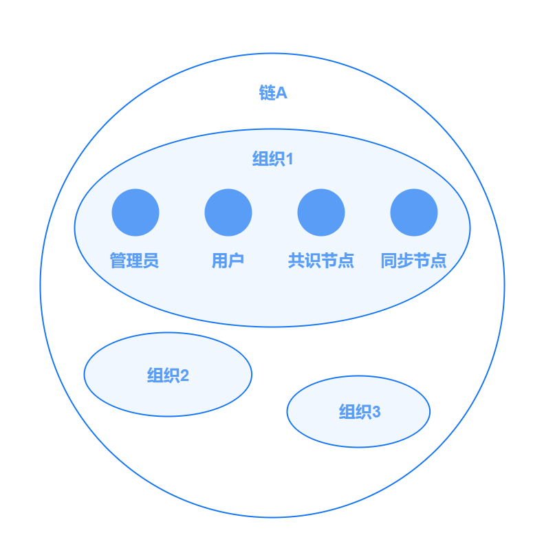
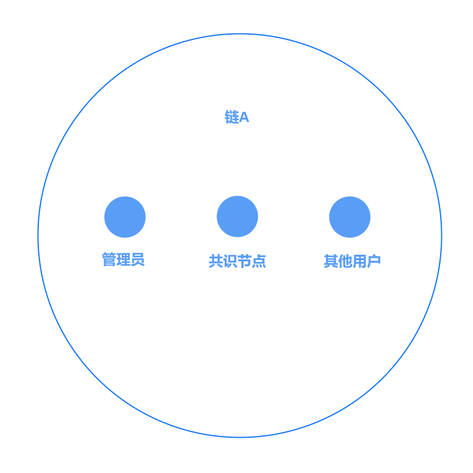
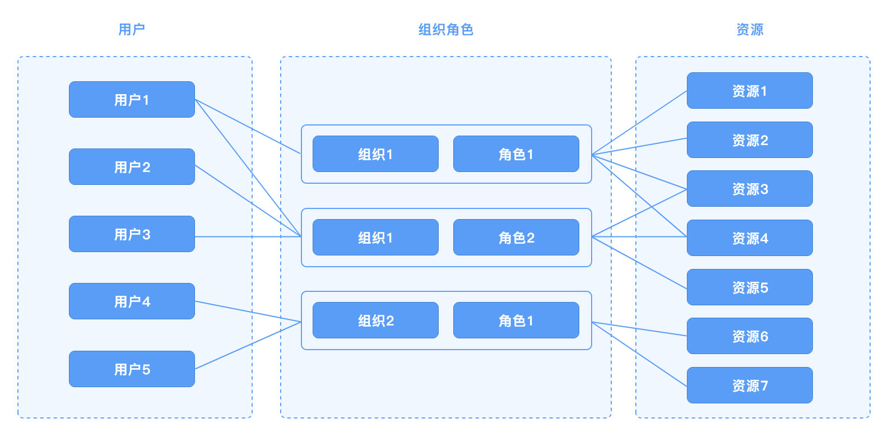

# 身份权限管理

## 概述

在区块链中，身份权限模块负责解决两个问题：

- 如何标识区块链节点、交易发送者等链上参与成员？
- 如何管理发送交易、查询交易、配置更新等链上操作权限？

传统的中心化信息系统中，往往采用用户名来标识用户，采用基于角色的权限控制 `role based access control, RBAC`模型、权限控制列表 `access control list, ACL` 等来管控操作权限。在区块链中，中心化的用户注册和登录不再可行，需采用基于密码学的方式进行用户标识，而权限控制仍可采用`RBAC、ACL`等传统方式。

在长安链2.X版本中, 我们实现了三种身份权限管理模型：

* PermissionedWithCert：基于数字证书的用户标识体系、基于角色的权限控制体系;
* PermissionedWithKey：基于公钥的用户标识体系、基于角色的权限控制体系。
* Public：基于公钥的用户标识体系、基于角色的权限控制体系。

其中，PermissionedWithCert和PermissionedWithKey模式面向强权限控制场景(联盟链)，Public模式面向弱权限控制场景(公链)

关于不同的身份模式配置，请参考[Cert模式长安链介绍](../instructions/Cert模式长安链介绍.md) ，[PK模式长安链介绍](../instructions/PK模式长安链介绍.md) 。后续迭代中，将支持更为丰富的身份权限管理模型。


## 用户标识体系

<span id="user_id_type"></span>

### 用户标识方法

区块链中，可采用公钥、地址（公钥哈希）、数字证书等方式来标识链上用户身份，具体对比如下表所示：

| 标识方法          | 标识长度 | 外部依赖         | 附加信息                |
|---------------|------|--------------|---------------------|
| 公钥/地址         | 小    | 无            | 不能附加额外信息            |
| 数字证书          | 大    | 需依赖CA颁发数字证书  | 可在证书字段中附加组织、角色等额外信息 |
| 分布式数字身份 (DID) | 小    | 需依赖 DID 支撑平台 | 可在 DID 文档中附加额外信息    |

长安链2.X版本可以采用**数字证书**或**公钥**来标识链上成员。


### 长安链用户体系

面向强权限控制场景，长安链的链上用户体系如下图所示：



一条链由多个组织构成，每个组织下拥有一个或多个区块链节点和用户（类型详见下文中[角色类型](#role_type)）。

如果采用**数字证书**的标识方式，每个组织在创世块中的`trust roots` 字段定义组织根证书，若链上成员拥有某根证书颁发的合法证书，则视为该成员为此组织下的合法用户。

如果采用**公钥**的标识方式，每个组织在创世块中的`trust roots` 字段定义组织的管理员公钥。每个组织在创世块中的`consensus`里定义组织的共识节点列表。其他用户需要在通过合法的交易注册身份才能成为链上的合法用户，详情见下文[公钥角色绑定](#pk_role_binding)

面向弱权限控制场景，长安链的链上用户体系如下图所示：



一条链上有多个链管理员，在创世块中的`trust roots`字段定义链管理员。共识节点是由共识算法和创世块中共识算法配置决定的。其他用户可以自由参与发交易，同步数据等链上活动。

## 基于角色的权限控制体系
### 角色类型

<span id="role_type"></span>

长安链中，定义了以下几种角色类型：

- 共识节点 `consensus`：有权参与区块共识流程的链上节点；
- 同步节点`common`：无权参与区块共识流程，但可在链上同步数据的节点；
- 管理员 `admin`：可代表组织进行链上治理的用户；
- 普通用户 `client`：无权进行链上治理，但可发送和查询交易的用户；
- 轻节点用户```light```：无权进行链上治理，无权发送交易，只可查询、订阅自己组织的区块、交易数据，属于SPV轻节点用户（详情见[轻节点](../tech/SPV轻节点.md)）。

### 权限定义

长安链采用三段式语法定义资源的访问权限：规则 (`rule`)、组织列表 (`orgList`)、角色列表 (`roleList`)

- 规则：以关键字的形式描述了需要多少个组织的用户共同认可才可访问资源，合法的规则包括：
  - `ALL`：要求 `orgList` 列表中所有组织参与，每个组织至少提供一个符合 `roleList` 要求角色的签名；
  - `ANY`：要求 `orgList` 列表中任意一个组织提供符合 `roleList` 要求角色的签名；
  - `MAJORITY`：要求联盟链中过半数组织提供各自 `admin` 角色的签名；
  - 一个以字符串形式表达的**整数** (e.g. "3")：要求`orgList` 列表中大于或等于规定数目的组织提供符合 `roleList` 要求角色的签名；
  - 一个以字符串形式表达的**分数** (e.g. "2/3") ：要求`orgList` 列表中大于或等于规定比例的组织提供符合 `roleList` 要求角色的签名；
  - `SELF`：要求资源所属的组织提供符合 `roleList` 要求角色的签名，在此关键字下，`orgList`中的组织列表信息不生效，该规则目前只适用于修改组织根证书、修改组织共识节点地址这两个操作的权限配置；
  - `FORBIDDEN`：此规则表示禁止所有人访问，在此关键字下，`orgList`和 `roleList` 不生效。
- 组织列表：合法的组织列表集合，组织需出现在配置文件的 `trust root` 中，若为空则默认出现在 `trust root` 中的所有组织；
- 角色列表：合法的角色列表集合，若为空则默认所有角色。

示例如下：

| 权限定义                                         | 说明                                               |
|----------------------------------------------|--------------------------------------------------|
| `[admin, client]` `ALL` `[org1, org2, org3]` | 三个组织各自提供至少一个管理员或普通用户提供签名才可访问对应资源                 |
| `[admin]` `1/2` `[]`                         | 链上所有组织中过半数组织的管理员提供签名才可访问对应资源（自定义版本的`MAJORITY`规则） |
| `[admin]` `SELF` `[]`                        | 资源所属组织的管理员提供签名才可访问对应资源，例如组织管理员有权修改各自组织的根证书       |

### 资源定义

长安链中，资源名称的定义采用 **[合约名称]-[方法名称]** 的规则。

例如:
* 修改链上配置的系统合约 **CHAIN_CONFIG** ，该合约包含添加根证书的方法 **TRUST_ROOT_ADD**，如果要修改该方法的权限，对应的资源名称为：CHAIN_CONFIG-TRUST_ROOT_ADD。
* CHAIN_CONFIG-TRUST_ROOT_ADD对应的默认权限定义是`{MAJORITY [] [ADMIN]}`则表示**添加根证书**操作需要客户端交易满足**半数以上组织管理员多签**，才能验证通过。

### 权限管理流程

长安链中，权限控制的整体流程为：

1. **配置加载**：链初始化时，加载配置文件中定义的资源名称和权限的对应关系，若无则加载默认配置；
2. **权限定位**：需要鉴权时，根据上下文确定访问的资源名称，找到对应的权限定义；
3. **签名校验**：根据用户提供的签名背书列表，校验签名是否满足权限定义的最低要求，返回鉴权成功或失败。


## PermissionedWithCert

### 标识方法

采用**数字证书**的标识方式，每个加入区块链网络中的节点和用户，需在加入前获得经认可的CA颁发的数字证书，且每条发出的消息需附加数字签名，供其他成员进行合法性校验。

### 权限管理

长安链2.X中，PermissionedWithCert模式采用了基于角色的权限控制模型，如下图所示。具体来说，需将用户绑定到某一组织的一个或多个角色上，再将链上资源（即链上需要进行权限管理的操作）绑定至特定的组织、角色，即可完成资源和用户的关联。



目前长安链PermissionWithCert模式内部默认权限列表如下：

| 合约名             | 方法名                          | 资源名                                          | 功能描述                          | 默认权限                                           | 权限描述                            |
|-----------------|------------------------------|----------------------------------------------|-------------------------------|------------------------------------------------|---------------------------------|
|                 |                              | ARCHIVE                                      | 归档                            | {[ADMIN] SELF []}                              | 本组织管理员签名                        |
|                 |                              | INVOKE_CONTRACT                              | 调用合约                          | {[CONSENSUS COMMON CLIENT ADMIN LIGHT] ANY []} | 任一组织共识节点、同步节点、轻节点、普通用户和管理员签名    |
|                 |                              | QUERY_CONTRACT                               | 查询合约                          | {[CONSENSUS COMMON CLIENT ADMIN LIGHT] ANY []} | 任一组织共识节点、同步节点、轻节点、普通用户和管理员签名    |
|                 |                              | SUBSCRIBE                                    | 订阅                            | {[LIGHT CLIENT ADMIN] ANY []}                  | 任一组织轻节点、普通用户和管理员签名              |
| ACCOUNT_MANAGER | SET_ADMIN                    | ACCOUNT_MANAGER-SET_ADMIN                    | 设置管理员地址                       | {[ADMIN] MAJORITY []}                          | 半数以上组织管理员多签                     |
| ACCOUNT_MANAGER | SET_CONTRACT_METHOD_PAYER    | ACCOUNT_MANAGER-SET_CONTRACT_METHOD_PAYER    | 为合约方法设置代付款账户                  | {[CONSENSUS CLIENT ADMIN] ANY []}              | 任意CLIENT、ADMIN、ConsensusNode可操作 |
| ACCOUNT_MANAGER | REFUND_GAS_VM                | ACCOUNT_MANAGER-REFUND_GAS_VM                | 退gas                          | {[] ANY []}                                    | 无限制                             |
| ACCOUNT_MANAGER | CHARGE_GAS                   | ACCOUNT_MANAGER-CHARGE_GAS                   | 收取gas费用                       | {[] ANY []}                                    | 无限制                             |
| ACCOUNT_MANAGER | CHARGE_GAS_FOR_MULTI_ACCOUNT | ACCOUNT_MANAGER-CHARGE_GAS_FOR_MULTI_ACCOUNT | 统一扣除区块内所有交易的gas               | {[CONSENSUS] ANY []}                           | 任意节点可以操作                        |
| ARCHIVE_MANAGER | ARCHIVE_BLOCK                | ARCHIVE_MANAGER-ARCHIVE_BLOCK                | 归档                            | {[ADMIN] SELF []}                              | 本组织管理员签名                        |
| ARCHIVE_MANAGER | RESTORE_BLOCK                | ARCHIVE_MANAGER-RESTORE_BLOCK                | 恢复归档数据                        | {[ADMIN] SELF []}                              | 本组织管理员签名                        |
| CERT_MANAGE     | CERTS_ALIAS_DELETE           | CERT_MANAGE-CERTS_ALIAS_DELETE               | 删除证书别名                        | {[ADMIN] ANY []}                               | 任一组织管理员签名                       |
| CERT_MANAGE     | CERTS_DELETE                 | CERT_MANAGE-CERTS_DELETE                     | 删除证书哈希                        | {[ADMIN] ANY []}                               | 任一组织管理员签名                       |
| CERT_MANAGE     | CERTS_FREEZE                 | CERT_MANAGE-CERTS_FREEZE                     | 冻结证书                          | {[ADMIN] ANY []}                               | 任一组织管理员签名                       |
| CERT_MANAGE     | CERTS_REVOKE                 | CERT_MANAGE-CERTS_REVOKE                     | 注销证书                          | {[ADMIN] ANY []}                               | 任一组织管理员签名                       |
| CERT_MANAGE     | CERTS_UNFREEZE               | CERT_MANAGE-CERTS_UNFREEZE                   | 解冻证书                          | {[ADMIN] ANY []}                               | 任一组织管理员签名                       |
| CERT_MANAGE     | CERT_ADD                     | CERT_MANAGE-CERT_ADD                         | 上链证书哈希                        | {[CLIENT ADMIN LIGHT] ANY []}                  | 任一组织普通用户、管理员和轻节点签名              |
| CERT_MANAGE     | CERT_ALIAS_ADD               | CERT_MANAGE-CERT_ALIAS_ADD                   | 添加证书别名                        | {[CLIENT ADMIN LIGHT] ANY []}                  | 任一组织普通用户、管理员和轻节点签名              |
| CERT_MANAGE     | CERT_ALIAS_UPDATE            | CERT_MANAGE-CERT_ALIAS_UPDATE                | 更新证书别名                        | {[ADMIN] ANY []}                               | 任一组织管理员签名                       |
| CHAIN_CONFIG    | UPDATE_VERSION               | CHAIN_CONFIG-UPDATE_VERSION                  | 更新链版本                         | {[ADMIN] MAJORITY []}                          | 半数以上管理员多签                       |
| CHAIN_CONFIG    | BLOCK_UPDATE                 | CHAIN_CONFIG-BLOCK_UPDATE                    | 更新出块配置                        | {[ADMIN] MAJORITY []}                          | 半数以上组织管理员多签                     |
| CHAIN_CONFIG    | CONSENSUS_EXT_ADD            | CHAIN_CONFIG-CONSENSUS_EXT_ADD               | 添加共识扩展字段                      | {[ADMIN] MAJORITY []}                          | 半数以上组织管理员多签                     |
| CHAIN_CONFIG    | CONSENSUS_EXT_DELETE         | CHAIN_CONFIG-CONSENSUS_EXT_DELETE            | 删除共识扩展字段                      | {[ADMIN] MAJORITY []}                          | 半数以上组织管理员多签                     |
| CHAIN_CONFIG    | CONSENSUS_EXT_UPDATE         | CHAIN_CONFIG-CONSENSUS_EXT_UPDATE            | 更新共识扩展字段                      | {[ADMIN] MAJORITY []}                          | 半数以上组织管理员多签                     |
| CHAIN_CONFIG    | CORE_UPDATE                  | CHAIN_CONFIG-CORE_UPDATE                     | 核心模块配置更新                      | {[ADMIN] MAJORITY []}                          | 半数以上组织管理员多签                     |
| CHAIN_CONFIG    | ENABLE_OR_DISABLE_GAS        | CHAIN_CONFIG-ENABLE_OR_DISABLE_GAS           | 是否开启全局gas                     | {[ADMIN] MAJORITY []}                          | 半数以上组织管理员多签                     |
| CHAIN_CONFIG    | GET_CHAIN_CONFIG             | CHAIN_CONFIG-GET_CHAIN_CONFIG                | 获取链配置                         | {[CONSENSUS COMMON CLIENT ADMIN LIGHT] ANY []} | 任一组织共识节点、同步节点、普通用户、管理员或轻节点签名    |
| CHAIN_CONFIG    | NODE_ID_ADD                  | CHAIN_CONFIG-NODE_ID_ADD                     | 添加节点ID                        | {[ADMIN] MAJORITY []}                          | 半数以上组织管理员多签                     |
| CHAIN_CONFIG    | NODE_ID_DELETE               | CHAIN_CONFIG-NODE_ID_DELETE                  | 删除节点ID                        | {[ADMIN] MAJORITY []}                          | 半数以上组织管理员多签                     |
| CHAIN_CONFIG    | NODE_ID_UPDATE               | CHAIN_CONFIG-NODE_ID_UPDATE                  | 更新节点ID                        | {[ADMIN] SELF []}                              | 本组织管理员签名                        |
| CHAIN_CONFIG    | NODE_ORG_ADD                 | CHAIN_CONFIG-NODE_ORG_ADD                    | 添加共识组织及节点                     | {[ADMIN] MAJORITY []}                          | 半数以上组织管理员多签                     |
| CHAIN_CONFIG    | NODE_ORG_DELETE              | CHAIN_CONFIG-NODE_ORG_DELETE                 | 删除共识组织                        | {[ADMIN] MAJORITY []}                          | 半数以上组织管理员多签                     |
| CHAIN_CONFIG    | NODE_ORG_UPDATE              | CHAIN_CONFIG-NODE_ORG_UPDATE                 | 更新共识组织                        | {[ADMIN] MAJORITY []}                          | 半数以上组织管理员多签                     |
| CHAIN_CONFIG    | PERMISSION_ADD               | CHAIN_CONFIG-PERMISSION_ADD                  | 添加权限                          | {[ADMIN] MAJORITY []}                          | 半数以上组织管理员多签                     |
| CHAIN_CONFIG    | PERMISSION_DELETE            | CHAIN_CONFIG-PERMISSION_DELETE               | 删除权限（恢复默认）                    | {[ADMIN] MAJORITY []}                          | 半数以上组织管理员多签                     |
| CHAIN_CONFIG    | PERMISSION_UPDATE            | CHAIN_CONFIG-PERMISSION_UPDATE               | 更新权限                          | {[ADMIN] MAJORITY []}                          | 半数以上组织管理员多签                     |
| CHAIN_CONFIG    | SET_ACCOUNT_MANAGER_ADMIN    | CHAIN_CONFIG-SET_ACCOUNT_MANAGER_ADMIN       | 设置管理员地址                       | {[ADMIN] MAJORITY []}                          | 半数以上组织管理员多签                     |
| CHAIN_CONFIG    | SET_INVOKE_BASE_GAS          | CHAIN_CONFIG-SET_INVOKE_BASE_GAS             | 设置基础扣费的Gas大小（单次调用的最少扣除的Gas数量） | {[ADMIN] MAJORITY []}                          | 半数以上组织管理员多签                     |
| CHAIN_CONFIG    | SET_INVOKE_GAS_PRICE         | CHAIN_CONFIG-SET_INVOKE_GAS_PRICE            | 设置调用 Gas 价格                   | {[ADMIN] MAJORITY []}                          | 半数以上管理员多签                       |
| CHAIN_CONFIG    | TRUST_MEMBER_ADD             | CHAIN_CONFIG-TRUST_MEMBER_ADD                | 添加第三方用户                       | {[ADMIN] MAJORITY []}                          | 半数以上组织管理员多签                     |
| CHAIN_CONFIG    | TRUST_MEMBER_DELETE          | CHAIN_CONFIG-TRUST_MEMBER_DELETE             | 删除第三方用户                       | {[ADMIN] MAJORITY []}                          | 半数以上组织管理员多签                     |
| CHAIN_CONFIG    | TRUST_MEMBER_UPDATE          | CHAIN_CONFIG-TRUST_MEMBER_UPDATE             | 更新第三方用户                       | {[ADMIN] MAJORITY []}                          | 半数以上组织管理员多签                     |
| CHAIN_CONFIG    | TRUST_ROOT_ADD               | CHAIN_CONFIG-TRUST_ROOT_ADD                  | 添加信任根证书                       | {[ADMIN] MAJORITY []}                          | 半数以上组织管理员多签                     |
| CHAIN_CONFIG    | TRUST_ROOT_DELETE            | CHAIN_CONFIG-TRUST_ROOT_DELETE               | 删除信任根证书                       | {[ADMIN] MAJORITY []}                          | 半数以上组织管理员多签                     |
| CHAIN_CONFIG    | TRUST_ROOT_UPDATE            | CHAIN_CONFIG-TRUST_ROOT_UPDATE               | 更新信任根证书                       | {[ADMIN] SELF []}                              | 本组织管理员签名                        |
| CHAIN_CONFIG    | SET_INSTALL_BASE_GAS         | CHAIN_CONFIG-SET_INSTALL_BASE_GAS            | 设置安装/升级合约花费gas                | {[ADMIN] MAJORITY []}                          | 半数以上组织管理员多签                     |
| CHAIN_CONFIG    | SET_INSTALL_GAS_PRICE        | CHAIN_CONFIG-SET_INSTALL_GAS_PRICE           | 设置安装/升级合约花费gas/byte           | {[ADMIN] MAJORITY []}                          | 半数以上组织管理员多签                     |
| CHAIN_CONFIG    | ENABLE_ONLY_CREATOR_UPGRADE  | CHAIN_CONFIG-ENABLE_ONLY_CREATOR_UPGRADE     | 开启只允许创建者升级合约功能                | {[ADMIN] MAJORITY []}                          | 半数以上组织管理员多签                     |
| CHAIN_CONFIG    | DISABLE_ONLY_CREATOR_UPGRADE | CHAIN_CONFIG-DISABLE_ONLY_CREATOR_UPGRADE    | 关闭只允许创建者升级合约功能                | {[ADMIN] MAJORITY []}                          | 半数以上组织管理员多签                     |
| CHAIN_CONFIG    | MULTI_SIGN_ENABLE_MANUAL_RUN | CHAIN_CONFIG-MULTI_SIGN_ENABLE_MANUAL_RUN    | 启用发送者的多重签名执行合约                | {[ADMIN] MAJORITY []}                          | 半数以上组织管理员多签                     |
| CONTRACT_MANAGE | FREEZE_CONTRACT              | CONTRACT_MANAGE-FREEZE_CONTRACT              | 冻结合约                          | {[ADMIN] MAJORITY []}                          | 半数以上组织管理员多签                     |
| CONTRACT_MANAGE | GET_DISABLED_CONTRACT_LIST   | CONTRACT_MANAGE-GET_DISABLED_CONTRACT_LIST   | 获取冻结合约列表                      | {[] ANY []}                                    | 无限制                             |
| CONTRACT_MANAGE | GRANT_CONTRACT_ACCESS        | CONTRACT_MANAGE-GRANT_CONTRACT_ACCESS        | 授予对原生合约的访问权限                  | { {[ADMIN] MAJORITY []}                        | 半数以上组织管理员多签                     |
| CONTRACT_MANAGE | INIT_CONTRACT                | CONTRACT_MANAGE-INIT_CONTRACT                | 安装合约                          | {[ADMIN] ANY []}                               | 任一管理员签名                         |
| CONTRACT_MANAGE | REVOKE_CONTRACT              | CONTRACT_MANAGE-REVOKE_CONTRACT              | 吊销合约                          | {[ADMIN] MAJORITY []}                          | 半数以上组织管理员多签                     |
| CONTRACT_MANAGE | UNFREEZE_CONTRACT            | CONTRACT_MANAGE-UNFREEZE_CONTRACT            | 解冻合约                          | {[ADMIN] MAJORITY []}                          | 半数以上组织管理员多签                     |
| CONTRACT_MANAGE | UPGRADE_CONTRACT             | CONTRACT_MANAGE-UPGRADE_CONTRACT             | 升级合约                          | {[ADMIN] MAJORITY []}                          | 半数以上组织管理员多签                     |
| CONTRACT_MANAGE | VERIFY_CONTRACT_ACCESS       | CONTRACT_MANAGE-VERIFY_CONTRACT_ACCESS       | 验证是否有权访问某个原生合约                | {[ADMIN] MAJORITY []}                          | 半数以上组织管理员多签                     |
| PRIVATE_COMPUTE | SAVE_CA_CERT                 | PRIVATE_COMPUTE-SAVE_CA_CERT                 | 保存隐私合约的根证书中                   | {[ADMIN] MAJORITY []}                          | 半数以上组织管理员多签                     |
| PRIVATE_COMPUTE | SAVE_ENCLAVE_REPORT          | PRIVATE_COMPUTE-SAVE_ENCLAVE_REPORT          | 保存隐私合约Enclave的Report          | {[ADMIN] MAJORITY []}                          | 半数以上组织管理员多签                     |
| PUBKEY_MANAGE   | PUBKEY_ADD                   | PUBKEY_MANAGE-PUBKEY_ADD                     | 添加公钥                          | {[] FORBIDDEN []}                              | 禁止                              |
| PUBKEY_MANAGE   | PUBKEY_DELETE                | PUBKEY_MANAGE-PUBKEY_DELETE                  | 删除公钥                          | {[] FORBIDDEN []}                              | 禁止                              |

```
  V2.3.3版本去掉ALTER_ADDR_TYPE（修改地址类型）功能，地址类型需要在链初始化时确定，确定后不支持修改。
```

可以通过修改链上配置中的权限定义部分，来自定义或者修改用户合约和系统合约中的某些方法的权限。 

参考如下示例：

```yaml
  - resource_name: CHAIN_CONFIG-TRUST_ROOT_ADD
    policy:
      rule: MAJORITY
      org_list:
      role_list:
        - admin
```

采用命令行工具或SDK工具修改链上配置参考：[命令行工具](../dev/命令行工具.md) 和 [SDK](../sdk/GoSDK使用说明.md) 

### 外部证书兼容

长安链中，若采用**数字证书**作为用户标识，需要在证书字段中，附加组织和角色等信息。

例如，X.509标准的数字证书中的Organization字段，需要填写长安链中的组织信息。OrganizationalUnit字段，需要填写长安链中的角色信息。

若用户采用非长安链CA（chainmaker-ca）或证书生成工具（chainmaker-cryptogen）颁发的数字证书，需要利用**外部证书兼容**的功能，来参与链上活动。

目前长安链的用户、节点的签名证书（即业务证书）支持使用BJCA、CFCA等国家认可的第三方CA颁发的外部证书。因TLS证书仅作用于通信层，故无需使用外部证书。

具体配置方法参考：[外部证书兼容配置手册](../dev/CA证书服务.html#兼容外部证书) 

## PermissionedWithKey

### 标识方法

采用**公钥**的标识方式，能够避免像数字证书体系那样繁琐的签发流程，使用户加入区块链网络更加简单快捷，但无法承载用户或节点的组织信息以及角色信息。

### 权限管理

由于PermissionedWithKey也是面向强权限控制场景的模式，权限管理方案与PermissionedWithCert模式大致相同。差异主要表现在以下两方面：

<span id="pk_role_binding"></span>

#### 公钥角色绑定

由于公钥无法承载用户或节点的组织信息以及角色信息，因此需要把这些信息存到链上，并跟节点或者用户的公钥绑定，我们新增了公钥管理的系统合约：`PUBKEY_MANAGE`，该合约采用`SELF`的权限控制方案，即需要组织的管理员签名，为该组织下用户或节点的公钥绑定信息至链上。而组织管理员是启动区块链时，默认注册到链上的，通过写到链配置的`trust roots`字段。另外，共识节点的组织和角色信息，也是通过在链配置中默认注册的。

`PUBKEY_MANAGE`，该合约拥有下列三个方法：

* PUBKEY_ADD：增加公钥身份信息方法
* PUBKEY_DELETE：删除公钥身份信息方法
* PUBKEY_QUERY：查询公钥身份信息方法

**注**：该合约的三个方法仅在PermissionedWithKey模式下支持使用。

具体操作方法参考[命令行工具](../dev/命令行工具.md) 和 [SDK](../sdk/GoSDK使用说明.md) 。

#### 系统合约权限差异

PermissionedWithKey模式下，由于采用**公钥**的标识方式，不再使用数字证书，所以**数字证书相关的系统合约**和**外部证书兼容相关的系统合约**是被禁止使用的，具体如下：

`CERT_MANAGE`：证书管理系统合约

|       方法       |  功能  | 备注  |
|:--------------:|:----:|:---:|
|    CERT_ADD    | 添加证书 | 禁止  |
|  CERTS_DELETE  | 删除证书 | 禁止  |
|  CERTS_QUERY   | 查询证书 | 禁止  |
|  CERTS_FREEZE  | 冻结证书 | 禁止  |
| CERTS_UNFREEZE | 解冻证书 | 禁止  |
|  CERTS_REVOKE  | 吊销证书 | 禁止  |

`CHAIN_CONFIG`：链配置更新系统合约

|         方法          |   功能   | 备注  |
|:-------------------:|:------:|:---:|
|  TRUST_MEMBER_ADD   | 添加外部证书 | 禁止  |
| TRUST_MEMBER_UPDATE | 更新外部证书 | 禁止  |
| TRUST_MEMBER_DELETE | 删除外部证书 | 禁止  |


目前长安链PermissionWithKey模式内部默认权限列表如下：

| 合约名             | 方法名                          | 资源名                                          | 功能描述                          | 默认权限                                           | 权限描述                            |
|-----------------|------------------------------|----------------------------------------------|-------------------------------|------------------------------------------------|---------------------------------|
|                 |                              | ARCHIVE                                      | 归档                            | {[ADMIN] SELF []}                              | 本组织管理员签名                        |
|                 |                              | INVOKE_CONTRACT                              | 调用合约                          | {[CLIENT ADMIN] ANY []}                        | 任一组织普通用户、管理员签名                  |
|                 |                              | QUERY_CONTRACT                               | 查询合约                          | {[CONSENSUS COMMON LIGHT CLIENT ADMIN] ANY []} | 任一组织共识节点、同步节点、轻节点、普通用户和管理员签名    |
|                 |                              | SUBSCRIBE                                    | 订阅                            | {[LIGHT CLIENT ADMIN] ANY []}                  | 任一组织轻节点、普通用户、管理员签名              |
| ACCOUNT_MANAGER | CHARGE_GAS_FOR_MULTI_ACCOUNT | ACCOUNT_MANAGER-CHARGE_GAS_FOR_MULTI_ACCOUNT | 统一扣除区块内所有交易的gas               | {[CONSENSUS] ANY []}                           | 任一组织共识节点签名                      |
| ACCOUNT_MANAGER | SET_ADMIN                    | ACCOUNT_MANAGER-SET_ADMIN                    | 设置Gas管理员地址                    | {[ADMIN] MAJORITY []}                          | 半数以上组织管理员多签                     |
| ACCOUNT_MANAGER | SET_CONTRACT_METHOD_PAYER    | ACCOUNT_MANAGER-SET_CONTRACT_METHOD_PAYER    | 为合约方法设置代付款账户                  | {[CONSENSUS CLIENT ADMIN] ANY []}              | 任意CLIENT、ADMIN、ConsensusNode可操作 |
| ACCOUNT_MANAGER | CHARGE_GAS                   | ACCOUNT_MANAGER-CHARGE_GAS                   | 收取gas费用                       | {[] ANY []}                                    | 无限制                             |
| ARCHIVE_MANAGER | ARCHIVE_BLOCK                | ARCHIVE_MANAGER-ARCHIVE_BLOCK                | 归档                            | {[ADMIN] SELF []}                              | 本组织管理员签名                        |
| ARCHIVE_MANAGER | RESTORE_BLOCK                | ARCHIVE_MANAGER-RESTORE_BLOCK                | 恢复归档数据                        | {[ADMIN] SELF []}                              | 本组织管理员签名                        |
| CERT_MANAGE     | CERTS_DELETE                 | CERT_MANAGE-CERTS_DELETE                     | 删除证书                          | {[] FORBIDDEN []}                              | 禁止                              |
| CERT_MANAGE     | CERTS_FREEZE                 | CERT_MANAGE-CERTS_FREEZE                     | 冻结证书                          | {[] FORBIDDEN []}                              | 禁止                              |
| CERT_MANAGE     | CERTS_REVOKE                 | CERT_MANAGE-CERTS_REVOKE                     | 撤消证书                          | {[] FORBIDDEN []}                              | 禁止                              |
| CERT_MANAGE     | CERTS_UNFREEZE               | CERT_MANAGE-CERTS_UNFREEZE                   | 解冻证书                          | {[] FORBIDDEN []}                              | 禁止                              |
| CERT_MANAGE     | CERT_ADD                     | CERT_MANAGE-CERT_ADD                         | 添加证书                          | {[] FORBIDDEN []}                              | 禁止                              |
| CERT_MANAGE     | CERT_ALIAS_ADD               | CERT_MANAGE-CERT_ALIAS_ADD                   | 添加证书别名                        | {[] FORBIDDEN []}                              | 禁止                              |
| CERT_MANAGE     | CERT_ALIAS_UPDATE            | CERT_MANAGE-CERT_ALIAS_UPDATE                | 更新证书别名                        | {[] FORBIDDEN []}                              | 禁止                              |
| CHAIN_CONFIG    | UPDATE_VERSION               | CHAIN_CONFIG-UPDATE_VERSION                  | 更新链版本                         | {[ADMIN] MAJORITY []}                          | 半数以上管理员多签                       |
| CHAIN_CONFIG    | BLOCK_UPDATE                 | CHAIN_CONFIG-BLOCK_UPDATE                    | 更新区块配置                        | {[ADMIN] MAJORITY []}                          | 半数以上组织管理员多签                     |
| CHAIN_CONFIG    | CONSENSUS_EXT_ADD            | CHAIN_CONFIG-CONSENSUS_EXT_ADD               | 添加共识扩展字段                      | {[ADMIN] MAJORITY []}                          | 半数以上组织管理员多签                     |
| CHAIN_CONFIG    | CONSENSUS_EXT_DELETE         | CHAIN_CONFIG-CONSENSUS_EXT_DELETE            | 删除共识扩展字段                      | {[ADMIN] MAJORITY []}                          | 半数以上组织管理员多签                     |
| CHAIN_CONFIG    | CONSENSUS_EXT_UPDATE         | CHAIN_CONFIG-CONSENSUS_EXT_UPDATE            | 更新共识扩展字段                      | {[ADMIN] MAJORITY []}                          | 半数以上组织管理员多签                     |
| CHAIN_CONFIG    | CORE_UPDATE                  | CHAIN_CONFIG-CORE_UPDATE                     | 更新核心模块配置                      | {[ADMIN] MAJORITY []}                          | 半数以上组织管理员多签                     |
| CHAIN_CONFIG    | ENABLE_OR_DISABLE_GAS        | CHAIN_CONFIG-ENABLE_OR_DISABLE_GAS           | 是否开启gas                       | {[ADMIN] MAJORITY []}                          | 半数以上组织管理员多签                     |
| CHAIN_CONFIG    | GET_CHAIN_CONFIG             | CHAIN_CONFIG-GET_CHAIN_CONFIG                | 获取链配置                         | {[CONSENSUS COMMON CLIENT ADMIN LIGHT] ANY []} | 任一共识节点、同步节点、普通用户、管理员和轻节点签名      |
| CHAIN_CONFIG    | NODE_ID_ADD                  | CHAIN_CONFIG-NODE_ID_ADD                     | 添加节点ID                        | {[ADMIN] MAJORITY []}                          | 半数以上组织管理员多签                     |
| CHAIN_CONFIG    | NODE_ID_DELETE               | CHAIN_CONFIG-NODE_ID_DELETE                  | 删除节点ID                        | {[ADMIN] MAJORITY []}                          | 半数以上组织管理员多签                     |
| CHAIN_CONFIG    | NODE_ID_UPDATE               | CHAIN_CONFIG-NODE_ID_UPDATE                  | 更新节点ID                        | {[ADMIN] SELF []}                              | 本组织管理员签名                        |
| CHAIN_CONFIG    | NODE_ORG_ADD                 | CHAIN_CONFIG-NODE_ORG_ADD                    | 添加共识组织和节点                     | {[ADMIN] MAJORITY []}                          | 半数以上组织管理员多签                     |
| CHAIN_CONFIG    | NODE_ORG_DELETE              | CHAIN_CONFIG-NODE_ORG_DELETE                 | 删除共识组织                        | {[ADMIN] MAJORITY []}                          | 半数以上组织管理员多签                     |
| CHAIN_CONFIG    | NODE_ORG_UPDATE              | CHAIN_CONFIG-NODE_ORG_UPDATE                 | 更新共识组织                        | {[ADMIN] MAJORITY []}                          | 半数以上组织管理员多签                     |
| CHAIN_CONFIG    | PERMISSION_ADD               | CHAIN_CONFIG-PERMISSION_ADD                  | 添加权限                          | {[ADMIN] MAJORITY []}                          | 半数以上组织管理员多签                     |
| CHAIN_CONFIG    | PERMISSION_DELETE            | CHAIN_CONFIG-PERMISSION_DELETE               | 删除权限（恢复成默认）                   | {[ADMIN] MAJORITY []}                          | 半数以上组织管理员多签                     |
| CHAIN_CONFIG    | PERMISSION_UPDATE            | CHAIN_CONFIG-PERMISSION_UPDATE               | 更新权限                          | {[ADMIN] MAJORITY []}                          | 半数以上组织管理员多签                     |
| CHAIN_CONFIG    | SET_ACCOUNT_MANAGER_ADMIN    | CHAIN_CONFIG-SET_ACCOUNT_MANAGER_ADMIN       | 设置管理员地址                       | {[ADMIN] MAJORITY []}                          | 半数以上组织管理员多签                     |
| CHAIN_CONFIG    | SET_INVOKE_BASE_GAS          | CHAIN_CONFIG-SET_INVOKE_BASE_GAS             | 设置基础扣费的Gas大小（单次调用的最少扣除的Gas数量） | {[ADMIN] MAJORITY []}                          | 半数以上组织管理员多签                     |
| CHAIN_CONFIG    | SET_INVOKE_GAS_PRICE         | CHAIN_CONFIG-SET_INVOKE_GAS_PRICE            | 设置调用 Gas 价格                   | {[ADMIN] MAJORITY []}                          | 半数以上管理员多签                       |
| CHAIN_CONFIG    | TRUST_MEMBER_ADD             | CHAIN_CONFIG-TRUST_MEMBER_ADD                | 添加可信成员                        | {[] FORBIDDEN []}                              | 禁止                              |
| CHAIN_CONFIG    | TRUST_MEMBER_DELETE          | CHAIN_CONFIG-TRUST_MEMBER_DELETE             | 删除可信成员                        | {[] FORBIDDEN []}                              | 禁止                              |
| CHAIN_CONFIG    | TRUST_MEMBER_UPDATE          | CHAIN_CONFIG-TRUST_MEMBER_UPDATE             | 更新可信成员                        | {[] FORBIDDEN []}                              | 禁止                              |
| CHAIN_CONFIG    | TRUST_ROOT_ADD               | CHAIN_CONFIG-TRUST_ROOT_ADD                  | 添加管理员公钥                       | {[ADMIN] MAJORITY []}                          | 半数以上组织管理员多签                     |
| CHAIN_CONFIG    | TRUST_ROOT_DELETE            | CHAIN_CONFIG-TRUST_ROOT_DELETE               | 删除管理员公钥                       | {[ADMIN] MAJORITY []}                          | 半数以上组织管理员多签                     |
| CHAIN_CONFIG    | TRUST_ROOT_UPDATE            | CHAIN_CONFIG-TRUST_ROOT_UPDATE               | 更新管理员公钥                       | {[ADMIN] SELF []}                              | 本组织管理员签名                        |
| CHAIN_CONFIG    | SET_INSTALL_BASE_GAS         | CHAIN_CONFIG-SET_INSTALL_BASE_GAS            | 设置安装/升级合约花费gas                | {[ADMIN] MAJORITY []}                          | 半数以上组织管理员多签                     |
| CHAIN_CONFIG    | SET_INSTALL_GAS_PRICE        | CHAIN_CONFIG-SET_INSTALL_GAS_PRICE           | 设置安装/升级合约花费gas/byte           | {[ADMIN] MAJORITY []}                          | 半数以上组织管理员多签                     |
| CHAIN_CONFIG    | ENABLE_ONLY_CREATOR_UPGRADE  | CHAIN_CONFIG-ENABLE_ONLY_CREATOR_UPGRADE     | 开启只允许创建者升级合约功能                | {[ADMIN] MAJORITY []}                          | 半数以上组织管理员多签                     |
| CHAIN_CONFIG    | DISABLE_ONLY_CREATOR_UPGRADE | CHAIN_CONFIG-DISABLE_ONLY_CREATOR_UPGRADE    | 关闭只允许创建者升级合约功能                | {[ADMIN] MAJORITY []}                          | 半数以上组织管理员多签                     |
| CHAIN_CONFIG    | MULTI_SIGN_ENABLE_MANUAL_RUN | CHAIN_CONFIG-MULTI_SIGN_ENABLE_MANUAL_RUN    | 启用发送者的多重签名执行合约                | {[ADMIN] MAJORITY []}                          | 半数以上组织管理员多签                     |
| CONTRACT_MANAGE | FREEZE_CONTRACT              | CONTRACT_MANAGE-FREEZE_CONTRACT              | 冻结合约                          | {[ADMIN] MAJORITY []}                          | 半数以上组织管理员多签                     |
| CONTRACT_MANAGE | GET_DISABLED_CONTRACT_LIST   | CONTRACT_MANAGE-GET_DISABLED_CONTRACT_LIST   | 获取冻结合约列表                      | {[] ANY []}                                    | 无限制                             |
| CONTRACT_MANAGE | GRANT_CONTRACT_ACCESS        | CONTRACT_MANAGE-GRANT_CONTRACT_ACCESS        | 授予对原生合约的访问权限                  | { {[ADMIN] MAJORITY []}                        | 半数以上组织管理员多签                     |
| CONTRACT_MANAGE | INIT_CONTRACT                | CONTRACT_MANAGE-INIT_CONTRACT                | 安装合约                          | {[ADMIN] ANY []}                               | 任一管理员签名                         |
| CONTRACT_MANAGE | REVOKE_CONTRACT              | CONTRACT_MANAGE-REVOKE_CONTRACT              | 注销合约                          | {[ADMIN] MAJORITY []}                          | 半数以上组织管理员多签                     |
| CONTRACT_MANAGE | UNFREEZE_CONTRACT            | CONTRACT_MANAGE-UNFREEZE_CONTRACT            | 解冻合约                          | {[ADMIN] MAJORITY []}                          | 半数以上组织管理员多签                     |
| CONTRACT_MANAGE | UPGRADE_CONTRACT             | CONTRACT_MANAGE-UPGRADE_CONTRACT             | 升级合约                          | {[ADMIN] MAJORITY []}                          | 半数以上组织管理员多签                     |
| CONTRACT_MANAGE | VERIFY_CONTRACT_ACCESS       | CONTRACT_MANAGE-VERIFY_CONTRACT_ACCESS       | 验证是否有权访问某个原生合约                | {[ADMIN] MAJORITY []}                          | 半数以上组织管理员多签                     |
| PRIVATE_COMPUTE | SAVE_CA_CERT                 | PRIVATE_COMPUTE-SAVE_CA_CERT                 | 隐私合约保存根证书                     | {[ADMIN] MAJORITY []}                          | 半数以上组织管理员多签                     |
| PRIVATE_COMPUTE | SAVE_ENCLAVE_REPORT          | PRIVATE_COMPUTE-SAVE_ENCLAVE_REPORT          | 保存隐私合约Enclave的Report          | {[ADMIN] MAJORITY []}                          | 半数以上组织管理员多签                     |
| PUBKEY_MANAGE   | PUBKEY_ADD                   | PUBKEY_MANAGE-PUBKEY_ADD                     | 添加公钥                          | {[ADMIN] SELF []}                              | 本组织管理员签名                        |
| PUBKEY_MANAGE   | PUBKEY_DELETE                | PUBKEY_MANAGE-PUBKEY_DELETE                  | 删除公钥                          | {[ADMIN] SELF []}                              | 本组织管理员签名                        |

```
  V2.3.3版本去掉ALTER_ADDR_TYPE（修改地址类型）功能，地址类型需要在链初始化时确定，确定后不支持修改。
```

## Public

### 标识方法

采用**公钥**的标识方式，能够避免像数字证书体系那样繁琐的签发流程，使用户加入区块链网络更加简单快捷，但无法承载用户或节点的组织信息以及角色信息。

### 支持的共识算法

Public模式下，目前支持的共识算法及他们对应的权限策略见下：
* [DPOS](#DPOS)
* [TBFT](#TBFT)

### 权限管理

Public模式下，由于权限开放性很高，而且用户没有组织属性，因此不支持通过配置进行自定义权限策略。在该模式下不再需要的系统合约都会被禁止，而针对不同的共识算法，权限控制策略也会有所差别。
#### 交易类型

**任意普通用户都可以调用的交易类型**：

|    交易类型     |   功能   |
| :-------------: | :------: |
| INVOKE_CONTRACT | 合约调用 |
| QUERY_CONTRACT  | 合约查询 |
|    SUBSCRIBE    |   订阅   |

**需要任何一个链管理员签名才可以调用的交易类型**：

| 交易类型 |   功能   |
| :------: | :------: |
| ARCHIVE  | 数据归档 |


<span id="DPOS"></span>

#### DPOS共识

大部分系统合约被禁止使用。

Public-DPOS模式默认权限列表如下：

| 合约名             | 方法名                          | 资源名                                          | 功能描述                          | 默认权限                  | 权限描述        |
|-----------------|------------------------------|----------------------------------------------|-------------------------------|-----------------------|-------------|
|                 |                              | ARCHIVE                                      | 归档                            | {[ADMIN] ANY []}      | 任一管理员签名     |
|                 |                              | INVOKE_CONTRACT                              | 执行合约                          | {[] ANY []}           | 无限制         |
|                 |                              | SUBSCRIBE                                    | 订阅                            | {[] ANY []}           | 无限制         |
|                 |                              | QUERY_CONTRACT                               | 查询合约                          | {[] ANY []}           | 无限制         |
| ACCOUNT_MANAGER | REFUND_GAS_VM                | ACCOUNT_MANAGER-REFUND_GAS_VM                | /                             | {[] FORBIDDEN []}     | 禁止          |
| ACCOUNT_MANAGER | REFUND_GAS                   | ACCOUNT_MANAGER-REFUND_GAS                   | /                             | {[] FORBIDDEN []}     | 禁止          |
| ACCOUNT_MANAGER | SET_ADMIN                    | ACCOUNT_MANAGER-SET_ADMIN                    | /                             | {[] FORBIDDEN []}     | 禁止          |
| ACCOUNT_MANAGER | SET_CONTRACT_METHOD_PAYER    | ACCOUNT_MANAGER-SET_CONTRACT_METHOD_PAYER    | /                             | {[] FORBIDDEN []}     | 禁止          |
| ACCOUNT_MANAGER | CHARGE_GAS                   | ACCOUNT_MANAGER-CHARGE_GAS                   | 收取gas费用                       | {[] FORBIDDEN []}     | 禁止          |
| ACCOUNT_MANAGER | RECHARGE_GAS                 | ACCOUNT_MANAGER-RECHARGE_GAS                 | gas充值                         | {[] FORBIDDEN []}     | 禁止          |
| ACCOUNT_MANAGER | CHARGE_GAS_FOR_MULTI_ACCOUNT | ACCOUNT_MANAGER-CHARGE_GAS_FOR_MULTI_ACCOUNT | 收取多个帐户gas费用                   | {[CONSENSUS] ANY []}  | 任意节点可以操作    |
| ARCHIVE_MANAGER | ARCHIVE_BLOCK                | ARCHIVE_MANAGER-ARCHIVE_BLOCK                | 归档                            | {[ADMIN] ANY []}      | 任一管理员签名     |
| ARCHIVE_MANAGER | RESTORE_BLOCK                | ARCHIVE_MANAGER-RESTORE_BLOCK                | 恢复归档数据                        | {[ADMIN] ANY []}      | 任一管理员签名     |
| CERT_MANAGE     | CERTS_ALIAS_DELETE           | CERT_MANAGE-CERTS_ALIAS_DELETE               | /                             | {[] FORBIDDEN []}     | 禁止          |
| CERT_MANAGE     | CERTS_DELETE                 | CERT_MANAGE-CERTS_DELETE                     | /                             | {[] FORBIDDEN []}     | 禁止          |
| CERT_MANAGE     | CERTS_FREEZE                 | CERT_MANAGE-CERTS_FREEZE                     | /                             | {[] FORBIDDEN []}     | 禁止          |
| CERT_MANAGE     | CERTS_REVOKE                 | CERT_MANAGE-CERTS_REVOKE                     | /                             | {[] FORBIDDEN []}     | 禁止          |
| CERT_MANAGE     | CERTS_UNFREEZE               | CERT_MANAGE-CERTS_UNFREEZE                   | /                             | {[] FORBIDDEN []}     | 禁止          |
| CERT_MANAGE     | CERT_ADD                     | CERT_MANAGE-CERT_ADD                         | /                             | {[] FORBIDDEN []}     | 禁止          |
| CERT_MANAGE     | CERT_ALIAS_ADD               | CERT_MANAGE-CERT_ALIAS_ADD                   | /                             | {[] FORBIDDEN []}     | 禁止          |
| CERT_MANAGE     | CERT_ALIAS_UPDATE            | CERT_MANAGE-CERT_ALIAS_UPDATE                | /                             | {[] FORBIDDEN []}     | 禁止          |
| CHAIN_CONFIG    | UPDATE_VERSION               | CHAIN_CONFIG-UPDATE_VERSION                  | 更新链版本                         | {[ADMIN] MAJORITY []} | 半数以上管理员多签   |
| CHAIN_CONFIG    | BLOCK_UPDATE                 | CHAIN_CONFIG-BLOCK_UPDATE                    | 更新区块配置                        | {[ADMIN] ANY []}      | 任一管理员签名     |
| CHAIN_CONFIG    | CONSENSUS_EXT_ADD            | CHAIN_CONFIG-CONSENSUS_EXT_ADD               | /                             | {[] FORBIDDEN []}     | 禁止          |
| CHAIN_CONFIG    | CONSENSUS_EXT_DELETE         | CHAIN_CONFIG-CONSENSUS_EXT_DELETE            | /                             | {[] FORBIDDEN []}     | 禁止          |
| CHAIN_CONFIG    | CONSENSUS_EXT_UPDATE         | CHAIN_CONFIG-CONSENSUS_EXT_UPDATE            | /                             | {[] FORBIDDEN []}     | 禁止          |
| CHAIN_CONFIG    | CORE_UPDATE                  | CHAIN_CONFIG-CORE_UPDATE                     | 更新核心模块配置                      | {[ADMIN] ANY []}      | 任一管理员签名     |
| CHAIN_CONFIG    | ENABLE_OR_DISABLE_GAS        | CHAIN_CONFIG-ENABLE_OR_DISABLE_GAS           | /                             | {[] FORBIDDEN []}     | 禁止          |
| CHAIN_CONFIG    | NODE_ID_ADD                  | CHAIN_CONFIG-NODE_ID_ADD                     | /                             | {[] FORBIDDEN []}     | 禁止          |
| CHAIN_CONFIG    | NODE_ID_DELETE               | CHAIN_CONFIG-NODE_ID_DELETE                  | /                             | {[] FORBIDDEN []}     | 禁止          |
| CHAIN_CONFIG    | NODE_ID_UPDATE               | CHAIN_CONFIG-NODE_ID_UPDATE                  | /                             | {[] FORBIDDEN []}     | 禁止          |
| CHAIN_CONFIG    | NODE_ORG_ADD                 | CHAIN_CONFIG-NODE_ORG_ADD                    | /                             | {[] FORBIDDEN []}     | 禁止          |
| CHAIN_CONFIG    | NODE_ORG_DELETE              | CHAIN_CONFIG-NODE_ORG_DELETE                 | /                             | {[] FORBIDDEN []}     | 禁止          |
| CHAIN_CONFIG    | NODE_ORG_UPDATE              | CHAIN_CONFIG-NODE_ORG_UPDATE                 | /                             | {[] FORBIDDEN []}     | 禁止          |
| CHAIN_CONFIG    | PERMISSION_ADD               | CHAIN_CONFIG-PERMISSION_ADD                  | 添加权限                          | {[ADMIN] MAJORITY []} | 半数以上管理员多签   |
| CHAIN_CONFIG    | PERMISSION_DELETE            | CHAIN_CONFIG-PERMISSION_DELETE               | 删除权限（恢复默认）                    | {[ADMIN] MAJORITY []} | 半数以上管理员多签   |
| CHAIN_CONFIG    | PERMISSION_UPDATE            | CHAIN_CONFIG-PERMISSION_UPDATE               | 更新权限                          | {[ADMIN] MAJORITY []} | 半数以上管理员多签   |
| CHAIN_CONFIG    | SET_ACCOUNT_MANAGER_ADMIN    | CHAIN_CONFIG-SET_ACCOUNT_MANAGER_ADMIN       | 设置管理员地址                       | {[] FORBIDDEN []}     | 禁止          |
| CHAIN_CONFIG    | SET_INVOKE_BASE_GAS          | CHAIN_CONFIG-SET_INVOKE_BASE_GAS             | 设置基础扣费的Gas大小（单次调用的最少扣除的Gas数量） | {[] FORBIDDEN []}     | 禁止          |
| CHAIN_CONFIG    | SET_INVOKE_GAS_PRICE         | CHAIN_CONFIG-SET_INVOKE_GAS_PRICE            | 设置调用 Gas 价格                   | {[] FORBIDDEN []}     | 禁止          |
| CHAIN_CONFIG    | TRUST_MEMBER_ADD             | CHAIN_CONFIG-TRUST_MEMBER_ADD                | /                             | {[] FORBIDDEN []}     | 禁止          |
| CHAIN_CONFIG    | TRUST_MEMBER_DELETE          | CHAIN_CONFIG-TRUST_MEMBER_DELETE             | /                             | {[] FORBIDDEN []}     | 禁止          |
| CHAIN_CONFIG    | TRUST_MEMBER_UPDATE          | CHAIN_CONFIG-TRUST_MEMBER_UPDATE             | /                             | {[] FORBIDDEN []}     | 禁止          |
| CHAIN_CONFIG    | TRUST_ROOT_ADD               | CHAIN_CONFIG-TRUST_ROOT_ADD                  | 添加管理员公钥                       | {[ADMIN] MAJORITY []} | 半数以上管理员多签   |
| CHAIN_CONFIG    | TRUST_ROOT_DELETE            | CHAIN_CONFIG-TRUST_ROOT_DELETE               | 删除管理员公钥                       | {[ADMIN] MAJORITY []} | 半数以上管理员多签   |
| CHAIN_CONFIG    | TRUST_ROOT_UPDATE            | CHAIN_CONFIG-TRUST_ROOT_UPDATE               | 更新管理员公钥                       | {[ADMIN] MAJORITY []} | 半数以上管理员多签   |
| CHAIN_CONFIG    | SET_INSTALL_BASE_GAS         | CHAIN_CONFIG-SET_INSTALL_BASE_GAS            | 设置安装/升级合约花费gas                | {[] FORBIDDEN []}     | 禁止          |
| CHAIN_CONFIG    | SET_INSTALL_GAS_PRICE        | CHAIN_CONFIG-SET_INSTALL_GAS_PRICE           | 设置安装/升级合约花费gas/byte           | {[] FORBIDDEN []}     | 禁止          |
| CHAIN_CONFIG    | ENABLE_ONLY_CREATOR_UPGRADE  | CHAIN_CONFIG-ENABLE_ONLY_CREATOR_UPGRADE     | 开启只允许创建者升级合约功能                | {[ADMIN] MAJORITY []} | 半数以上组织管理员多签 |
| CHAIN_CONFIG    | DISABLE_ONLY_CREATOR_UPGRADE | CHAIN_CONFIG-DISABLE_ONLY_CREATOR_UPGRADE    | 关闭只允许创建者升级合约功能                | {[ADMIN] MAJORITY []} | 半数以上组织管理员多签 |
| CHAIN_CONFIG    | MULTI_SIGN_ENABLE_MANUAL_RUN | CHAIN_CONFIG-MULTI_SIGN_ENABLE_MANUAL_RUN    | 启用发送者的多重签名执行合约                | {[] FORBIDDEN []}     | 禁止          |
| CONTRACT_MANAGE | FREEZE_CONTRACT              | CONTRACT_MANAGE-FREEZE_CONTRACT              | 冻结合约                          | {[ADMIN] ANY []}      | 任一管理员签名     |
| CONTRACT_MANAGE | GET_DISABLED_CONTRACT_LIST   | CONTRACT_MANAGE-GET_DISABLED_CONTRACT_LIST   | 获取冻结合约列表                      | {[] ANY []}           | 无限制         |
| CONTRACT_MANAGE | GRANT_CONTRACT_ACCESS        | CONTRACT_MANAGE-GRANT_CONTRACT_ACCESS        | /                             | {[] FORBIDDEN []}     | 禁止          |
| CONTRACT_MANAGE | INIT_CONTRACT                | CONTRACT_MANAGE-INIT_CONTRACT                | 安装合约                          | {[ADMIN] ANY []}      | 任一管理员签名     |
| CONTRACT_MANAGE | REVOKE_CONTRACT              | CONTRACT_MANAGE-REVOKE_CONTRACT              | 吊销合约                          | {[ADMIN] ANY []}      | 任一管理员签名     |
| CONTRACT_MANAGE | REVOKE_CONTRACT_ACCESS       | CONTRACT_MANAGE-REVOKE_CONTRACT_ACCESS       | /                             | {[] FORBIDDEN []}     | 禁止          |
| CONTRACT_MANAGE | UNFREEZE_CONTRACT            | CONTRACT_MANAGE-UNFREEZE_CONTRACT            | 解冻合约                          | {[ADMIN] ANY []}      | 任一管理员签名     |
| CONTRACT_MANAGE | UPGRADE_CONTRACT             | CONTRACT_MANAGE-UPGRADE_CONTRACT             | 升级合约                          | {[ADMIN] ANY []}      | 任一管理员签名     |
| CONTRACT_MANAGE | VERIFY_CONTRACT_ACCESS       | CONTRACT_MANAGE-VERIFY_CONTRACT_ACCESS       | /                             | {[] FORBIDDEN []}     | 禁止          |
| MULTI_SIGN      | REQ                          | MULTI_SIGN-REQ                               | /                             | {[] FORBIDDEN []}     | 禁止          |
| MULTI_SIGN      | VOTE                         | MULTI_SIGN-VOTE                              | /                             | {[] FORBIDDEN []}     | 禁止          |
| PRIVATE_COMPUTE | SAVE_CA_CERT                 | PRIVATE_COMPUTE-SAVE_CA_CERT                 | /                             | {[] FORBIDDEN []}     | 禁止          |
| PRIVATE_COMPUTE | SAVE_ENCLAVE_REPORT          | PRIVATE_COMPUTE-SAVE_ENCLAVE_REPORT          | /                             | {[] FORBIDDEN []}     | 禁止          |
| PUBKEY_MANAGE   | PUBKEY_ADD                   | PUBKEY_MANAGE-PUBKEY_ADD                     | /                             | {[] FORBIDDEN []}     | 禁止          |
| PUBKEY_MANAGE   | PUBKEY_DELETE                | PUBKEY_MANAGE-PUBKEY_DELETE                  | /                             | {[] FORBIDDEN []}     | 禁止          |

```
  V2.3.3版本去掉ALTER_ADDR_TYPE（修改地址类型）功能，地址类型需要在链初始化时确定，确定后不支持修改。
```

<span id="TBFT"></span>

#### TBFT共识

大部分系统合约被禁止使用，仅支持如下系统合约

**需要任何一个链管理员签名才可以调用的系统合约**：

`CONTRACT_MANAGE`：合约管理系统合约

|        方法         |  功能  |
|:-----------------:|:----:|
|   INIT_CONTRACT   | 创建合约 |
| UPGRADE_CONTRACT  | 升级合约 |
|  FREEZE_CONTRACT  | 冻结合约 |
| UNFREEZE_CONTRACT | 解冻合约 |
|  REVOKE_CONTRACT  | 吊销合约 |

**需要半数以上链管理员签名才可以调用的系统合约**：

`CHAIN_CONFIG`：链配置更新系统合约

|          方法           |    功能     |
|:---------------------:|:---------:|
|      CORE_UPDATE      | 核心引擎配置更新  |
|     BLOCK_UPDATE      | 区块设置配置更新  |
|      NODE_ID_ADD      |  共识节点增加   |
|    NODE_ID_DELETE     |  共识节点删除   |
|    NODE_ID_UPDATE     |  共识节点更新   |
|    NODE_ORG_UPDATE    | 共识节点org更新 |
| ENABLE_OR_DISABLE_GAS |  GAS开关设置  |
|   TRUST_ROOT_UPDATE   |  链管理员更新   |


`ACCOUNT_MANAGER`：审计管理系统合约

|    方法     |    功能    |
|:---------:|:--------:|
| SET_ADMIN | GAS管理员设置 |


Public-TBFT模式默认权限列表如下：

| 合约名             | 方法名                          | 资源名                                          | 功能描述                          | 默认权限                              | 权限描述                            |
|-----------------|------------------------------|----------------------------------------------|-------------------------------|-----------------------------------|---------------------------------|
|                 |                              | ARCHIVE                                      | 归档                            | {[ADMIN] ANY []}                  | 任一管理员签名                         |
|                 |                              | INVOKE_CONTRACT                              | 执行合约                          | {[] ANY []}                       | 无限制                             |
|                 |                              | SUBSCRIBE                                    | 订阅                            | {[] ANY []}                       | 无限制                             |
|                 |                              | QUERY_CONTRACT                               | 查询合约                          | {[] ANY []}                       | 无限制                             |
| ACCOUNT_MANAGER | REFUND_GAS_VM                | ACCOUNT_MANAGER-REFUND_GAS_VM                | /                             | {[] FORBIDDEN []}                 | 禁止                              |
| ACCOUNT_MANAGER | SET_ADMIN                    | ACCOUNT_MANAGER-SET_ADMIN                    | 设置管理员地址                       | {[ADMIN] MAJORITY []}             | 半数以上管理员多签                       |
| ACCOUNT_MANAGER | SET_CONTRACT_METHOD_PAYER    | ACCOUNT_MANAGER-SET_CONTRACT_METHOD_PAYER    | 为合约方法设置代付款账户                  | {[CONSENSUS CLIENT ADMIN] ANY []} | 任意CLIENT、ADMIN、ConsensusNode可操作 |
| ACCOUNT_MANAGER | CHARGE_GAS                   | ACCOUNT_MANAGER-CHARGE_GAS                   | 收取gas费用                       | {[] ANY []}                       | 无限制                             |
| ACCOUNT_MANAGER | CHARGE_GAS_FOR_MULTI_ACCOUNT | ACCOUNT_MANAGER-CHARGE_GAS_FOR_MULTI_ACCOUNT | 收取多个帐户gas费用                   | {[CONSENSUS] ANY []}              | 任意节点可以操作                        |
| ARCHIVE_MANAGER | ARCHIVE_BLOCK                | ARCHIVE_MANAGER-ARCHIVE_BLOCK                | 归档                            | {[ADMIN] ANY []}                  | 任一管理员签名                         |
| ARCHIVE_MANAGER | RESTORE_BLOCK                | ARCHIVE_MANAGER-RESTORE_BLOCK                | 恢复归档数据                        | {[ADMIN] ANY []}                  | 任一管理员签名                         |
| CERT_MANAGE     | CERTS_ALIAS_DELETE           | CERT_MANAGE-CERTS_ALIAS_DELETE               | /                             | {[] FORBIDDEN []}                 | 禁止                              |
| CERT_MANAGE     | CERTS_DELETE                 | CERT_MANAGE-CERTS_DELETE                     | /                             | {[] FORBIDDEN []}                 | 禁止                              |
| CERT_MANAGE     | CERTS_FREEZE                 | CERT_MANAGE-CERTS_FREEZE                     | /                             | {[] FORBIDDEN []}                 | 禁止                              |
| CERT_MANAGE     | CERTS_REVOKE                 | CERT_MANAGE-CERTS_REVOKE                     | /                             | {[] FORBIDDEN []}                 | 禁止                              |
| CERT_MANAGE     | CERTS_UNFREEZE               | CERT_MANAGE-CERTS_UNFREEZE                   | /                             | {[] FORBIDDEN []}                 | 禁止                              |
| CERT_MANAGE     | CERT_ADD                     | CERT_MANAGE-CERT_ADD                         | /                             | {[] FORBIDDEN []}                 | 禁止                              |
| CERT_MANAGE     | CERT_ALIAS_ADD               | CERT_MANAGE-CERT_ALIAS_ADD                   | /                             | {[] FORBIDDEN []}                 | 禁止                              |
| CERT_MANAGE     | CERT_ALIAS_UPDATE            | CERT_MANAGE-CERT_ALIAS_UPDATE                | /                             | {[] FORBIDDEN []}                 | 禁止                              |
| CHAIN_CONFIG    | UPDATE_VERSION               | CHAIN_CONFIG-UPDATE_VERSION                  | 更新链版本                         | {[ADMIN] MAJORITY []}             | 半数以上管理员多签                       |
| CHAIN_CONFIG    | BLOCK_UPDATE                 | CHAIN_CONFIG-BLOCK_UPDATE                    | 更新区块配置                        | {[ADMIN] MAJORITY []}             | 半数以上管理员多签                       |
| CHAIN_CONFIG    | CONSENSUS_EXT_ADD            | CHAIN_CONFIG-CONSENSUS_EXT_ADD               | 添加共识扩展参数                      | {[ADMIN] MAJORITY []}             | 半数以上管理员多签                       |
| CHAIN_CONFIG    | CONSENSUS_EXT_DELETE         | CHAIN_CONFIG-CONSENSUS_EXT_DELETE            | 删除共识扩展参数                      | {[ADMIN] MAJORITY []}             | 半数以上管理员多签                       |
| CHAIN_CONFIG    | CONSENSUS_EXT_UPDATE         | CHAIN_CONFIG-CONSENSUS_EXT_UPDATE            | 更新共识扩展参数                      | {[ADMIN] MAJORITY []}             | 半数以上管理员多签                       |
| CHAIN_CONFIG    | CORE_UPDATE                  | CHAIN_CONFIG-CORE_UPDATE                     | 更新核心模块配置                      | {[ADMIN] MAJORITY []}             | 半数以上管理员多签                       |
| CHAIN_CONFIG    | ENABLE_OR_DISABLE_GAS        | CHAIN_CONFIG-ENABLE_OR_DISABLE_GAS           | 是否开启gas                       | {[ADMIN] MAJORITY []}             | 半数以上管理员多签                       |
| CHAIN_CONFIG    | NODE_ID_ADD                  | CHAIN_CONFIG-NODE_ID_ADD                     | 添加节点ID                        | {[ADMIN] MAJORITY []}             | 半数以上管理员多签                       |
| CHAIN_CONFIG    | NODE_ID_DELETE               | CHAIN_CONFIG-NODE_ID_DELETE                  | 删除节点ID                        | {[ADMIN] MAJORITY []}             | 半数以上管理员多签                       |
| CHAIN_CONFIG    | NODE_ID_UPDATE               | CHAIN_CONFIG-NODE_ID_UPDATE                  | 更新节点ID                        | {[ADMIN] MAJORITY []}             | 半数以上管理员多签                       |
| CHAIN_CONFIG    | NODE_ORG_ADD                 | CHAIN_CONFIG-NODE_ORG_ADD                    | /                             | {[] FORBIDDEN []}                 | 禁止                              |
| CHAIN_CONFIG    | NODE_ORG_DELETE              | CHAIN_CONFIG-NODE_ORG_DELETE                 | /                             | {[] FORBIDDEN []}                 | 禁止                              |
| CHAIN_CONFIG    | NODE_ORG_UPDATE              | CHAIN_CONFIG-NODE_ORG_UPDATE                 | 更新节点ID列表                      | {[ADMIN] MAJORITY []}             | 半数以上管理员多签                       |
| CHAIN_CONFIG    | PERMISSION_ADD               | CHAIN_CONFIG-PERMISSION_ADD                  | 添加权限                          | {[ADMIN] MAJORITY []}             | 半数以上管理员多签                       |
| CHAIN_CONFIG    | PERMISSION_DELETE            | CHAIN_CONFIG-PERMISSION_DELETE               | 删除权限（恢复默认）                    | {[ADMIN] MAJORITY []}             | 半数以上管理员多签                       |
| CHAIN_CONFIG    | PERMISSION_UPDATE            | CHAIN_CONFIG-PERMISSION_UPDATE               | 更新权限                          | {[ADMIN] MAJORITY []}             | 半数以上管理员多签                       |
| CHAIN_CONFIG    | SET_ACCOUNT_MANAGER_ADMIN    | CHAIN_CONFIG-SET_ACCOUNT_MANAGER_ADMIN       | 设置管理员地址                       | {[ADMIN] MAJORITY []}             | 半数以上管理员多签                       |
| CHAIN_CONFIG    | SET_INVOKE_BASE_GAS          | CHAIN_CONFIG-SET_INVOKE_BASE_GAS             | 设置基础扣费的Gas大小（单次调用的最少扣除的Gas数量） | {[ADMIN] MAJORITY []}             | 半数以上管理员多签                       |
| CHAIN_CONFIG    | SET_INVOKE_GAS_PRICE         | CHAIN_CONFIG-SET_INVOKE_GAS_PRICE            | 设置调用 Gas 价格                   | {[ADMIN] MAJORITY []}             | 半数以上管理员多签                       |
| CHAIN_CONFIG    | TRUST_MEMBER_ADD             | CHAIN_CONFIG-TRUST_MEMBER_ADD                | /                             | {[] FORBIDDEN []}                 | 禁止                              |
| CHAIN_CONFIG    | TRUST_MEMBER_DELETE          | CHAIN_CONFIG-TRUST_MEMBER_DELETE             | /                             | {[] FORBIDDEN []}                 | 禁止                              |
| CHAIN_CONFIG    | TRUST_MEMBER_UPDATE          | CHAIN_CONFIG-TRUST_MEMBER_UPDATE             | /                             | {[] FORBIDDEN []}                 | 禁止                              |
| CHAIN_CONFIG    | TRUST_ROOT_ADD               | CHAIN_CONFIG-TRUST_ROOT_ADD                  | 添加管理员公钥                       | {[ADMIN] MAJORITY []}             | 半数以上管理员多签                       |
| CHAIN_CONFIG    | TRUST_ROOT_DELETE            | CHAIN_CONFIG-TRUST_ROOT_DELETE               | 删除管理员公钥                       | {[ADMIN] MAJORITY []}             | 半数以上管理员多签                       |
| CHAIN_CONFIG    | TRUST_ROOT_UPDATE            | CHAIN_CONFIG-TRUST_ROOT_UPDATE               | 更新管理员公钥                       | {[ADMIN] MAJORITY []}             | 半数以上管理员多签                       |
| CHAIN_CONFIG    | SET_INSTALL_BASE_GAS         | CHAIN_CONFIG-SET_INSTALL_BASE_GAS            | 设置安装/升级合约花费gas                | {[ADMIN] MAJORITY []}             | 半数以上组织管理员多签                     |
| CHAIN_CONFIG    | SET_INSTALL_GAS_PRICE        | CHAIN_CONFIG-SET_INSTALL_GAS_PRICE           | 设置安装/升级合约花费gas/byte           | {[ADMIN] MAJORITY []}             | 半数以上组织管理员多签                     |
| CHAIN_CONFIG    | ENABLE_ONLY_CREATOR_UPGRADE  | CHAIN_CONFIG-ENABLE_ONLY_CREATOR_UPGRADE     | 开启只允许创建者升级合约功能                | {[ADMIN] MAJORITY []}             | 半数以上组织管理员多签                     |
| CHAIN_CONFIG    | DISABLE_ONLY_CREATOR_UPGRADE | CHAIN_CONFIG-DISABLE_ONLY_CREATOR_UPGRADE    | 关闭只允许创建者升级合约功能                | {[ADMIN] MAJORITY []}             | 半数以上组织管理员多签                     |
| CHAIN_CONFIG    | MULTI_SIGN_ENABLE_MANUAL_RUN | CHAIN_CONFIG-MULTI_SIGN_ENABLE_MANUAL_RUN    | 启用发送者的多重签名执行合约                | {[ADMIN] MAJORITY []}             | 半数以上组织管理员多签                     |
| CONTRACT_MANAGE | FREEZE_CONTRACT              | CONTRACT_MANAGE-FREEZE_CONTRACT              | 冻结合约                          | {[ADMIN] ANY []}                  | 任一管理员签名                         |
| CONTRACT_MANAGE | GET_DISABLED_CONTRACT_LIST   | CONTRACT_MANAGE-GET_DISABLED_CONTRACT_LIST   | 获取冻结合约列表                      | {[] ANY []}                       | 无限制                             |
| CONTRACT_MANAGE | GRANT_CONTRACT_ACCESS        | CONTRACT_MANAGE-GRANT_CONTRACT_ACCESS        | /                             | {[] FORBIDDEN []}                 | 禁止                              |
| CONTRACT_MANAGE | INIT_CONTRACT                | CONTRACT_MANAGE-INIT_CONTRACT                | 安装合约                          | {[ADMIN] ANY []}                  | 任一管理员签名                         |
| CONTRACT_MANAGE | REVOKE_CONTRACT              | CONTRACT_MANAGE-REVOKE_CONTRACT              | 吊销合约                          | {[ADMIN] ANY []}                  | 任一管理员签名                         |
| CONTRACT_MANAGE | REVOKE_CONTRACT_ACCESS       | CONTRACT_MANAGE-REVOKE_CONTRACT_ACCESS       | /                             | {[] FORBIDDEN []}                 | 禁止                              |
| CONTRACT_MANAGE | UNFREEZE_CONTRACT            | CONTRACT_MANAGE-UNFREEZE_CONTRACT            | 解冻合约                          | {[ADMIN] ANY []}                  | 任一管理员签名                         |
| CONTRACT_MANAGE | UPGRADE_CONTRACT             | CONTRACT_MANAGE-UPGRADE_CONTRACT             | 升级合约                          | {[ADMIN] ANY []}                  | 任一管理员签名                         |
| CONTRACT_MANAGE | VERIFY_CONTRACT_ACCESS       | CONTRACT_MANAGE-VERIFY_CONTRACT_ACCESS       | /                             | {[] FORBIDDEN []}                 | 禁止                              |
| PRIVATE_COMPUTE | SAVE_CA_CERT                 | PRIVATE_COMPUTE-SAVE_CA_CERT                 | /                             | {[] FORBIDDEN []}                 | 禁止                              |
| PRIVATE_COMPUTE | SAVE_ENCLAVE_REPORT          | PRIVATE_COMPUTE-SAVE_ENCLAVE_REPORT          | /                             | {[] FORBIDDEN []}                 | 禁止                              |
| MULTI_SIGN      | REQ                          | MULTI_SIGN-REQ                               | 多签请求                          | {[] ANY []}                       | 无限制                             |
| MULTI_SIGN      | VOTE                         | MULTI_SIGN-VOTE                              | 多签投票                          | {[] ANY []}                       | 无限制                             |
| MULTI_TRIG      | TRIG                         | MULTI_SIGN-TRIG                              | 多签执行                          | {[] ANY []}                       | 无限制                             |
| PUBKEY_MANAGE   | PUBKEY_ADD                   | PUBKEY_MANAGE-PUBKEY_ADD                     | /                             | {[] FORBIDDEN []}                 | 禁止                              |
| PUBKEY_MANAGE   | PUBKEY_DELETE                | PUBKEY_MANAGE-PUBKEY_DELETE                  | /                             | {[] FORBIDDEN []}                 | 禁止                              |


