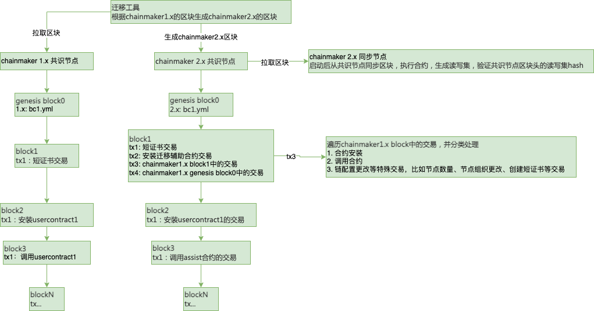

# 迁移工具设计文档

## 1. 迁移工具的目的

迁移工具可以解决的业务需求场景：

1. 由于业务需求，想要将当前的区块链系统替换为新的区块链系统，同时保留当前区块链系统的原始区块数据，比如

- Fabric --> Chainmaker
- BCOS --> Chainmaker

1. 当前区块链系统无法满足业务需求，想要升级当前区块链系统的版本，但是区块链系统新旧版本之间的区块、读写集等数据结构不兼容，比如

- Chainmaker 1.x --> Chainmaker 2.x

## 2. 迁移方案设计思路

chainmaker1.x迁移到chainmaker2.x最直观的想法，将chainmaker1.x的区块赋值给chainmaker2.x的区块，有了chainmaker2.x的区块，给到chainamker2.x的存储模块，直接启动chainmaker2.x的链就可以了

1. 拉取chainamaker1.x的区块

- transfer-tool通过1.x的存储模块拉取1.x的区块，1.x链的data目录和transfer-tool部署到同一个环境

1. 将chainmaker 1.x的区块转换为chainmaker 2.x的区块

- 区块就是一个结构体，先获得chainmaker 1.x的区块结构体，然后赋值给chainmaker 2.x的区块结构体

1. 将chainmaker2.x的区块放到chainmaker 2.x的链存储目录，并启动chainamker2.x

- 根据chainmaker 2.x的区块，只启动一个共识节点，直接运行chainmaker 2.x，如果后续想增加共识节点，等迁移完成后，可通过配置交易动态增加共识节点

## 3. 迁移方案遇到的问题及优化

问题1：考虑到同步节点时，会遇到问题

同步节点在同步共识节点区块的时候，会验证区块，在虚拟机中执行交易的合约，生成读写集，跟共识节点区块头的读写集hash进行对比来验证交易是否被正确执行，如果chainmaker区块中的每笔交易都执行chainmaker1.x的业务合约逻辑会很浪费时间，同时还需要解析chainmaker1.x的合约在chainmaker2.x上执行，可能会不兼容，因此这种方案实现难度大，不太合理

问题1解决方案：换一种思路，不管chainmaker1.x的业务逻辑多复杂，最终业务合约的执行结果在区块链中的表现形式都是kv形式的读写集，因此想到chainmaker2.x的合约不执行chainamker1.x的业务逻辑，而是将chainmaker 1.x交易的读写集直接赋值给chainmaker 2.x区块中交易的读写集

问题2: 考虑交易中存在跨合约调用时的优化

方式1：比如交易tx1的合约a跨合约调用合约b，a合约中需要判断是否存在跨合约调用，如果存在，跨合约调用b，如果b合约也存在跨合约调用c合约，b合约也需要判断，a、b合约的逻辑相同，都是transfer合约

方式2：所有调用用户合约的交易，都调用assist合约，assist合约遍历交易的读写集的合约名，然后对不同合约名分别进行跨合约调用不同的用户合约，不同的用户合约逻辑都相同，都是transfer合约的逻辑

1. 统一都是assist合约，很明显的知道它是一笔迁移合约

## 4. 迁移方案整体流程图

## 5、迁移工具的核心模块：区块转换实现逻辑

将chainmaker1.x的区块转换为chainmaker2.x的区块，chainmaker 1.x和chainmaker 2.x 区块结构体的区别：https://www.processon.com/mindmap/62205c15e0b34d525108e0cc

1. chainmaker 2.x的block0

   新链的创始块必须由bc.yml自动生成的，因为新增节点的创世块也是由bc.yml生成的，如果创世块不相同，新节点无法启动

2. chainmaker 2.x的block1

    1. tx1：创建短证书交易
        - txId：chainmaker1.x没有对应的txid，根据uuid生成
        - 读写集：调用短证书的系统合约相关逻辑，生成对应读写集
    2. tx2：创建迁移辅助合约交易
        - txId：chainmaker1.x没有对应的txid，根据uuid生成
        - 读写集：调用安装合约的系统合约逻辑，生成对应读写集
    3. tx3：来源于chainmake1.x的block1.txs
        1. chainmake1.x的tx如果是用户合约安装的交易
            - 转换成chainmaker2.x相对应的用户合约安装：合约名chainmaker1.x的合约名，合约的内容transfer合约内容，就是写了一个transfer合约，然后重命名成各种用户合约，被安装了n份
        2. chainmake1.x的tx如果是系统合约相关交易，比如节点、组织数量、创建短证书等交易
            - 转换为chainmaker2.x 特殊的交易：对chainmaker1.x的原始交易内容序列化，作为2.x交易的kv存起来
        3. chainmake1.x的tx如果是正常调用用户合约的交易
            - 转换为chainmaker 2.x相对应的assist合约调用类型的交易：调用的合约名是迁移辅助合约assist，2.x交易的kv保存序列化后的chainmaker1.x的原始的交易和原始读写集，assist合约将1.x原始读写集转换为map，对读写集进行分类，map的key：1.x用户合约名usercontract，value：1.x业务读写集kv，然后根据用户合约名usercontract，跨合约调用该用户合约（合约内容为transfer合约，transfer合约的逻辑，将1.x交易的业务读写集，更新到对应的2.x交易的业务读写集）
    4. tx4：序列化chainmake 1.x的genesisblock.tx1作为chainamker2.x的tx4的kv

3. chainmaker 2.x的block2、block3...

   与chainmaker2.x的tx3的处理逻辑相同

## 6. 迁移工具架构设计图

