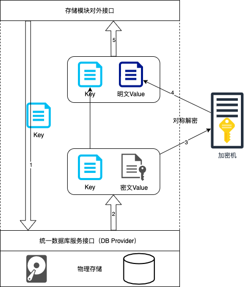
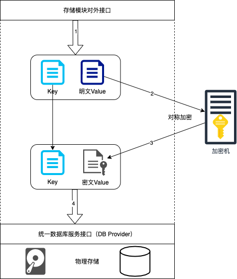

# 透明数据加密

## 透明数据加密（TDE）简介
透明数据加密（Transparent Data Encryption (简称TDE)）是指可以在文件层对数据和文件进行实时加密和解密，落盘的文件是加密后的内容，而对于上层应用系统和开发人员而言，加解密过程是无感知的，写入和读取的内容是明文内容，所以叫做透明数据加密。
TDE的目的是保证磁盘文件的机密性，远离直接从文件直接访问数据的攻击者。TDE主要应对以下的场景：
1. 硬盘被盗导致数据泄露
2. 黑客入侵系统进行文件复制导致数据泄露
3. IT人员绕过业务系统和审批流程，进行无记录的越权数据查看或修改
在没有启用TDE的情况下，任何人只要获得了数据库文件，即可直接浏览数据库中的所有内容，但如果在数据库上启用了TDE，整个数据被安全加密了；没有密匙的话，就不能访问到数据。

## TDE如何工作
TDE需要一个密钥来加密和解密数据，这个密钥可以通过配置项的形式传入ChainMaker，也可以使用独立的文件来保存，同时也支持硬件加密机这种物理隔离高安全的密钥托管和加解密方案。
以配置为密码机进行透明数据加密的长安链为例，存储模块在收到存储KeyValue键值对的请求时，先将Value内容以二进制形式发送到密码机，密码机使用内置的密钥对收到的数据进行对称加密，并将密文返回给长安链存储模块。长安链存储模块将原来的Key和加密后的Value作为新的键值对，发送给底层的统一数据库服务接口DB Provider，由底层数据库服务接口调用具体的数据库引擎存储收到的键值对。

在长安链进行数据查询时则执行类似的解密过程。在存储模块收到外部查询数据的请求后，将请求的查询条件（比如Key查询）直接发送给底层的DB Provider，获得数据库中对应的数据，这时数据的Key是明文，Value是加密的。接下来将密文Value发送给加密机，由加密机用自己内部的密钥进行数据解密，并将解密后的内容返回给长安链存储模块。长安链将解密的内容作为Value，结合之前的Key，形成新的键值对返回给外部调用者。

## 长安链TDE的局限性
### TDE启用状态和密钥不可随意变更
由于TDE是对所有区块所有交易进行统一的加解密，所以TDE的启用或者不启用必须在没有写入任何数据的新节点上，一旦启用了TDE并进行了数据同步，就不能变更密钥，也不能由启用改为不启用。如果要变更密钥或者变更启用状态，那么就只能将之前已经同步的所有数据全部删除，重新同步，重新写入。
### TDE只加密键值对（Key-Value）中的Value部分
因为长安链存储模块对外提供了按Key范围查询和前缀查询的特性，所以不能对Key进行加密，如果对Key也进行了加密，那么每次前缀查询将不得不扫描整个数据库所有Key进行解密后匹配，性能上是无法接受的。所以在硬盘数据被盗或者非法访问的情况下，用户虽然无法获得Value值，但是仍然可以获得Key的内容，所以在编写合约时，请不要将机密信息放入Key中。
### TDE不支持SQL合约的数据加密
长安链TDE是对键值数据库场景下对Value部分的加解密，对于SQL合约的场景，由于业务数据是通过生成的SQL语句产生的，所以无法对SQL语句进行加密。如果想对SQL数据库进行落盘加密，建议启用对应数据库自身提供的TDE服务。
### TDE对性能有一定的影响
由前面的TDE处理流程我们可以看到，在写入或者读取KeyValue数据时，多了一个对称加密解密的环节，所以必然会对整体性能有一定的影响，不过由于对称加密的性能极高，所以在大多数场景下，TDE对性能的影响不是很大，经过实际测试，在启用TDE的情况会为存储模块带来2%的性能下降。

## 总结
长安链2.1版的新特性透明数据加密（TDE）是一种数据库领域常见的数据保护防泄漏方案，该方案可以在用户无感知的情况下实现数据落盘加密，在保护了磁盘上数据的防止被非法查看的情况下，该特性对于用户和上层应用友好，无需做出任何修改。长安链TDE既支持AES对称加密算法也支持国密SM4对称加密算法，既支持硬件密码机的集成也支持软件加密方案，为企业用户带来了更多的数据安全新选择。
