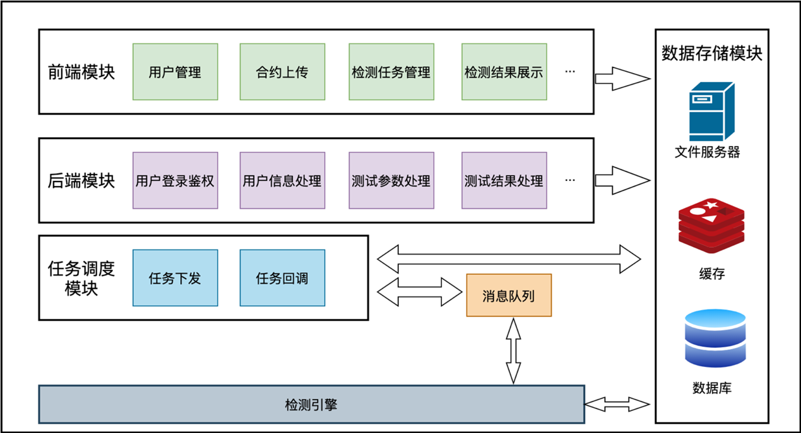
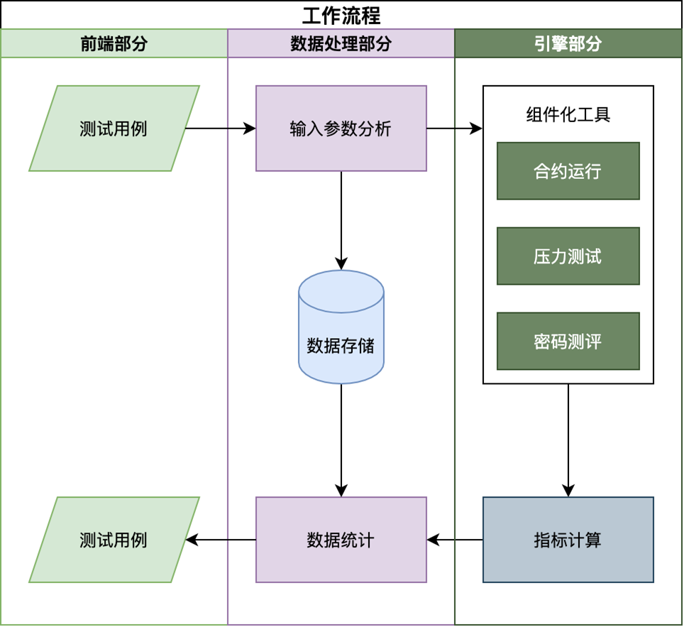
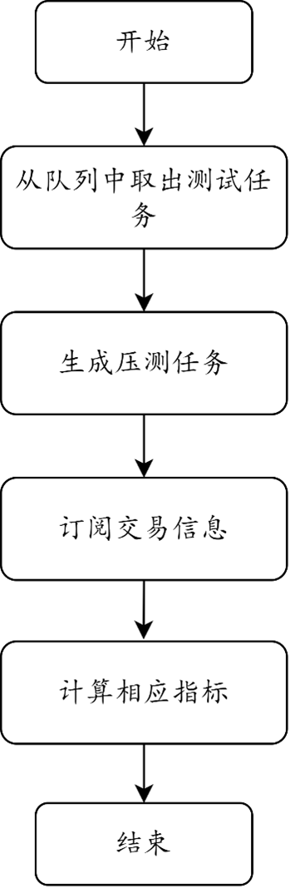
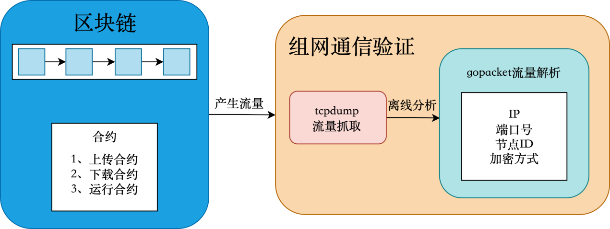

# 长安链敏捷测评技术文档

## 工具介绍

​		用户在前端页面选择输入压测参数，生成测试用例；后端对输入参数进行分析，向引擎发布测试任务，对测试任务进行存储；引擎调用压测框架进行压力测试，期间调用合约运行模块运行合约，调用密码测评模块动态抓取流量动态验证长安链内部使用的加密算法以及通信方式；在压力测试结束时引擎调用指标计算模块计算压测结果并向后端返回。后端对压测结果进行数据统计，将统计后的数据进行存储；并发送至前端；前端页面对测试结果进行可视化展示。

了解使用方法，请参考[长安链敏捷测评使用文档](../dev/长安链敏捷测评使用文档.md)

## 整体架构

### 工具架构

<div align=center>

<center>工具架构</center>
</div> 

​		测评系统主要包括前端模块、后端模块、任务调度模块、检测引擎和数据存储模块，其中各模块的功能定义以及功能如下。

​		前端模块：前端模块是智能合约安全检测系统的重要组成部分，它提供了清晰美观、简洁实用的WEB界面，为用户提供了便捷的操作方式。在前端模块中，用户可以进行身份信息的管理，包括注册、登录、修改密码等操作。同时，用户可以上传智能合约文件，并进行检测任务的管理。在合约检测任务管理中，用户可以查看任务的执行状态、任务的执行结果等信息。在检测信息的界面展示方面，前端模块可以将检测结果以图表、网络拓扑图等方式进行展示，方便用户进行查看和分析。此外，前端模块还具有良好的用户体验，它能够根据用户的操作行为进行智能提示，提高用户的操作效率。同时，前端模块还具有良好的可扩展性，可以方便地进行功能扩展和界面定制，以满足不同用户的需求。

​		后端模块：后端模块是智能合约安全检测系统的核心组成部分，它负责对系统的业务逻辑进行处理，并为前端模块提供对应的调用接口。在系统业务逻辑方面，后端模块主要包括登录鉴权、用户信息处理、测试信息处理及测试结果处理等功能。在登录鉴权方面，后端模块可以对用户进行身份验证，保证系统的安全性。在用户信息处理方面，后端模块可以对用户的信息进行增删改查等操作，保证用户信息的完整性和准确性。在合约信息处理方面，后端模块可以对上传的合约文件进行解析和存储，以便后续的检测工作。在敏捷测评检测方面，后端模块可以将检测任务下发给检测引擎，并将检测结果返回给前端模块。

​		任务调度模块：任务调度模块是敏捷测评系统的重要组成部分，它用于连接业务逻辑和检测引擎。任务调度模块通过消息队列来实现任务调度，并使用定时任务进行驱动。在敏捷测评任务的下发方面，任务调度模块可以将检测任务下发给检测引擎，并监控检测任务的执行状态。在检测引擎检测结果的回调方面，任务调度模块可以将检测结果回调给后端模块，并将检测结果进行存储和展示。

​		检测引擎：主要是用于的指定合约进行安全检测，并对检测结果进行解析封装处理。

​		数据存储模块：数据存储模块是敏捷测评系统的重要组成部分，它负责对系统运行的相关数据进行持久化，包括文件数据的存储、对象数据存储及数据高效缓存等功能。在文件数据的存储方面，数据存储模块可以将上传的合约文件进行存储，并对文件进行索引和管理，以方便后续的检测工作。在对象数据存储方面，数据存储模块可以对用户信息、合约信息、检测结果等数据进行存储和管理，以保证数据的完整性和准确性。在数据高效缓存方面，数据存储模块使用缓存技术对常用数据进行缓存，以提高系统的访问速度和响应能力。

### 前端页面部分

#### 介绍

​		用户在前端页面选择输入压测参数，生成测试用例；后端对输入参数进行分析，向引擎发布测试任务，对测试任务进行存储；引擎调用压测框架进行压力测试，期间调用合约运行模块运行合约，调用密码测评模块动态抓取流量动态验证长安链内部使用的加密算法以及通信方式；在压力测试结束时引擎调用指标计算模块计算压测结果并向后端返回。后端对压测结果进行数据统计，将统计后的数据进行存储；并发送至前端；前端页面对测试结果进行可视化展示。

#### 页面说明

##### 系统模块

1. 登录页面：区块链敏捷测试平台采用B/S框架，用户登录后方可进行系统的各种操作。
2. 首页：输入用户名和密码，经验证通过后进入系统首页，系统首页对测试数据进行可视化展示。系统管理提供用户管理、角色管理、菜单管理、日志管理等功能。
3. 用户管理：点击"系统管理"\>"用户管理"，进入用户管理页面，该功能完成包括对用户信息进行搜索、添加以及修改的信息管理。搜索功能实现在众多用户中搜索目标用户，在"用户管理"页面上方搜索栏处进行相关搜索信息的输入。添加功能完成对用户信息的添加和对新增用户详细信息的查看。修改功能完成对用户信息的修改。除此之外，还可以对记录进行删除操作和用户信息的导入、导出操作。
4. 角色管理：点击"系统管理"\>"角色管理"，进入角色管理页面，本功能完成对角色信息的管理，各个角色拥有不同的权限，角色与用户相关联。角色管理包括搜索功能、添加功能以及修改功能。搜索功能完成在众多角色中找到想要查询的部分角色，添加功能完成对角色信息的添加和对新增角色详细信息的查看，修改功能完成对角色信息的修改。并可以对记录进行删除操作和角色信息的导出操作。
5. 菜单管理：点击"系统管理"\>"菜单管理"，进入菜单管理页面，本功能完成对系统左侧菜单栏界面进行管理，包括搜索功能、添加功能以及修改功能。
6. 日志管理：点击"系统管理"\> "日志管理"，进入日志管理页面，本功能主要是对系统操作日志和登录日志进行记录。点击"系统管理"\> "日志管理"\>"操作日志管理"，进入操作日志管理页面。对平台进行操作时，系统会自动记录操作信息并进行保存。操作日志管理包括搜索功能以及查看日志详情功能，并可以对日志记录进行删除和导出。点击"系统管理"\> "日志管理"\>"登录日志管理"，进入登录日志管理页面。当用户登录平台时，系统会自动记录登录信息并进行保存。登录日志管理包括搜索功能以及查看日志详情功能。

##### 测试模块

​		点击"压力测试"\> "内置合约压力测试"，进入内置合约压力测试页面，在本页面中完成内置合约压力测试，包括搜索压力测试、新增压力测试、修改压力测试、开始压力测试、压力测试结果查看功能、网络拓扑查看功能以及压力测试进度查看功能。

1. 搜索页面：搜索压力测试信息完成在众多压力测试中找到想要查询的部分测试，在"内置合约压力测试"页面上方搜索框中输入搜索目标的关键字，包括虚拟机ip、通信协议、源IP地址、通信源端口，点击"搜索"，进行模糊搜索压力测试信息；重置搜索条件时点击"重置"键，清除已经设置的搜索条件。
2. 新增压力测试页面：完成对压力测试信息的新增功能。在"内置合约压力测试"页面上方点击"新增"，添加功能完成对测试信息的添加和对新增测试信息的查看，根据提示信息输入IP地址、端口号、链模式、链和节点的配置文件、合约JSON文件等信息，点击"确定"，新增压力测试信息完成。
3. 修改压力测试页面：修改压力测试信息功能完成对测试信息的修改。对于已经添加到系统里的测试信息，在"内置合约压力测试"页面中找到需要修改信息的测试信息，点击右侧的"修改"或表头上方的"修改"键，根据提示修改IP地址、端口号、链模式、链和节点的配置文件、合约JSON文件等信息。
4. 删除、导出：在"内置合约压力测试"页面中，点击待删除压力测试记录右侧的"删除"键；或批量选择待删除压力测试信息左侧的勾选框，选择完毕后，点击表头上方的"删除"键进行删除；若误勾选，再次点击勾选框取消选中。若要将压力测试信息导出，在"内置合约压力测试"页面中，点击表头上方的"导出"键进行导出。
5. 开始以及进度展示：完成开始压力测试功能。对于已经添加到系统里的测试信息，在"内置合约压力测试"页面中找到需要开启压力测试的测试信息，点击右侧的"测试"键，开始压力测试。完成压力测试进度查看功能。对于已经添加到系统里的测试信息，在"内置合约压力测试"页面中找到需要查看测试进度信息的测试，点击右侧的"进度查看"，查看压力测试进度的结果，共三个进度：添加、测试与结束。
6. 结果查看页面：完成压力测试结果查看功能。对于已经添加到系统里的测试信息，在"内置合约压力测试"页面中找到需要查看测试结果信息的测试，点击右侧的"结果查看"，查看压力测试的结果。
7. 网络拓扑查看页面：完成网络拓扑查看功能。对于已经添加到系统里的测试信息，在"内置合约压力测试"页面中找到需要查看网络拓扑信息的测试，点击右侧的"网络拓扑"，查看网络拓扑信息。
8. 任务参数详情查看页面：完成压力测试任务参数查看功能。对于已经添加到系统里的测试信息，在"内置合约压力测试"页面中找到需要查看测试进度信息的测试，点击"测试任务"中对应的链接按钮，查看压力测试参数详细内容。

### 核心流程

<div align=center>

<center>核心流程</center>
</div> 

​		前端页面部分是整个工作流程的入口，用户可以在这里输入测试用例，并查看测试结果可视化。在这个部分中，系统会提供一个用户友好的界面，以便用户更方便地输入测试用例和查看测试结果。用户可以通过输入测试用例的相关信息，例如输入参数等等，来定义测试用例。然后，系统会将测试用例传递到数据处理部分进行处理。

​		数据处理部分是整个工作流程的核心部分，它包含了输入参数分析、数据存储和数据统计三个部分。在这个部分中，系统会对输入的测试用例进行分析，以便得到一些有用的信息。然后，系统会将测试用例传递到引擎部分进行处理。同时，系统会将测试结果存储到数据存储中，以便后续的数据统计和分析。

​		输入参数分析：在输入参数分析部分，系统会对输入的测试用例进行分析，以便得到一些有用的信息。例如，系统会分析测试用例中的输入参数类型、范围、数量等等，以便后续的处理和分析。在这个部分中，系统会使用一些数据分析工具和算法。

​		数据存储：在数据存储部分，系统会将测试结果和统计分析结果保存到数据库中，以便后续的查询和分析。在这个部分中，系统会使用一些数据库管理工具和技术。

​		数据统计：在数据统计部分，系统会对测试结果和指标计算结果进行统计和分析。同时，系统会将统计和分析结果存储到数据存储中，以便后续的查询和分析。

​		引擎部分是整个工作流程的核心部分，它包含了组件化工具和指标计算两个部分。在这个部分中，系统会将测试用例传递到组件化工具中进行处理，包括合约运行、压力测试和密码测评等。然后，系统会将处理得到的结果传递到指标计算中进行计算，以便得到一些有用的指标。最后，系统会将指标计算得到的结果传递到数据统计中进行统计和分析。

​		组件化工具：在组件化工具部分，系统会将测试用例传递到组件化工具中进行处理。组件化工具是一个非常重要的工具，它可以帮助我们更好地管理和执行测试用例。在这个部分中，系统会使用一些组件化工具和技术。

​		指标计算：在指标计算部分，系统会将处理得到的结果传递到指标计算中进行计算，以便得到一些有用的指标。在这个部分中，系统会使用一些指标计算工具和算法，例如性能指标、安全指标、可靠性。

​		数据统计部分是整个工作流程的重要部分，它可以帮助我们更好地分析和理解测试结果。在这个部分中，系统会对测试结果和指标计算结果进行统计和分析。

​		数据存储部分是整个工作流程的重要部分，它可以帮助我们更好地管理和存储测试结果和统计分析结果。在这个部分中，系统会将测试结果、指标计算结果和统计分析结果保存到数据库中，以便后续的查询和分析。

​		整个流程的结束是在测试结果可视化和数据存储两个部分。在测试结果可视化中，用户可以直观地查看测试结果。在数据存储中，系统会将测试结果和统计分析结果保存到数据库中，以便后续的查询和分析。

​		总的来说，整个工作流程包含了前端页面、数据处理、引擎、数据统计和数据存储五个部分。通过使用这个工作流程，我们可以更好地管理和分析测试用例，从而提高我们的工作效率和准确性。同时，这个工作流程还可以帮助我们更好地理解和评估测试结果，从而提高测试的效率和准确性。当用户输入测试用例时，系统会将测试用例传递到数据处理部分进行处理。在数据处理部分中，系统会对输入的测试用例进行分析，以便得到一些有用的信息。然后，系统会将测试用例传递到引擎部分进行处理。在引擎部分中，系统会将测试用例传递到组件化工具中进行处理，包括合约运行、压力测试和密码测评等。然后，系统会将处理得到的结果传递到指标计算中进行计算，以便得到一些有用的指标。最后，系统会将指标计算得到的结果传递到数据统计中进行统计和分析。在数据统计部分中，系统会对测试结果和指标计算结果进行统计和分析。同时，系统会将统计和分析结果存储到数据存储中，以便后续的查询和分析。在数据存储部分中，系统会将测试结果、指标计算结果和统计分析结果保存到数据库中，以便后续的查询和分析。最后，在测试结果可视化中，用户可以直观地查看测试结果。

## 检测引擎

### **区块链性能测试模块**

#### 介绍

​		长安链性能测试模块是用于评估长安链在负载情况下的性能表现的工具。该模块主要功能包括设计压力测试场景、执行压力测试以及进行性能分析与优化。用户可以根据实际需求设置并发请求数量、交易类型和频率等参数来设计各种负载情况下的测试场景。通过模拟大量并发请求和交易，该模块可以对长安链进行性能测试，并提供响应时间、吞吐量、交易成功率等指标的测试结果。通过使用该模块进行压力测试，用户可以了解长安链的性能指标，并根据测试结果进行性能优化，提升长安链的稳定性、可扩展性和吞吐量。

#### 系统架构

<div align=center>

<center>系统架构</center>
</div> 

​		如上图所示，区块链性能测试架构图主要包括四个模块：由数据处理模块抓取测试任务并执行获得两类配置文件，其中一类用于与目标的区块链网络建立连接，另一类生成本次测试任务的压测参数，并输入到压测模块；压测模块负责通过模拟测试用例生成真实交易，异步向目标区块链节点发送交易，执行压测任务。同时启动消息订阅模块实时订阅区块链网络产生的交易信息，并在交易完成时返回结果给指标计算模块。指标计算模块根据相应的测试任务匹配对应的指标并进行计算，返回该测试任务的测试结果。

#### 整体流程

<div align=center>

<center>整体流程</center>
</div> 

​		性能测试方式验证流程如上图所示：

- 从任务队列里获取到压测任务。根据测试任务中数据构造实际需求设计各种负载情况下的测试场景，构造并发请求数量、交易类型、交易频率等参数以模拟真实的使用情况，生成压测任务，并由压测模块执行。
- 启动消息订阅机制订阅交易信息。通过订阅交易信息，消息订阅模块可以实时获取交易的状态、响应时间等关键指标。这些信息对于评估长安链在压力下的性能表现非常重要。
- 在消息订阅机制提示交易任务结束后，指标计算模块可以通过收集到的交易信息计算出响应时间、吞吐量、交易成功率等指标。这些指标可以反映出长安链在高负载情况下的性能表现。通过计算相应指标，用户可以评估长安链的稳定性、可扩展性和吞吐量，并确定性能瓶颈所在。

#### 压测客户端介绍

​		在进行性能测试时，压测客户端是一个不可或缺的工具。它扮演着模拟真实用户行为、创建压力环境、监控性能指标以及优化系统性能等重要角色。通过使用压测客户端，我们可以模拟大量并发请求，以测试系统在高负载下的稳定性和可扩展性。同时，它还可以实时监测系统的性能指标，如响应时间、吞吐量和成功率，帮助我们了解系统的性能状况，并发现潜在的性能瓶颈和问题。因此，压测客户端在性能测试中扮演着至关重要的角色，接下来我们将更详细地介绍压测客户端的设计细节。

##### 数据处理模块生成配置文件

1. 配置文件结构定义：首先，确定生成配置文件的结构。这包括定义两种配置文件的各个字段和其对应的含义。

2. 用户输入参数：用户需要提供输入参数来生成配置文件。这些参数可以通过指定API或者交互式界面进行输入。用户需要提供的参数包括压测任务名称、智能合约相关参数、压测参数等。用户输入的参数将用于填充配置文件中相应字段的值。

3. 配置文件生成：根据用户提供的参数，生成配置文件。根据配置文件的结构，将用户输入的参数填充到配置文件的相应字段中。可以使用编程语言或者工具来生成配置文件。生成的配置文件应符合定义的结构，并包含用户输入的参数值。

4. 配置文件保存：将生成的配置文件保存到指定的位置，本系统将区块链节点的配置文件放入工作目录的build文件夹下，将连接参数和压力参数配置文件放入config文件夹下。

​       通过以上步骤，可以实现数据处理模块生成配置文件的功能。生成的配置文件可以用于后续的压力测试任务执行，确保任务的准确性和一致性。

##### 与区块链网络建立连接

​		通过数据模块生成的长安链节点相关的配置wen文件，采用长安链提供的以配置文件创建ChainClient方式，创建与目标节点的连接（可能是多目标节点的压测，此时将会创建与多目标节点的连接）。

##### 异步发送压测任务

​		异步发送压测任务的步骤如下：

1. 准备压测任务数据：首先，由用户测试任务中提供的数据需要准备好要发送的压测任务数据，包括被测的智能合约、方法以及方法所对应的参数。同时将压测任务数据输入到压测模块。
2. 异步发送任务：使用chainmaker提供的调用智能合约的sdk-go方法，使用多线程模拟真实用户高并发的场景，异步的发送交易到目的虚拟机。

​       通过以上步骤，可以实现异步发送压测任务的功能。异步发送可以提高系统的并发能力和性能，使得可以同时发送多个压测任务，提高压测效率。

##### 消息订阅机制

1. 启动chainmaker提供的消息订阅机制：实时的获取交易信息。检查交易发送是否成功、成功上链的时间、落块时间、每个块包含交易数等信息。

2. 错误处理和重试：如果发送任务失败，可以根据具体的错误类型进行相应的错误处理和重试机制。这可以包括重新发送任务、记录错误日志、报警等操作，以确保任务的可靠性和稳定性。

##### 指标计算

1. 确定指标类型：首先需要确定要计算的指标类型。指标可以是吞吐量、响应时间、成功率等不同的性能指标。根据具体需求，确定要计算的指标类型、含义。
2. 收集数据：在进行指标计算之前，需要收集相关的数据。主要是通过消息订阅机制获取关键的交易数据。
3. 计算指标：根据指标的定义和要求，使用相应的计算方法对数据进行指标计算。不同的指标计算方法可能有不同的算法和公式。
4. 测试结果返回：计算完成后，可以对指标进行返回并生成测试报告。

​       通过指标结果分析可以帮助用户了解系统的性能表现和瓶颈，并进行性能优化和改进。在压力测试和性能评估中，指标计算是评估系统性能和稳定性的重要一环。

### 区块链组网通信验证模块

#### 介绍

​		根据长安链的通信特点，完成一次区块链组网通信方式验证需要启动链、链交易、交易过程中抓取流量并解析验证长安链中通信组网方式。目前版本的区块链通信组网验证能够支持根据抓取的流量解析得到通信节点的IP、端口号、节点ID和通信加密方式，并根据通信关系构建网络拓扑图。区块链组网通信验证强依赖于长安链本身，因此在进行通信组网方式验证前需先对长安链进行一定程度的熟悉。

#### 系统架构

<div align=center>

<center>系统架构</center>
</div> 

​		如上图所示，区块链通信组网方式验证架构图主要包括两个部分：测试执行引擎包括动态运行合约产生流量，组网验证主要有tcpdump抓取特定端口流量和gopacket实现流量的解析。

#### 整体流程

<div align=center>

<center>整体流程</center>
</div> 

区块链通信组网方式验证流程如上图所示：

- 用户向引擎发送请求以验证区块链的组网方式。该请求包含了要运行的合约以及输出压力参数等信息。引擎接收到请求后，下载并运行相应的合约。
- 捕获特定端口的流量，使用tcpdump工具，并将抓取到的流量保存为离线文件并dump到本地客户机，以便后续分析。
- 使用gopacket库来分析离线的流量文件，可以提取长安链通信节点的IP地址、端口号、节点ID以及通信所采用的加密方式等信息。
- 将分析得到的结果反馈到前端，前端根据通信关系生成相应的网络拓扑图，展示区块链中的节点之间的连接关系。

#### 流量抓取和解析

​		区块链流量抓取与分析是进行通信组网方式验证的重要环节，如果要完整的构建网络拓扑图实现通信组网方式验证，需尽可能地抓取特定端口的流量。引擎提供生成网络拓扑图的功能，包含两部分工作：gopacket解析流量和网络关系拓扑图生成。

##### 抓取区块链通信流量

​		TCPDump是一种流行的抓包工具，用于在计算机网络中捕获和分析数据包。它提供了一种命令行界面的方式来监听网络接口，捕获经过该接口的数据包，并将其保存到文件中以供进一步分析和调试。使用TCPDump进行数据包捕获首先需指定要监听的网络接口，可以是物理接口（如eth0）或虚拟接口（如lo）。接下来，使用过滤规则来选择要捕获的数据包。过滤规则可以基于源IP地址、目标IP地址、协议类型、端口号等多个条件。通过过滤规则，可以仅捕获符合特定条件的数据包，以减少保存和分析的数据量。一旦开始监听和捕获数据包，TCPDump会实时输出捕获到的数据包信息。这些信息包括源IP地址、目标IP地址、协议类型、端口号、数据包大小等。通过实时输出，可以快速检查和分析捕获到的数据包。

##### 通信流量解析

​		当使用tcpdump抓取到区块链通信流量后，使用gopacket库来解析流量并提取其中的关键信息并将关键信息发送到前端：

1. 打开捕获的数据包文件：使用gopacket库提供的文件读取功能，打开之前通过tcpdump捕获的数据包文件。这将创建一个读取数据包的数据源。

2. 创建数据包解析器：根据捕获的数据包类型，使用gopacket库创建相应的数据包解析器。例如，如果捕获的是以太网数据包，可以创建一个以太网解析器。

3. 循环迭代数据包：使用一个循环来逐个读取和解析捕获的数据包。在每个迭代步骤中，从数据源中读取一个数据包，并将其传递给相应的解析器进行解析。

4. 解析数据包字段：在解析器的帮助下，可以提取数据包的各个字段和属性。这包括源IP地址、目标IP地址、端口号、协议类型、数据包长度等。根据区块链通信协议的特点，可能还需要解析特定协议的字段，如区块头、交易信息等。

5. 分析提取的信息：根据需要，对解析得到的数据包信息进行进一步分析。可以统计通信流量、计算吞吐量、检测异常行为、分析通信模式等。这些信息有助于了解区块链网络的运行状况、性能特征和安全问题。

6. 关闭数据源和文件：在完成所有数据包的解析后，关闭数据源和数据包文件，释放资源。

   ```go
   // SourceInfo 节点源信息
   type SourceInfo struct {
      Ip     string `json:"Ip"`
      Port   string `json:"Port"`
      Nodeid string `json:"Nodeid"`
   }
   // DestInfo 目标节点信息
   type DestInfo struct {
      Ip            string `json:"Ip"`
      Port          string `json:"Port"`
      Protocol      string `json:"Protocol"`
      Cryptoversion string `json:"Cryptoversion"`
      Nodeid        string `json:"Nodeid"`
   }
   ```

​        进行流量解析源节点共有三个域：源IP、源端口号、源节点ID，目的节点共有5个域：目的IP、目的端口号、通信协议、通信加密方式、目的节点ID，其中网络拓扑图中每一对指向关系都对应这一个源节点、一个目的节点和一条以通信加密方式为权值的边。  