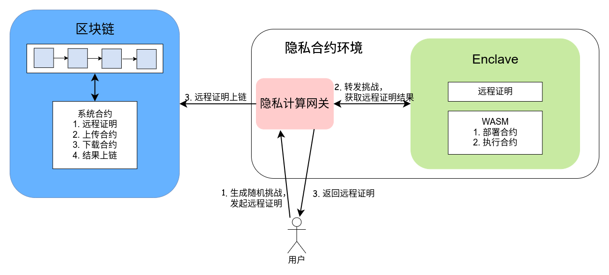
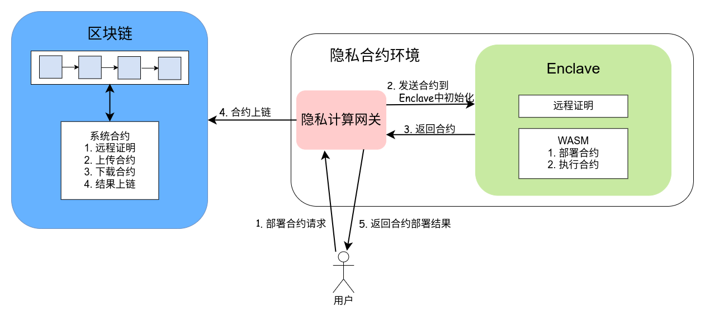
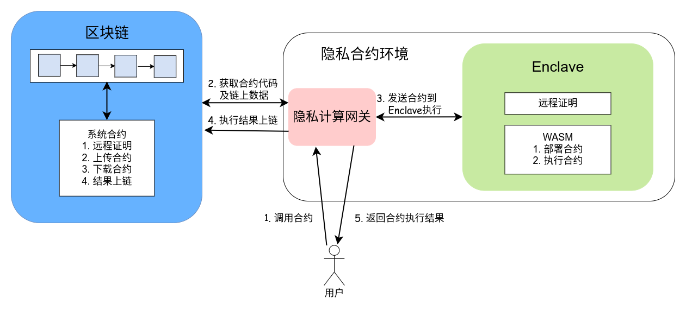

# 隐私计算方案

## 概述
一般来说，参与到区块链交易中的数据对链参与者都是公开的。而长安链隐私合约功能为区块链提供在合约中处理敏感数据的能力，达到保护数据隐私的同时保证合约执行过程的可靠性（包括合约逻辑、数据的完整性）。长安链隐私合约采用可信计算技术，在可信执行环境中执行隐私合约。敏感数据以密文形式存在于区块链账本中，用户使用时在可信执行环境中解密，而可信执行环境外无法获得敏感数据明文。同时，可信执行环境的远程证明保证合约逻辑不被篡改。如此，达到敏感数据在区块链上的可用不可见，而数据处理流程仍然可以在区块链上公开验证的效果。

长安链支持Intel SGX作为执行隐私合约的硬件基础。目前Intel SGX相对于其他可信计算硬件，具有兼容性好、文档完善等优势。

## 隐私合约设计方案
隐私合约功能由一个基于可信执行环境的隐私合约环境提供。这个隐私合约环境由可信执行环境Enclave和隐私计算网关组成。其中Enclave是运行在可信执行环境的逻辑，负责对合约进行验证、编译、执行，敏感数据密文只能在Enclave中解密。长安链的Enclave中实现了一套WASM逻辑，可以对任意数据处理逻辑进行编译、运行。隐私计算网关负责将用户、Enclave发出的信息打包成区块链的交易payload，并转发给区块链存证。

整个流程分为三个阶段：可信执行环境的远程证明、隐私合约的部署、隐私合约的调用。

- 远程证明动作可以是一次性的。在该阶段，由用户发起对隐私合约环境中Enclave的远程证明，验证该Enclave是否运行于可信执行环境中，以及该Enclave中的逻辑是否在部署后被篡改过。
- 隐私合约的部署发生在远程证明之后，每个不同的隐私合约需要单独进行一次部署。在这个阶段中，用户可以部署经区块链共识接受的任意数据处理逻辑作为隐私合约，隐私合约会被存在区块链上，其逻辑受到公开监管。不同于普通合约用户直接将合约代码上传到区块链节点的部署方式，隐私合约需要用户将合约上传到隐私计算环境初始化后，由隐私计算环境通过网关将处理好的合约上传到区块链账本中。
- 隐私合约的调用发生在部署之后。一个隐私合约部署后，用户可以用相同或不同的数据为入参进行多次调用。

### 可信执行环境与远程证明
[可信执行环境](https://en.wikipedia.org/wiki/Trusted_execution_environment)是CPU的一个安全加固区域，可以保证其中的软件逻辑和数据在机密性和完整性上得到保护。该区域的软硬件环境可以看做是与外界隔离的一个反沙箱环境。在这个环境中运行的程序，外部包括操作系统无法读取或写入其内存，也无法干扰其代码运行逻辑。

[远程证明](https://en.wikipedia.org/wiki/Trusted_Computing#Remote_attestation)可以使验证者辨别被验证的可信执行环境上的软件逻辑是否有变更。通常，远程证明的被验证方通过可信硬件生成一个证书，这个证书包含一个report信息，这个信息描述当前运行在可信执行环境中的软件（代码度量）。验证者通过验证这个证书的合法性来验证可信硬件上的软件进程是否被修改过。


#### [Intel DCAP](https://software.intel.com/content/dam/develop/external/us/en/documents/s21c-icmc2019-intel-sgx-opensource-attestation.pdf)远程证明（暂不支持，需搭配新款服务器）
Intel提供的远程证明机制。

- 信任Intel。在DCAP远程证明模式中，Intel会作为根CA为SGX硬件提供认证。
- 需要在网络中维护一个PCCS服务提供对网络中的SGX硬件认证。PCCS服务是将Intel为SGX下发的类似二级证书的信息缓存到一个局域网络中。

#### 自定义信任根的远程证明（v1.2.0开始支持）
自定义信任根的远程证明对DCAP做了一些改动，将对Intel的信任转移到对任意选定的CA机构的信任上。

在可信执行环境初始化阶段，可信硬件基于硬件固有密钥生成一对签名公私钥对和一对加密公私钥对，并向一个选定的CA机构申请证书。该证书中包含签名公钥和加密公钥。这个过程类似于硬件出厂时向Intel注册信息。



在用户发起对Enclave的远程证明时：

1. 用户生成一个随机挑战（任意随机字符串），将其发送到隐私合约环境，由隐私计算网关转发到Enclave中。
2. Enclave对收到的随机挑战制作一个远程证明。Enclave收到随机挑战后，调用SGX EREPORT指令获取report。这个report包含当前运行中的软件的代码度量和Enclave的其他信息。Enclave将随机挑战与report拼接后，用签名私钥对其签名，制作出包含随机挑战、report、Enclave签名、Enclave证书4个组件的远程证明。
3. Enclave通过隐私计算网关输出远程证明（包括随机挑战、report、Enclave签名、Enclave证书）。
    - 隐私计算网关会调用系统合约将远程证明写入区块链存证。系统合约中包含验证远程证明合法性的逻辑，通过验证的远程证明会被写入区块链存证。
    - 隐私计算网关会返回一份远程证明给发起证明流程的用户，用户可以线下自行验证远程证明。

### 合约部署阶段
在初始化（远程证明）阶段将Enclave的远程证明写入区块后，就可以在链上进行隐私合约的部署了。v2.2.1_private_contract版本只支持rust语言开发的合约。



Solidity隐私合约的部署流程如上图所示：
1. 用户发起部署合约的请求，并把合约发送给隐私合约环境。
2. 隐私计算网关在接收到用户部署请求后，把其中的合约送入Enclave的WASM中进行初始化。部分情况中，这一步还需要借助链上数据参与，则由隐私计算网关打包查询请求与链交互后，再在WASM中初始化合约。
3. Enclave初始化合约完成后，通知隐私计算网关。
4. 若Enclave初始化合约成功，隐私计算网关会将合约通过链上系统合约存入区块链存证。链上的合约可用于合约逻辑的可靠性校验参照及合约的公共监管。
5. 隐私计算网关通知用户部署合约的事件状态。

<span id="invokeContract"></span>
### 合约调用阶段
用户可以随时发起对已经部署的隐私合约的调用请求。在调用隐私合约前，用户需要从区块链上获取远程证明并从中获得Enclave的加密公钥和签名验证公钥。隐私合约的调用流程如下：



1. 用户向隐私合约环境发起调用隐私合约的请求。这个请求中包含要调用的隐私合约ID、涉及到的链上数据的key、用户准备的链外数据。（其中，链上的数据和用户准备的链外数据可能是加密的。我们会在之后的小章节中介绍加密数据的推荐处理方式。）
2. 隐私计算网关根据用户调用合约的请求构造一个区块链请求，这个区块链请求用于从链上读取对应的隐私合约和链上数据。隐私计算网关将这个请求发送到区块链。
3. 隐私计算网关从区块链上获取到隐私合约代码和需要的链上数据后，连同来自用户的链外数据一起，转发给Enclave。Enclave接收到隐私合约代码、区块链上数据、用户提供的链外数据后，
    - 若数据是密文，使用加密私钥解密数据；
    - 以传入Enclave的链上、链外数据为入参执行隐私合约；
    - 按需要选择是否对执行结果加密；
    - 打包执行结果，其中内容包括：隐私合约执行结果、隐私合约、链上及链外的入参数据；
    - 使用签名私钥对打包好的执行结果签名。

    Enclave将执行结果与签名返回到隐私计算网关。
4. 隐私计算网关调用系统合约把执行结果与签名传到链上。系统合约会从链上获取Enclave远程证明，从中提取出签名公钥，并对执行结果的签名进行验证，并从执行结果中提取隐私合约、链上数据部分，与区块链上的信息进行比对。如果这些验证都通过了，则系统合约执行成功，隐私合约的执行结果会被打包到区块中等待共识出块。

#### 隐私合约入参数据加密

1. 在[合约调用阶段](#invokeContract)的第2、4步中，提到过隐私合约使用的数据可能是加密的。
    - 链外加密数据：用户可以随机生成对称密钥作为会话密钥对数据加密，然后从区块链上获取Enclave的加密公钥对会话密钥加密。用户调用隐私合约时传入的链外数据即为数据本身的对称加密密文和会话密钥的非对称加密密文。Enclave使用时，使用加密私钥解密出会话密钥，再用会话密钥解密出数据。
    - 区块链上加密数据：区块链上可能会有少量敏感数据的密文，这些密文首先是以与链外加密数据一样的处理方式上链的，Enclave使用链上密文时与使用链外密文的方式相同。
2. 在[合约调用阶段](#invokeContract)的第4步中，提到过可以按需要对隐私合约的执行结果进行加密。这里有两个选择：
    - 使用Enclave的加密公钥加密：Enclave随机生成一个对称密钥作为会话密钥，用于加密结果，再用Enclave的加密公钥加密会话密钥；执行结果的密文就包含会话密钥密文和数据密文两部分。这种情况下，隐私合约的执行结果只能在后续的隐私合约调用中在Enclave中使用，外部无法解密这个结果。
    
    - 使用入参中传入的一个公钥加密：入参中的公钥可以是来自区块链上的数据，也可以是用户发送调用隐私合约的请求时带入的链外的用户公钥。Enclave随机生成一个对称密钥作为会话密钥，用于加密结果，再用入参中的加密公钥加密会话密钥；执行结果的密文就包含会话密钥密文和数据密文两部分。这种情况下，隐私合约的执行结果可以被对应的加密私钥持有者解密使用。

## 使用指南
### 说明

- Graphene 是官方原有的项目名称后来更改为Gramine，下文都改成Gramine
- Gramine 使用v1.1，仓库地址：https://github.com/gramineproject/gramine
- 1.1之前的版本对Golang的支持不友好，不能使用
- 检查设备是否支持sgx
  - 如果设备不支持sgx可以使用simulation mode 运行
  - simulation mode 不能用于生产环境

### 环境部署

#### 推荐配置
- 系统：linux  (不支持windows,本文教程使用ubuntu20.04)
- 内核： 5.11+（推荐使用5.11以上版本）
- 内存： 8G+

#### Gramine 环境配置

安装教程：https://gramine.readthedocs.io/en/latest/quickstart.html

#### 下载相关代码

```sh
1. git clone -b v2.2.1_private_contract --depth=1 https://git.chainmaker.org.cn/chainmaker/chainmaker-go.git
2. git clone -b v2.2.1_private_contract  --depth=1 https://git.chainmaker.org.cn/chainmaker/graphene.git
3. git clone -b v2.2.1_private_contract  --depth=1 https://git.chainmaker.org.cn/chainmaker/chainmaker-tee.git
```

#### 代码编译

##### CA准备

- 准备CA
  - 在tee目录下的info_test.go文件中可以生成第三方根CA仅做测试使用
  - 或自行准备第三方CA

##### 编译Enclave-server
###### 准备 enclave-server.manifest.template文件
``` sh

loader.preload = "file:{{ gramine.libos }}"
libos.entrypoint = "{{ entrypoint }}"
loader.log_level = "{{ log_level }}"

loader.env.LD_LIBRARY_PATH = "/lib:{{ arch_libdir }}:/usr/lib:/usr{{ arch_libdir }}"

loader.pal_internal_mem_size = "1G"
loader.insecure__use_cmdline_argv = true

sys.enable_sigterm_injection = true

fs.mount.lib.type = "chroot"
fs.mount.lib.path = "/lib"
fs.mount.lib.uri = "file:{{ gramine.runtimedir() }}"

fs.mount.lib2.type = "chroot"
fs.mount.lib2.path = "{{ arch_libdir }}"
fs.mount.lib2.uri = "file:{{ arch_libdir }}"


fs.mount.tmp.type = "chroot"
fs.mount.tmp.path = "/tmp"
fs.mount.tmp.uri = "file:/tmp"

# fs.mount.libos.path 
# fs.mount.libos.uri
# set Absolute Path
fs.mount.libos.type = "chroot"
fs.mount.libos.path = "/home/XXX/code-w/chainmaker-graphene/"  # 设置绝对路径
fs.mount.libos.uri = "file:/home/XXX/code-w/chainmaker-graphene/" # 设置绝对路径

sgx.nonpie_binary = true
sgx.enclave_size = "16G"  #根据自己的机器配置型改，建议最小分配8G内存
sys.stack.size = "128M"
sgx.thread_num = 256      #根据机器配置优化调整

sgx.trusted_files = [
    "file:{{ entrypoint }}",
    "file:{{ gramine.runtimedir() }}/",
    "file:{{ arch_libdir }}/",
    "file:/usr{{ arch_libdir }}/",
    "file:/etc/mime.types",
    "file:/etc/default/apport",
]


sgx.allowed_files = [
    "file:/etc/nsswitch.conf",
    "file:/etc/ethers",
    "file:/etc/hosts",
    "file:/etc/group",
    "file:/etc/passwd",
    "file:/etc/gai.conf",
    "file:/etc/host.conf",
    "file:/etc/resolv.conf",
    "file:./configs/",
    "file:/tmp",
    "file:/home/XXX/chainmaker-graphene/",  # 设置绝对路径
    "file:./logs",
]
```

其他字段可自行参考https://gramine.readthedocs.io/en/latest/manifest-syntax.html 进行设置

- 生成 enclave-key.pem

```
openssl genrsa -3 -out /home/XXX/chainmaker-graphene/enclave-key.pem 3072 //替换自己的目录
```

- 执行 build.sh 文件编译

```shell
  sudo ./build.sh SIM //模拟模式下运行
  sudo ./build.sh SGX=1 DEBUG=1//硬件模式下运行（需要cpu支持）
  DEBUG=1 可选模式
```
##### 模拟模式

- gramine-direct   ./enclave-server -module=1

##### 硬件模式

- 运行 gramine-sgx  ./enclave-server

##### 签发证书

- 第一次部署 初始化完成后enclave-server将生成csr文件
- 使用csr文件在第三方CA处申请签发TEE证书
- 将签发的TEE证书以PEM格式存于文件(in_teecert.pem)并放在chainmaker-graphene/configs目录下
- 运行程序会自动校验和加载TEE证书

**注： enclave启动成功，使用 netstat -ntlp  查询有 ./loader的占用标识enclave启动成功**

##### 验证信息上链

- 使用以下[CMC](../dev/命令行工具)命令调用系统合约将得到的report信息上链

```shell
cmc tee upload_report \
--sdk-conf-path={./testdata/sdk_config.yml(SDK配置文件路径)} \
--report={report路径} \
--admin-key-file-paths={key路径} \
--admin-crt-file-paths={证书路径}
```

**注：若Enclave代码版本发生变化，需要再次执行步骤2将更新过的report信息重新上链**

- 将第三方CA的签名根证书上链

```shell
cmc tee upload_ca_cert \
--sdk-conf-path={./testdata/sdk_config.yml(SDK配置文件路径)} \
--ca_cert={根证书地址} \
--admin-key-file-paths={key路径} \
--admin-crt-file-paths={证书路径}
```

##### 编译隐私计算网关

```sh
cd ../gateway
go build main.go
./main start
```
##### 隐私计算网关配置config.yml

```yaml
# 服务配置信息
settings:
   # web服务配置信息
   application:
      domain: localhost:9090
      host: 0.0.0.0
      ishttps: false # 是否启用https
      name: sgx      # 服务名称
      port: "8081"   # 服务端口号
      concurrency: 10  # 最大并发数
   # SDK客户端配置信息
   config:
      capaths: # 根证书路径，支持多个
         - cert/ca
      chainid: chain1  # 链ID
      conncnt: 1  # 节点连接数
      nodeaddr: 127.0.0.1:12301  # 节点地址，格式：127.0.0.1:12301
      orgid: wx-org1.chainmaker.org # 归属组织
      tlshostname: consensus1.tls.wx-org1.chainmaker.org  # TLS Hostname
      usercttpath: cert/client1.tls.crt  # 客户端用户私钥路径
      userkeypath: cert/client1.tls.key  # 客户端用户证书
   # 日志配置信息
   log:
      compress: 1  # 是否使用gzip压缩，默认不压缩
      level: debug # 日志等级,默认Info
      localtime: 1  # 日志时间戳是否为本地时间戳，默认UTC时间
      maxage: 30 #  最长保存天数，默认不删除
      maxbackups: 300 # 最多备份几个
      maxsize: 1024 # 日志文件大小，默认100M
      path: ./logs/gateway.log # 日志文件名
   # https 配置信息
   ssl:
      key: keystring  # 证书key
      pem: temp/pem.pem # 证书
   #grpc连接池配置
 internalClient:
    targeturl: ":50053"  #端口
    initcapacity: 20     #初始化连接数
    maxcapacity: 300     #最大连接数
    dialtimeout: 2       #拨号超时时间
    idletimeout: 6       #空闲超时时间
    readtimeout: 5       #读超时时间
    writetimeout: 5      #写超时时间
  internalServer:
    port: ":50052"       #访问server端口

```
### 隐私计算网关接口

网关是用户调用隐私合约的入口，当前使用http接口方式进行调用。网关提供的接口主要包括远程证明、部署合约和调用合约三个接口。所有接口的请求method均使用post方式。使用方式参考示例，描述如下：

#### 示例参考

请参考gateway/service/tools/main.go

#### 部署合约接口

接口地址：http://x.x.x.x:port/private/deploy，其中x.x.x.x:port为服务地址，用户可以在配置里指定。

#### 执行隐私计算接口

接口地址：http://x.x.x.x:port/private/compute，其中x.x.x.x:port为服务地址，用户可以在配置里指定。

#### 远程证明接口

接口地址：http://x.x.x.x:port/private/remote_attestation，其中x.x.x.x:port为服务地址，用户可以在配置里指定。

## 附录——推荐的支持隐私合约的服务器CPU型号

| CPU序列号 | 型号及描述 | SGX Enclave最大预留内存   |
| --- | --- | --- |
| 6354 | Ice Lake SP XCC Intel Xeon Gold 6345 18c 205W 3.0GHz | 64GB |
| 8360Y | Ice Lake SP XCC Intel Xeon Platinum 8360Y 36c 250W 2.4GHz | 64GB |
| 6348 | Ice Lake SP XCC Intel Xeon Gold 6348 28c 235W 2.6GHz | 64GB |
| 8380 | Ice Lake SP XCC Intel Xeon 8380 40c 270W 2.3GHz | 512GB |
| 8368 | Ice Lake SP XCC Intel Xeon Platinum 8368 38c 270W 2.4GHz | 512GB |
| 8368Q | Ice Lake SP XCC Intel Xeon Platinum 8368Q 38c 270W 2.6GHz (liquid cooled) | 512GB |
| 8358 | Ice Lake SP XCC Intel Xeon Platinum 8358 32c 250W 2.6GHz | 64GB |
| 8358P | Ice Lake SP XCC Intel Xeon Platinum 8358P 32c 240W 2.6GHz | 8GB |
| 8352V | Ice Lake SP XCC Intel Xeon Platinum 8352V 36c 195W 2.1GHz | 8GB |
| 8351N | Ice Lake SP XCC Intel Xeon Platinum 8351N 36c 225W 2.4GHz | 64GB |
| 6314U | Ice Lake SP XCC Intel Xeon Gold 6314U 32c 205W 2.3GHz | 64GB |
| 6338 | Ice Lake SP XCC Intel Xeon Gold 6338 32c 205W 2.0GHz | 64GB |
| 6338N | Ice Lake SP XCC Intel Xeon Gold 6338N 32c 185W 2.2GHz | 64GB |
| 8352Y | Ice Lake SP XCC Intel Xeon Platinum 8352Y 32c 205W 2.2GHz | 64GB |
| 8352S | Ice Lake SP XCC Intel Xeon Platinum 8352S 32c 205W 2.2GHz | 512GB |
| 6330 | Ice Lake SP XCC Intel Xeon Gold 6330 28c 205W 2.0GHz | 64GB |
| 6330N | Ice Lake SP XCC Intel Xeon Gold 6330N 28c 165W 2.2GHz | 64GB |
| 6346 | Ice Lake SP XCC Intel Xeon Gold 6346 16c 205W 3.1GHz | 64GB |

