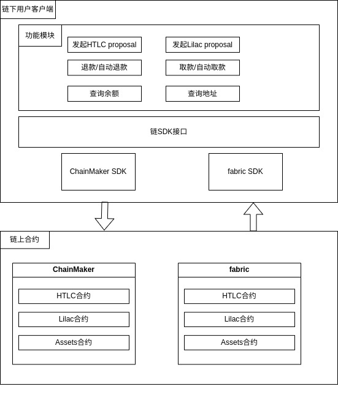

# 面向资产互换的原子性保障应用

## 概述
面向资产互换的原子性保障应用包含两种事务原子性保障协议，`哈希时间锁合约协议(hash time lock contract, HTLC)`和`哈希时间锁合约优化协议Lilac`。该应用在长安链（ChainMaker）上实现支持具有跨链事务原子性保障的跨链资产互换功能，支持长安链与长安链`ChainMaker(v2.3.0 && v2.3.1)`同构跨链、长安链`ChainMaker`与`Fabric(release1.4)`异构跨链。
在同构跨链与异构跨链基础上，该应用实现了基于`哈希时间锁协议HTLC`和`优化协议Lilac`的跨链用户客户端，以支持用户自动取款和时间锁超时失效后自动退款等操作。

`客户端`具备如下功能:
* 查询用户账户相关跨链资产信息
* 发起`HTLC`事务原子性保障跨链资产互换提案
* 发起`Lilac`事务原子性保障跨链资产互换提案
* 自动对发给用户的跨链资产互换提案取款
* 自动对发给用户的超时跨链资产互换提案退款

快速部署和使用实例，请按如下链接内容进行:
[部署和使用文档](../manage/面向资产互换的原子性保障应用.md)

## 设计
### 整体设计逻辑
- 整体设计逻辑如下图所示     
  

- 应用整体分为两部分，链上部分和链下部分。
- 链上部分主要包括三个合约：跨链资产合约Assets、哈希时间锁合约Htlc、哈希时间锁优化合约Lilac
- 链下用户客户端主要包括，长安链SDK、Fabric SDK、用户可用的功能模块，如查询用户账户地址、查询用户账户资产情况、发起跨链资产互换提案、对提案发起取款、对超时提案发起退款等

#### 链上合约设计
- 链上合约主要实现三个合约，分别是跨链资产`Assets`合约，哈希时间锁`HTLC`合约，哈希时间锁优化`Lilac`合约
`Assets`合约主要包括以下功能：
* `approve`授权其他账户能够从当前账户中花费一定金额的token
* `allowance`获取当前账户能够从指定账户中花费的token数量
* `transfer`转移一定数量的token给指定用户
* `balanceOf`获取当前账户剩余token数量
* `transferFrom`转移被授权人的token给指定用户
* `getAddress`获取当前用户的地址

`HTLC`合约主要包括以下功能：
* `newProposal`发起一个新的哈希时间锁提案
* `getProposal`根据proposal id获取完整的提案信息
* `withdraw`根据proposal id获取转给自己的token
* `refund`对一个超时的提案，取回自己锁定的token

`Lilac`合约主要包括以下功能：
* `newProposal`发起一个新的`Lilac`提案
* `getProposal`根据proposal id获取完整的提案信息
* `withdraw`根据proposal id获取转给自己的token
* `refund`对一个超时的提案，取回自己锁定的token

#### 链下用户客户端
- 链下用户客户端为用户开放部分可操作方法。用户通过连接客户端，输入命令的方式与系统交互。用户输入命令交由客户端后台解析命令，调用对应链的SDK接口，由对应区块链方法完成上链等相关工作。
用户客户端主要包括以下功能
* `newHtlcProposal`发起一个新的哈希时间锁提案
* `newLilacProposal`发起一个新的Lilac提案
* `refund`对一个属于自己的提案进行退款
* `withdraw`对一个属于自己的提案取款
* `getProposal`根据proposal id查询提案具体信息
* `getBalance`查询自己的token余额
* `getAddress`获取自己的地址
* `break`退出用户客户端
* `exit`退出用户客户端

## 接口及结构说明
- 为了屏蔽不同链之间的区别并适配更多的链，提高应用的扩展性并减少未来的适配成本，应用设计了`链SDK接口`与`本地提案结构`
### 链SDK接口说明
- 为了更好的进行多链适配与模块化，设计了`链SDK接口`抽象接口，任何想要接入该系统客户端的区块链，只要实现响应的接口即可。
```go
// ChainClientInterface 客户端实现这个接口, 定义功能
type ChainClientInterface interface {
	// 在链chainName发起一个proposalType的proposal, 参数为params
	// @param proposalType 发起的proposal类型
	// @param toAddr 接收者地址
	// @param amount 发送的数量
	// @param hashlock 哈希锁
	// @param timelock 时间锁, 单位秒
	// @return string proposalID
	// @return error 错误信息
	NewProposal(propsalType, toAddr, amount string, hashlock, timelock any) (string, error)

	// 撤销一个proposal
	// @param proposalType proposal类型"htlc","lilac"
	// @param proposalID 被撤销的id
	Refund(proposalType, proposalID string) error

	// 取钱
	// @param proposalType proposal类型"htlc","lilac"
	// @param proposalID 取这个proposal的钱
	// @param preimage 原像
	Withdraw(proposalType, proposlID string, preimage any) error

	// 监听一个链的事件
	// @param contractName 被监听的合约名
	// @param eventName 被监听的事件名称
	// @param resultChain 获取监听结果的通道
	SubscribeEvent(contractName, eventName string, resultChan chan<- any)

	// 解析订阅事件为一个proposal结构体
	// @param eventInfo 每个链对应的事件信息
	// @return proposal 解析出来的proposal
	// @return error 解析失败
	ParseEventToProposal(eventInfo any) (proposalstruct.Proposal, error)

	// 获取余额
	// @param address 地址,如果为""则返回自己的余额
	// @return string 余额
	// @return error err
	GetBalance(address string) (string, error)

	// 获取proposal
	// @param proposalID proposalID
	// @return proposal 这个proposalID对应的proposal
	// @return error err
	GetProposal(proposalType, proposalID string) (proposalstruct.Proposal, error)

	// 获取地址
	// @return string 地址
	// @return error err
	GetAddress() (string, error)

	// 获取chainID
	// @return string id
	// @return error err
	GetChainID() (string, error)

	// 关闭客户端
	// 最后 defer
	Close()
}
```

### 本地提案结构
- 为了屏蔽不同区块链信息解析的障碍，应用设计了`本地提案结构`，实现`链SDK接口`的链，在与用户客户端进行通信时，需要将链上信息解析为指定结构，便于客户端对信息的管理
```go

// Proposal 提案结构, 用于本地存储
type Proposal struct {
	Sender    string `json:"sender"`    // sender account Address
	Receiver  string `json:"receiver"`  // receiver account Address
	Amount    int64  `json:"amount"`    // transfer/lock token amounts
	PosalTime int64  `json:"posaltime"` // proposal generation time
	TimeLock  int64  `json:"timelock"`  // timelock
	// hashlock, 在htlc中是string, 在lilac中是[]string, 需要先转换成any/[]any
	HashLock any `json:"hashlock"`
	// 原像, 在htlc中是string, 在Lilac中是[]string, 需要先转换成any/[]any
	Preimage any `json:"preimage"`
	// BlockDepth int64  `json:"blockdepth"`
	Locked     bool `json:"locked"`     // proposal locked status
	Unlocked   bool `json:"unlocked"`   // proposal unlocked status
	Rolledback bool `json:"rolledback"` // propsoal rolledback status

	// 以下是为了实现proposal匹配而额外增加的属性
	ProposalID             string `json:"proposalID"`     // proposal id
	ChainName              string `json:"chainName"`      // proposal chain name
	UserName               string `json:"userName"`       // proposal user name
	ContractName           string `json:"contractName"`   // 这个proposal合约名
	ProposalType           string `json:"proposalType"`   //proposal type such as 'htlc' 'lilac'
	CorrespondingChainName string `json:"correChainName"` // 对端的名字
	CorrespondingAmount    int64  `json:"correAmount"`    // 对端应该转给我多少钱
}
```
