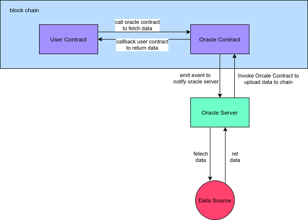
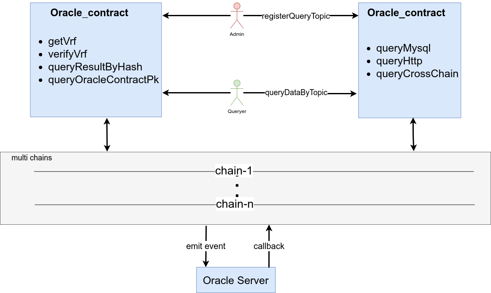
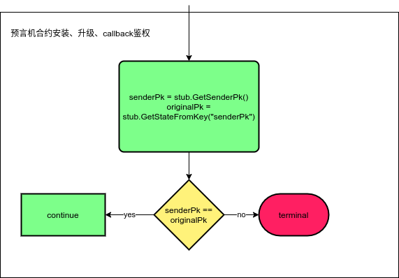
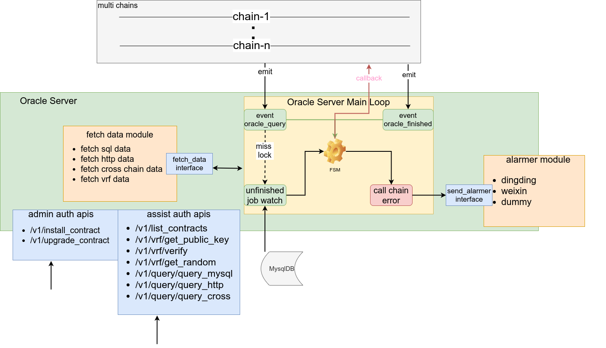
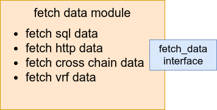
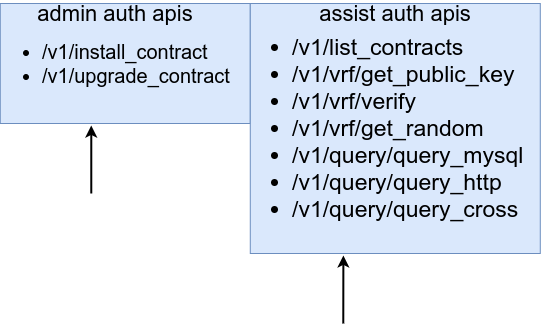
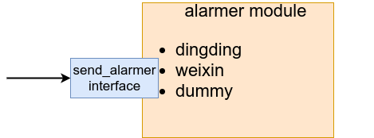

# 预言机服务技术方案

## 概述
`长安链·预言机`v1.0.0_alpha版本是一种中心化的可分布式部署的预言机，为长安链链上、链下数据的交互提供了一个桥梁。用户可以通过智能合约调用来获取链下的接口数据、指定的数据库数据、VRF（可验证随机数数据）以及借助智能合约做跨链数据的查询，同时也提供了注册查询topic/按照topic查询的功能以简化用户使用。

## 设计  

### 整体流程  
- 用户在智能合约中调用`预言机智能合约`中的取数据方法，`预言机智能合约`校验相应参数，发送相应的链事件
- `预言机服务`监听到链上取数据事件，根据合约中指定的取数据配置，进行数据的获取
- `预言机服务`将取到数据通过调用`预言机智能合约`方法来将数据回传，`预言机智能合约`通过回调用户智能合约告知用户数据取到，用户合约做相应业务处理即可     
  
<center> 预言机整体流程</center>

### 预言机智能合约设计
- 预言机功能由`预言机智能合约`提供接口的方式来实现。`用户智能合约`通过调用接口来获取数据。为方便用户使用，系统提供了复杂查询的订制化功能，可以由`管理员`来进行查询的订制，简化普通用户的查询。  
    
<center> 预言机智能合约交互</center>      

`管理员`即为是预言机合约安装人员,如下图为预言机智能合约的鉴权方案       

<center> 预言机智能合约的鉴权方案</center>

### 预言机服务设计
   `预言机服务`整体可以分为四个模块。由监听到的链上`预言机智能合约`事件进行驱动,各个模块配合运行完成取数据功能。服务将运行中所需数据保存到本地的`mysql`数据库中。
- 预言机状态流转模块
- 取数据模块
- 预言机接口模块  
- 预言机告警模块   

<center> 预言机Server结构</center>   

#### 预言机表设计
`预言机服务`将服务运行所需数据存储到了`mysql`数据库中。  
- `合约表(oracle_contracts)`主要记录通过接口安装的预言机合约信息。合约的安装、升级都会写入到表中。`预言机服务`监听链上的事件需要提供序号，因此在`预言机服务`处理完相关事件后，也会将事件序号的变化更新到表中
```sql
CREATE TABLE  if NOT exists `oracle_contracts`(
  `id` bigint unsigned NOT NULL AUTO_INCREMENT COMMENT '自增id',
  `chain_alias` varchar(128) NOT NULL COMMENT '链别名',
  `chain_id` varchar(128) NOT NULL COMMENT '链id',
  `contract_name` varchar(128) NOT NULL COMMENT '合约名称',
  `contract_version` int NOT NULL DEFAULT '1' COMMENT '合约版本',
  `deployed` tinyint NOT NULL DEFAULT '0' COMMENT '是否部署过，默认为0未部署，1为已经部署',
  `runtime_type` tinyint NOT NULL DEFAULT '6' COMMENT '1 为系统合约；2 为rust; 3 为c++; 4为tinygo; 5为solidity; 6为go',
  `topic_query_start` bigint unsigned NOT NULL COMMENT '订阅“查询事件”的起始位置',
  `topic_finish_start` bigint unsigned NOT NULL COMMENT '订阅“结束事件”的起始位置',
  `created_at` datetime NOT NULL DEFAULT CURRENT_TIMESTAMP COMMENT '创建时间',
  `updated_at` datetime NOT NULL DEFAULT CURRENT_TIMESTAMP ON UPDATE CURRENT_TIMESTAMP,
  PRIMARY KEY (`id`),
  UNIQUE KEY `idx_c_c` (`chain_alias`,`contract_name`)
) ENGINE=InnoDB AUTO_INCREMENT=1 DEFAULT CHARSET=utf8mb4 COLLATE=utf8mb4_general_ci COMMENT='合约情况表格'; 
```
- `事件状态表(event_state)`记录了从链上监听事件到整个事件流转完整的各个阶段
```sql
CREATE TABLE  if NOT exists `event_state`(
  `id` bigint unsigned NOT NULL AUTO_INCREMENT COMMENT '自增id',
  `chain_alias` varchar(128) NOT NULL,
  `request_id` varchar(256) NOT NULL COMMENT '请求id',
  `tx_id` varchar(128) NOT NULL COMMENT '交易id',
  `contract_name` varchar(128) NOT NULL COMMENT '合约名称',
  `state` tinyint NOT NULL DEFAULT '0' COMMENT '0：StateInit ；1：StateFetchDataFailed ； 2： StateFetchDataSucess ； 3：  StateCallbackFailed ； 4：StateCallbackSuccess ； 5：StateResultOnChainSuccess（终止态） ；6：StateCallbackFailedFibnoacci（多次调链失败终止态）',
  `query_type` tinyint NOT NULL DEFAULT '1' COMMENT '查询类型枚举 1：use_http；2：use_db ',
  `query_body` mediumblob NOT NULL COMMENT '具体的查询方案，暂定为序列化后的json字符串',
  `next_fibonacci` bigint unsigned NOT NULL DEFAULT '0' COMMENT '上链失败时候feibonacci重试记录',
  `block_height` bigint unsigned NOT NULL DEFAULT '1' COMMENT '当前事件的区块高度',
  `created_at` datetime NOT NULL DEFAULT CURRENT_TIMESTAMP COMMENT '创建时间',
  `updated_at` datetime NOT NULL DEFAULT CURRENT_TIMESTAMP ON UPDATE CURRENT_TIMESTAMP COMMENT '更新时间',
  PRIMARY KEY (`id`),
  UNIQUE KEY `uniq_s_c_r` (`request_id`) COMMENT '''请求id唯一索引''',
  KEY `updated_state` (`updated_at`,`state`),
  KEY `created_state` (`created_at`,`state`)
) ENGINE=InnoDB AUTO_INCREMENT=1 DEFAULT CHARSET=utf8mb4 COLLATE=utf8mb4_general_ci COMMENT='事件状态表格' ;
```
- `预言机取数据返回值存储表(event_result)`存储了预言机取到的数据结果
```sql
CREATE TABLE if NOT exists `event_result` (
  `request_id` varchar(256) NOT NULL COMMENT '请求id，唯一索引',
  `event_result` mediumblob NOT NULL COMMENT '取到的数据',
  `created_at` datetime NOT NULL DEFAULT CURRENT_TIMESTAMP COMMENT '链id',
  PRIMARY KEY (`request_id`),
  KEY `created_at` (`created_at`)
) ENGINE=InnoDB AUTO_INCREMENT=1 DEFAULT CHARSET=utf8mb4 COLLATE=utf8mb4_general_ci COMMENT='预言机取数据返回值存储表' ;

```
- `事件锁表(event_lock)`用于协调多个`预言机服务实例`进行工作
```sql
CREATE TABLE if NOT exists `event_lock` (
  `request_id` varchar(256) NOT NULL COMMENT '请求id',
  `locked_version` int NOT NULL DEFAULT '0' COMMENT '锁',
  `updated_at` datetime NOT NULL DEFAULT CURRENT_TIMESTAMP ON UPDATE CURRENT_TIMESTAMP COMMENT '更新时记录',
  PRIMARY KEY (`request_id`) COMMENT '请求id唯一索引',
  KEY `updated_at` (`updated_at`),
  KEY `request_updated` (`request_id`,`updated_at`)
) ENGINE=InnoDB AUTO_INCREMENT=1 DEFAULT CHARSET=utf8mb4 COLLATE=utf8mb4_general_ci COMMENT='事件锁' ; 
```
- `vrf表格(vrfs)`记录了vrf的公钥和私钥信息，其中srv_name为唯一索引（系统写的）。多个实例如果连接到同一个mysql实例，那么他们共享同一个vrf公私钥，各个实例生成vrf是一致的
```sql
CREATE TABLE if NOT exists  `vrfs`(
  `id` int unsigned NOT NULL AUTO_INCREMENT COMMENT '主键',
  `privatek` blob NOT NULL COMMENT '私钥',
  `publick` blob NOT NULL COMMENT '公钥',
  `srv_name` varchar(128) NOT NULL COMMENT '服务名称，唯一索引',
  PRIMARY KEY (`id`),
  UNIQUE KEY `uniq-s` (`srv_name`) COMMENT '利用服务名称作唯一索引'
) ENGINE=InnoDB AUTO_INCREMENT=1 DEFAULT CHARSET=utf8mb4 COLLATE=utf8mb4_general_ci COMMENT='vrf表格';
```
#### 预言机状态流转模块
`预言机服务`监听事件，取数据，回传数据到链上整个流程抽象成为一个有限状态机来进行实现，状态迁移如下图  

<center>预言机内部状态流转</center>  

#### 取数据模块
`预言机服务`可以支持四种取数据模式。通过解析指定的查询需求，实例化相应的接口实现类取数据
- 支持通过http接口取xml,json,html类型数据
- 支持通过mysql数据源取数据
- 支持跨链（长安链）调用链上合约查询数据
- 支持vrf数据取/验   

<center>取数据模块</center>   

#### 预言机接口模块
`预言机服务`的接口模块提供两种类型的接口。两类接口分别都有`token`验证（token为服务配置中的对应项）
- 安装、升级预言机合约接口`token配置项目为smart_oracle.yml文件中httpServer对象的admin_token`
- 辅助开发接口，用于查看通过预言机可以取的数据样式（不借助智能合约，方便开发测试）`token配置项目为smart_oracle.yml文件中httpServer对象的assist_token`    

<center>api接口模块</center>

#### 预言机告警模块
`预言机服务`在将数据通过调用`预言机合约`回调链的时候可能会发生错误，我们依据fibonacci重试的策略进行重试,当重试次数超过用户配置的最大值(配置项为fibonacci_limits)时候，会根据用户配置（配置项为alarmer）的报警方式进行报警   

<center>告警模块</center>   

## 代码整体目录结构   
```bash
.
├── alarms # 告警模块的代码包
├── config # 读取配置模块的代码包
├── config_files # 配置文件
│   ├── crypto-config # 使用chainmaker-cryptogen 工具生成的证书文件
│   ├── sdk-config # 链sdk配置
│   │   ├── sdk_config_chain1.yml # 链1的sdk
│   │   └── sdk_config_chain2.yml # 链2的sdk
│   └── smart_oracle.yml # 预言机服务的配置文件
├── contract_process # 预言机服务核心业务逻辑的代码包
├── custom.cnf # 可以参考这个配置来配置docker中的mysql数据库（5.7 及以后）
├── databases # 连接数据库模块的代码包
├── docker-compose.yml # docker-compose 模板文件
├── Dockerfile # docker 镜像文件
├── fetch_data # 取数据模块代码包
├── http_server_process # 预言机http服务接口代码包
├── install-upgrade-oracle-contract.sh #预言机合约安装、升级脚本
├── logger # 日志模块代码包
├── main.go # 服务入口
├── Makefile 
├── models # 预言机数据模型包
├── mysql-data-volumes # 默认的docker-compose启动mysql数据库的数据挂载点
│   └── data
├── readme.md
├── scripts # mysql建库脚本
│   └── init.sql
├── standard_oracle_contract # 系统自带的合约文件及代码
│   ├── oracle_contract_file
│   │   └── oracle_contract_v1 # 编译过的预言机合约可执行文件
│   ├── oracle_contract_src.zip # 预言机合约源代码
│   └── use_demo_src.zip # 用户使用预言机合约的示例源代码
│   └── use_demo.7z # 编译压缩后的示例智能合约文件
└── ut_cover.sh # 单元测试脚本

```